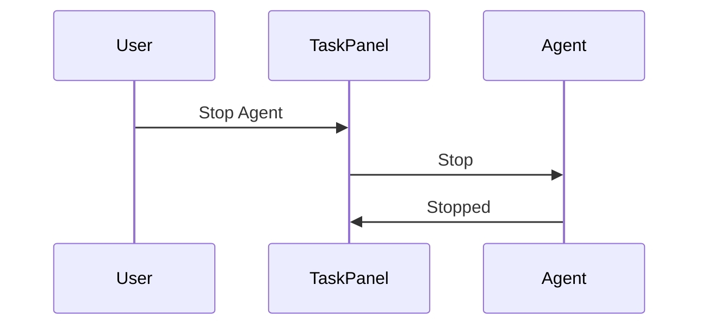

# Claude Code v2.1.191 アップデートまとめ

> 出典: https://code.claude.com/docs/en/changelog#2-1-191

## 💡 注目ポイント

### 1. `/rewind` コマンドの追加 — 会話を `/clear` 以前に戻せる

`/rewind` コマンドにより、`/clear` コマンド実行前の会話に戻ることができます。これにより、重要な情報やコンテキストを失わずに会話を再開できます。

### 2. バックグラウンドエージェントの停止が永続化 — タスクパネルからの停止が確実に有効

バックグラウンドエージェントをタスクパネルから停止すると、その停止が永続的になります。以前は停止したエージェントが再起動することがありましたが、この問題が解消されました。

### 3. ネットワークパーミッションダイアログの改善 — 許可したホストはセッション中記憶

ネットワークパーミッションダイアログで許可したホストは、セッション中は再度プロンプトが表示されずに記憶されます。これにより、同じホストへの接続時に毎回プロンプトが表示される煩わしさが解消されます。

### 4. ストリーミングレスポンス中の CPU 使用率削減 — テキスト更新を 100ms にまとめて約 37% 削減

ストリーミングレスポンス中の CPU 使用率が約 37% 削減されました。これはテキスト更新を 100ms にまとめることで実現されました。

## 📋 変更一覧

### ✨ 新機能

| 変更 | 誰にどう嬉しいか |
|---|---|
| `/rewind` コマンドの追加 | 会話を `/clear` 以前に戻せる |

### ⬆️ 改善

| 変更 | 誰にどう嬉しいか |
|---|---|
| バックグラウンドエージェントの停止が永続化 | タスクパネルからの停止が確実に有効 |
| ネットワークパーミッションダイアログの改善 | 許可したホストはセッション中記憶 |
| ストリーミングレスポンス中の CPU 使用率削減 | システムリソースの節約 |

### 🐛 バグ修正

| 変更 | 誰にどう嬉しいか |
|---|---|
| スクロール位置がストリーミングレスポンス中に下部にジャンプする問題を修正 | 読み取り中の快適性向上 |
| `/voice` が組織のポリシーで無効の場合、汎用的な「利用不可」メッセージを表示する問題を修正 | 制限の理由が明確に理解できる |
| `/login` URL が Windows Terminal で折り返し時に切り捨てられる問題を修正 | URL の完全表示 |
| Ghostty over ssh/tmux でのフルスクリーンモードでのリンクの Cmd+click が機能しない問題を修正 | リンクのクリック操作がスムーズに |
| `claude agents` がビルトインスラッシュコマンドをバックグラウンドセッションにプロンプトテキストとして送信する問題を修正 | 適切なヒント表示 |
| `claude agents` のジョブ行が貼り付けた画像のフルファイルシステムパスを表示する問題を修正 | `[Image #N]` プレースホルダーの適切な表示 |
| カンマ区切りのマッチングを持つフック（例：`"Bash,PowerShell"`）がサイレントに発火しない問題を修正 | フックの正常な動作 |
| `/permissions` の最近拒否されたタブで承認が閉じると破棄される問題を修正 | 承認が永続的に保存される |
| エージェントパネルがロースターをオーバーフローキャップを超えてスクロールすると1行ジャンプする問題を修正 | スクロールの安定性向上 |
| ウェルカムスプラッシュアートがデフォルトの80×24 macOS Terminalウィンドウをオーバーフローする問題を修正 | ウィンドウサイズに適合 |
| 管理された設定：`forceRemoteSettingsRefresh` が MDM またはファイルポリシーで設定されたときに有効になる問題を修正 | 設定の適切な適用 |
| MCPサーバーの信頼性向上：一時的なネットワークエラーに対してキャパビリティディスカバリーが再試行 | サーバーの安定性向上 |
| MCP OAuthの改善：一時的なネットワークエラー後にディスカバリーとトークン要求が再試行 | 認証プロセスの安定性向上 |
| MCPエラーメッセージの改善：HTTP 404エラーがURLを表示し、MCP設定を指摘 | エラーの理解と解決の容易化 |
| vimモードのプロンプト履歴検索（NORMAL `/`）の改善：スラッシュコマンドに到達する方法をヒント | 操作の効率化 |
| ターミナル出力キャッシュによる長セッションのメモリ成長の削減 | メモリ使用量の最適化 |
