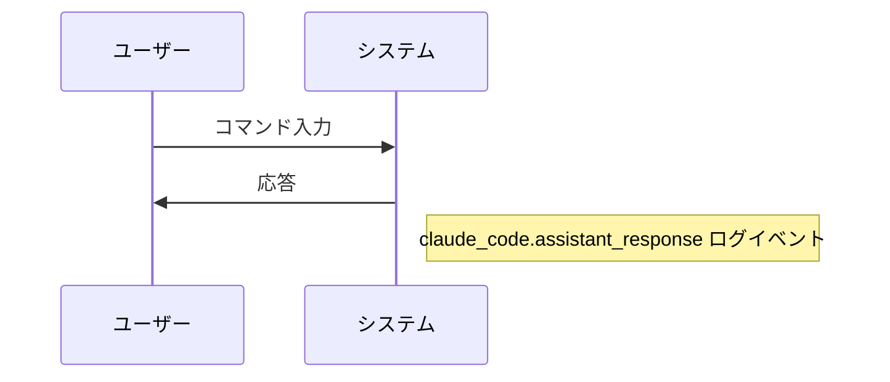

# Claude Code v2.1.193 アップデートまとめ

> 出典: https://code.claude.com/docs/en/changelog#2-1-193

## 💡 注目ポイント

### 1. `autoMode.classifyAllShell` 設定の追加 — シェルコマンドの自動分類を強化

これまでは任意のコード実行パターンのみが自動モードで分類されていましたが、
この設定を追加することで、すべての Bash/PowerShell コマンドを自動モードの
分類器を通すことができます。これにより、より広範なコマンドの分類が可能となり、
セキュリティと効率性の両立が図られます。

### 2. 自動モード拒否理由の追加 — 拒否理由をより明確に

自動モードでの拒否理由がトランスクリプト、拒否トースト、`/permissions` の
最近の拒否に追加されました。これにより、なぜ特定のコマンドが拒否されたかを
より明確に理解できるようになりました。

### 3. `claude_code.assistant_response` OpenTelemetry ログイベントの追加 — モデルの応答をログに記録

このイベントはモデルの応答テキストを含むログイベントを追加します。
`OTEL_LOG_ASSISTANT_RESPONSES=1` が設定されている場合のみ記録され、
未設定の場合は `OTEL_LOG_USER_PROMPTS` に従います。プロンプトコンテンツを
既にログ記録しているデプロイメントは、アップグレード時に応答コンテンツも
受け取り始めます。プロンプトのみをログ記録したい場合は
`OTEL_LOG_ASSISTANT_RESPONSES=0` を設定してください。

### 4. ライブファイルパスオートコンプリートの追加 — Bash モードでの作業効率アップ

Bash モード (`!`) にライブファイルパスオートコンプリートが追加されました。
これにより、ファイルパスの入力がより速く正確に行えるようになりました。

### 5. MCP サーバー認証のスタートアップ通知 — 認証が必要であることを明示

MCP サーバーに認証が必要な場合、スタートアップ時に `/mcp` を指す通知が
表示されるようになりました。これにより、認証が必要であることをユーザーに
明示し、スムーズな認証プロセスを促進します。

## 📋 変更一覧

### ✨ 新機能

| 変更 | 誰にどう嬉しいか |
|---|---|
| `autoMode.classifyAllShell` 設定の追加 | すべてのシェルコマンドを自動分類し、セキュリティと効率性を向上 |
| 自動モード拒否理由の追加 | 拒否理由をより明確に理解し、適切な対応が可能に |
| `claude_code.assistant_response` OpenTelemetry ログイベントの追加 | モデルの応答をログに記録し、デバッグや分析が容易に |
| ライブファイルパスオートコンプリートの追加 | Bash モードでのファイルパス入力が速く正確に |
| MCP サーバー認証のスタートアップ通知の追加 | 認証が必要であることを明示し、スムーズな認証プロセスを促進 |

### ⬆️ 改善

| 変更 | 誰にどう嬉しいか |
|---|---|
| バックグラウンドエージェントの改善 | 他のタスクの実行中にエージェントが動作し続け、効率が向上 |
| MCP `headersHelper` 認証の改善 | 401/403 エラー時に自動で再実行・再接続し、認証プロセスがスムーズに |
| プラグイン自動リネーム改善 | marketplace `renames` マップが自動でフォローされ、設定が新しい名前に更新 |

### 🐛 バグ修正

| 変更 | 誰にどう嬉しいか |
|---|---|
| `/model` と他のクライアントデータゲーテッド UI の修正 | `/login` 直後に古い/空の状態が表示されなくなり、正確な情報が得られる |
| バックグラウンディングの修正 | すべての実行中のタスクが新しいセッションに引き継がれる場合、"N 個のバックグラウンドタスクが放棄されます" というメッセージが表示されなくなる |
| ピン留めされたバックグラウンドエージェントの修正 | 自動更新後に毎回 "Continue from where you left off" と再プロンプトされなくなる |
| メインターンのバックグラウンディングの修正 | メイン会話を再実行する "general-purpose (resumed)" サブエージェントが生成されなくなる |
| エージェントパネルの修正 | サブエージェントを表示しているときに兄弟エージェントが隠されなくなる |
| `/add-dir` メッセージの改善 | ディレクトリがすでに作業ディレクトリである場合のメッセージが改善される |
