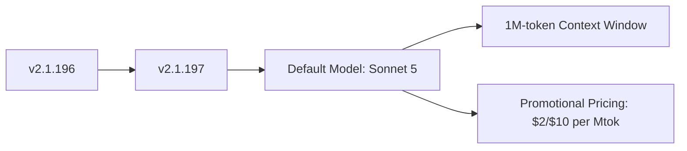

# Claude Code v2.1.197 アップデートまとめ

> 出典: https://code.claude.com/docs/en/changelog#2-1-197

## 💡 注目ポイント

### 1. Claude Sonnet 5 の導入 — より大規模なコンテキストでコードを理解

このバージョンでは、Claude Sonnet 5 がデフォルトモデルとして導入されました。Sonnet 5 は、1M トークンのコンテキストウィンドウをネイティブにサポートし、より大規模なコードベースを理解できます。また、8月31日までのプロモーション価格として、2ドルまたは10ドル/Mtok で利用可能です。

これまでのバージョンでは、より小さなコンテキストウィンドウで動作していたため、大規模なコードベースの理解に限界がありました。Sonnet 5 の導入により、より大規模なプロジェクトでも高い精度でコードを理解できるようになります。

## 📋 変更一覧

### ✨ 新機能

| 変更 | 誰にどう嬉しいか |
|---|---|
| Claude Sonnet 5 の導入 | 大規模なコードベースの理解が可能に |

### 📝 その他

| 変更 | 誰にどう嬉しいか |
|---|---|
| Sonnet 5 のプロモーション価格 | コスト効率が向上 |
