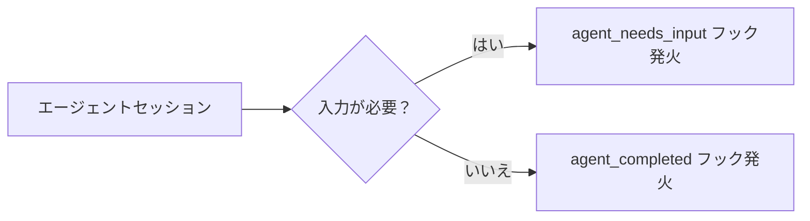

# Claude Code v2.1.198 アップデートまとめ

> 出典: https://code.claude.com/docs/en/changelog#2-1-198

## 💡 注目ポイント

### 1. Chrome で利用できるようになった

Chrome ユーザーは、ブラウザで直接 Claude を利用できるようになりました。これにより、Chrome ユーザーはブラウザ内でシームレスに AI 支援を受けられるようになります。

### 2. バックグラウンドエージェント通知の追加

`claude agents` でバックグラウンドエージェントの通知が追加されました。セッションが入力を必要としたり完了したりすると、`Notification` フック (`agent_needs_input` / `agent_completed`) が発火します。

これにより、エージェントの状態をリアルタイムで把握し、適切なタイミングで対話や確認を行うことができます。

### 3. `/dataviz` スキルの追加

チャートやダッシュボードのデザインガイダンスと、実行可能なカラーパレットバリデータを提供する `/dataviz` スキルが追加されました。これにより、データビジュアライゼーションの品質を向上させることができます。

### 4. バックグラウンドエージェントが自動で PR を作成

`claude agents` から起動されたバックグラウンドエージェントは、コード作業を完了すると自動でコミット、プッシュし、ドラフト PR を開くようになりました。これにより、コードレビューのワークフローが効率化されます。

### 5. エクスプローラエージェントがメインセッションのモデルを継承

ビルトインのエクスプローラエージェントが、メインセッションのモデル（Opus まで）を継承するようになりました。これにより、エクスプローラエージェントの出力品質が向上します。

## 📋 変更一覧

### ✨ 新機能

| 変更 | 誰にどう嬉しいか |
|---|---|
| Chrome で利用可能に | Chrome ユーザーがブラウザ内で AI 支援を受けられる |
| バックグラウンドエージェント通知の追加 | エージェントの状態をリアルタイムで把握できる |
| `/dataviz` スキルの追加 | データビジュアライゼーションの品質を向上できる |
| バックグラウンドエージェントが自動で PR を作成 | コードレビューのワークフローが効率化される |
| エクスプローラエージェントがメインセッションのモデルを継承 | エクスプローラエージェントの出力品質が向上 |

### ⬆️ 改善

| 変更 | 誰にどう嬉しいか |
|---|---|
| サブエージェントとコンテキスト圧縮がセッションの拡張思考設定を継承 | 委任されたタスクの出力品質が向上 |
| 一時的なネットワーク障害による応答中断をリトライする | 安定した通信が可能になる |
| キーボードショートカットヒントが Mac 接続時に opt/cmd を表示 | 直感的な操作が可能になる |
| API リトライ UX の改善 | API 過負荷時のエラーメッセージがわかりやすくなる |
| `/login` が `claude agents` ビューからサインインダイアログを開く | サインインプロセスが簡素化される |

### 🐛 バグ修正

| 変更 | 誰にどう嬉しいか |
|---|---|
| バックグラウンド分類器リクエストの過剰な要求を修正 | リソースの無駄使いを防ぐ |
| ウェブ、デスクトップ、VS Code タスクパネルのバックグラウンドタスクが "Running" でスタックするのを修正 | タスクが正常に完了する |
| エージェントチームが API エラーで死んだ teammate が "failed" と報告するように修正 | エラーの原因を特定しやすくなる |
| `/diff` パネルがブランチやコミットを切り替えた際にリフレッシュしない問題を修正 | 正確な diff を確認できる |
| マークダウンテーブルがフルスクリーンモードで右端のボーダーが折り返す問題を修正 | テーブルが正しく表示される |
| Claude Platform on AWS と Mantle セッションが STS トークン期限切れで "Please run /login" と表示される問題を修正 | セッションが自動で再認証される |
| macOS バックグラウンドエージェントセッションでローカルネットワークホストに "no route to host" と表示される問題を修正 | ローカルネットワークホストにアクセスできる |
| `/desktop` が worktree に入ったり出たりした後に "Cannot determine working directory" と表示される問題を修正 | 正しい作業ディレクトリが決定される |
| macOS でエージェントビューが開いている間にバックグラウンドエージェントが "Reconnecting…" と繰り返し表示される問題を修正 | エージェントが正常に接続される |
| `claude attach <id>` 内で ← を押すとシェルに戻ってしまう問題を修正 | エージェントビューが開く |
| `claude --bg` と `--print`/`-p` を組み合わせた際に unattachable セッションがサイレントで作成される問題を修正 | 矛盾するフラグが拒否される |
| ワークフロー進捗ビューが最古のエージェントをリストから落とす問題を修正 | フェーズカウンターが正しく表示される |
| `.claude/rules/` の条件付きルールがシンボリックリンク経由でターゲットファイルに到達した際に読み込まれない問題を修正 | 条件付きルールが正しく読み込まれる |
| macOS の Warp でフルスクリーンモードで Cmd+クリックが URL を開かない問題を修正 | URL が正しく開かれる |
| フルスクリーンモードでダブルクリックでの単語選択が URL のスキームを含む全体を選択しない問題を修正 | URL が正しく選択される |
| プランモードが読み取り専用のツールコールを自動許可しない問題を修正 | セッション開始時に読み取り専用のツールコールが自動許可される |
| `/branch` が最初の実際のプロンプトではなく圧縮サマリーからデフォルトのフォーク名を導出する問題を修正 | 正しいフォーク名が導出される |
| フォーカスモードの改善 | サブエージェントや完了したバックグラウンド通知が適切に表示される |
| コードブロック、diff、ファイルプレビューの構文ハイライトの精度を向上 | コードが正しくハイライトされる |
| キーボードショートカットヒントが Mac 経由 SSH 接続時に opt/cmd を表示するように修正 | 直感的な操作が可能になる |
| API リトライ UX の改善 | API 過負荷時のエラーメッセージがわかりやすくなる |
| `/login` が `claude agents` ビューからサインインダイアログを開くように修正 | サインインプロセスが簡素化される |
| サブエージェントが起動したエージェントからのメッセージを通常のタスク指示として扱うように修正 | サブエージェントの動作が正常になる |
| `/agents` ウィザードを削除 | サブエージェントの作成や管理が簡素化される |
