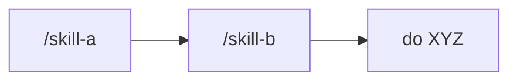
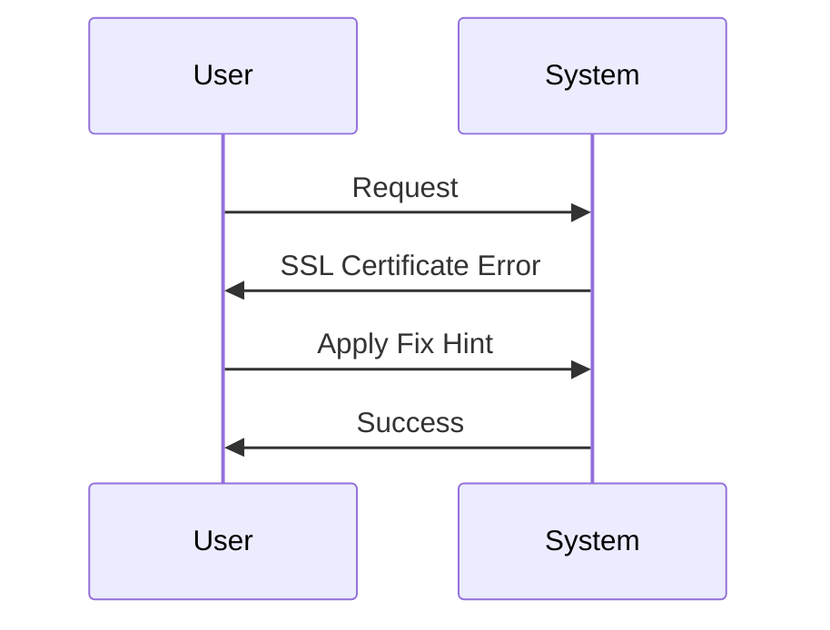
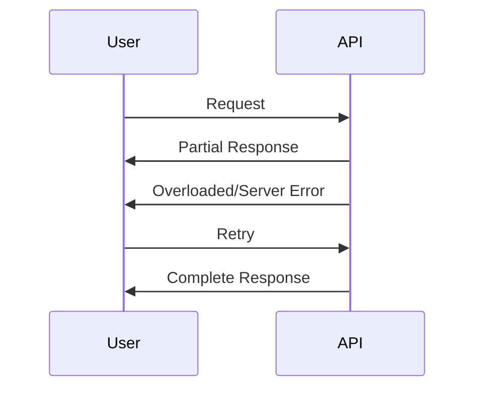
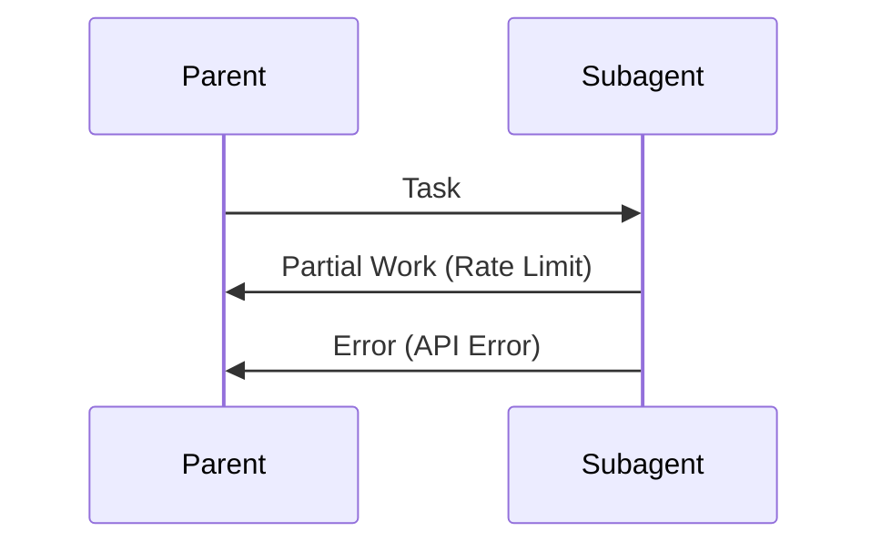
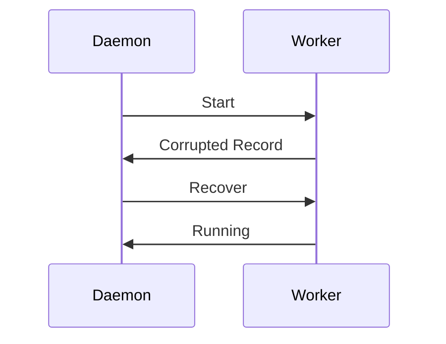

# Claude Code v2.1.199 アップデートまとめ

> 出典: https://code.claude.com/docs/en/changelog#2-1-199

## 💡 注目ポイント

### 1. スラッシュスキル連鎖呼び出しの改善

`/skill-a /skill-b do XYZ` のような連鎖呼び出しで、先頭のスキルが最大 5 つまでロードされるようになりました。これまでは最初のスキルのみがロードされていました。

これにより、複数のスキルを連続して使用する際に、よりスムーズな操作が可能になります。

### 2. SSL 証明書エラーの即時失敗とガイダンス表示

SSL 証明書エラー（TLS 検査プロキシ、`NODE_EXTRA_CA_CERTS` の不足、期限切れの証明書など）が検出された場合、再試行を消費せずに即時失敗し、修正ヒントを表示するようになりました。

これにより、ユーザーはより迅速に問題を認識し、修正することができます。

### 3. ストリーミング応答の保持

API が mid-stream で過負荷/サーバーエラーを発生させた場合、ストリーミング応答が破棄されていましたが、今では部分的な出力が不完全応答の通知と共に保持されるようになりました。

これにより、部分的な結果でもユーザーに提供することができ、情報の損失を防ぎます。

### 4. サブエージェントのエラー報告改善

レート制限やサーバーエラーによってサブエージェントが中断された場合、親エージェントに部分的な作業結果が返されるようになりました。また、API エラー（使用制限到達など）が正常に報告されるようになりました。

これにより、親エージェントはサブエージェントの状態をより正確に把握できるようになります。

### 5. バックグラウンドエージェントデーモンの安定性向上

Linux での unclean shutdown 後に worker レコードが破損した場合、バックグラウンドエージェントデーモンが自己終了し、すべての実行中のエージェントを終了させていましたが、この問題が修正されました。

これにより、バックグラウンドエージェントの安定性が向上し、不必要な終了が防止されます。

## 📋 変更一覧

### ✨ 新機能

| 変更 | 誰にどう嬉しいか |
|---|---|
| Stacked slash-skill invocations の改善 | 複数のスキルを連続して使用する際の操作性が向上 |

### ⬆️ 改善

| 変更 | 誰にどう嬉しいか |
|---|---|
| SSL 証明書エラーの即時失敗とガイダンス表示 | エラーの迅速な修正が可能に |
| ストリーミング応答の保持 | 部分的な結果でも情報が保持される |
| サブエージェントのエラー報告改善 | 親エージェントがサブエージェントの状態を正確に把握できる |
| バックグラウンドエージェントデーモンの安定性向上 | 不必要な終了が防止され、安定性が向上 |

### 🐛 バグ修正

| 変更 | 誰にどう嬉しいか |
|---|---|
| サブエージェントがレート制限やサーバーエラーで中断された際の部分的な作業結果の返却 | 作業の損失を防ぐ |
| API エラーが正しく親エージェントに報告される | エラーの原因を正確に把握できる |
| バックグラウンドエージェントデーモンが unclean shutdown 後に自己終了しなくなる | 安定性が向上 |
| その他の多数のバグ修正 | 全体的な安定性と使いやすさの向上 |

### 📝 その他

| 変更 | 誰にどう嬉しいか |
|---|---|
| `CLAUDE_CODE_RETRY_WATCHDOG` のデフォルト再試行回数が 300 に引き上げられ、`CLAUDE_CODE_MAX_RETRIES` の上限 15 が解除された | 一時的なエラーに対する耐性が向上 |
| `claude agents` セッション行でプルリクエストリンクが `#N` として表示されるようになった | 表示が簡潔になり、読みやすくなった |
