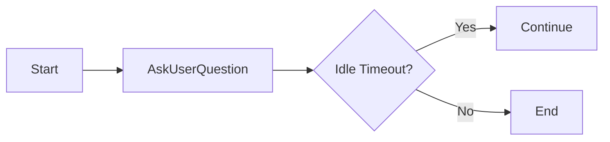
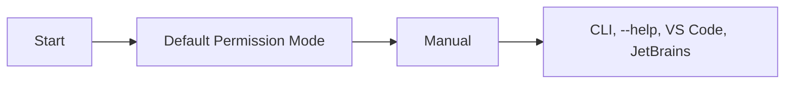
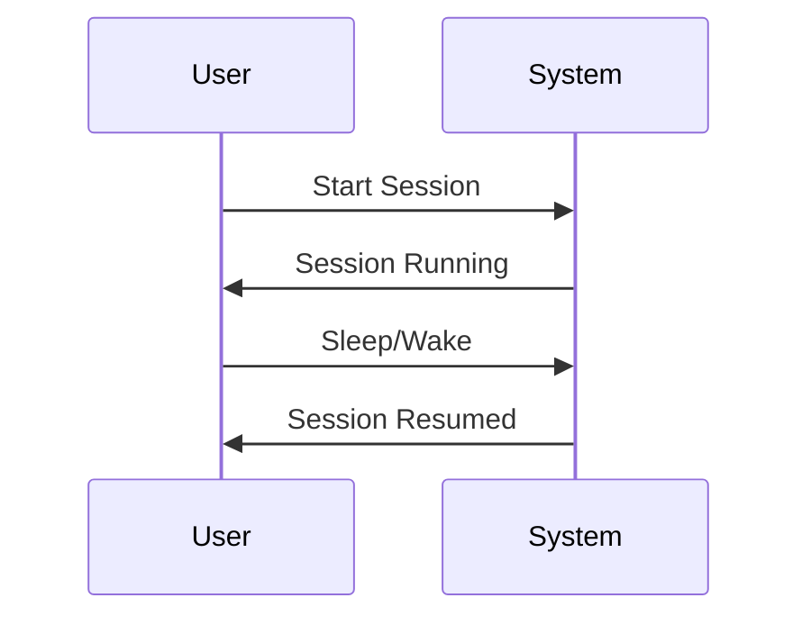
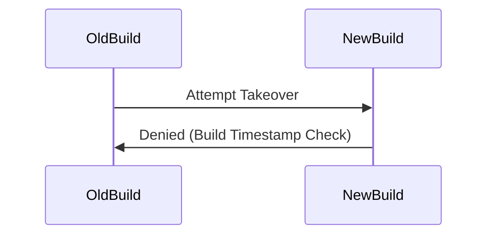
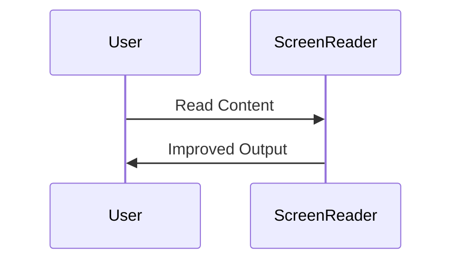

# Claude Code v2.1.200 アップデートまとめ

> 出典: https://code.claude.com/docs/en/changelog#2-1-200

## 💡 注目ポイント

### 1. `AskUserQuestion` ダイアログの自動継続の変更

`AskUserQuestion` ダイアログは、デフォルトで自動継続しなくなりました。アイドルタイムアウトは `/config` コマンドでオプトインできます。

これにより、ユーザーはより意図的な操作が可能になります。

### 2. デフォルトのパーミッションモードの変更

CLI、`--help`、VS Code、JetBrains 全体で「デフォルト」パーミッションモードが「マニュアル」に変更されました。`--permission-mode manual` と `"defaultMode": "manual"` は `default` と共に受け入れられます。

これにより、ユーザーはより細かい権限管理が可能になります。

### 3. バックグラウンドセッションの安定性向上

バックグラウンドセッションがスリープ/ウェイク後や停止したセッションを再開した後にサイレントで停止する問題が修正されました。

これにより、バックグラウンドセッションの安定性が向上します。

### 4. バックグラウンドエージェントデーモンのハンドオーバー修正

再インストールされた古いビルドがデーモンを乗っ取れないように、ビルドの最新性がバージョンに埋め込まれたビルドタイムスタンプで判断されるようになりました。

これにより、デーモンのハンドオーバーがより安全になります。

### 5. スクリーンリーダー出力の改善

装飾的なグリフが隠され、トランスクリプトシンボルが短いラベルとして読み上げられ、ネストされたテーブルが `Header: value.` 行として読み上げられるようになりました。

これにより、スクリーンリーダーのユーザーエクスペリエンスが向上します。

## 📋 変更一覧

### ⬆️ 改善

| 変更 | 誰にどう嬉しいか |
|---|---|
| `AskUserQuestion` ダイアログの自動継続の変更 | より意図的な操作が可能に |
| デフォルトのパーミッションモードの変更 | より細かい権限管理が可能に |
| バックグラウンドセッションの安定性向上 | バックグラウンドセッションの安定性が向上 |
| バックグラウンドエージェントデーモンのハンドオーバー修正 | デーモンのハンドオーバーがより安全に |
| スクリーンリーダー出力の改善 | スクリーンリーダーのユーザーエクスペリエンスが向上 |

### 🐛 バグ修正

| 変更 | 誰にどう嬉しいか |
|---|---|
| `.claude.json` の `disabledMcpServers` または `enabledMcpServers` が配列以外の値に設定された場合の起動時のクラッシュの修正 | 設定エラーによるクラッシュが防止される |
| バックグラウンドセッションがスリープ/ウェイク後や停止したセッションを再開した後にサイレントで停止する問題の修正 | バックグラウンドセッションの安定性が向上 |
| バックグラウンドセッションが Esc でキャンセルされたターンを停止後に再実行する問題の修正 | バックグラウンドセッションの安定性が向上 |
| クラッシュ後に stale `daemon.lock` が残り、OS が PID を再利用した場合のバックグラウンドエージェントの再起動不可能問題の修正 | バックグラウンドエージェントの安定性が向上 |
| バックグラウンドエージェントのロスターの問題の修正 | バックグラウンドエージェントの管理が改善 |
| レート制限によりテキスト出力を生成する前に中断されたサブエージェントが空の結果を返す問題の修正 | サブエージェントの動作が安定化 |
| バックグラウンドエージェントの出力からの制御バイトがエージェントビューのターミナルに到達する問題の修正 | エージェントビューの表示が改善 |
| `claude agents --plugin-dir <dir>` がフラグが `agents` の後に置かれた場合、エージェントビューにプラグインのエージェントとスキルが表示されない問題の修正 | プラグインの管理が改善 |
| プロジェクトスコープのプラグインが同じリポジトリの git worktrees から正しくロードされない問題の修正 | プラグインのロードが改善 |
| `/mcp` サーバーリストがスクリーンリーダーと拡大鏡のフォーカスを追跡しない問題の修正 | アクセシビリティが向上 |
| 音声ディクテーションが録音が音声をキャプチャしない場合、誤解を招く「音声接続失敗」メッセージを表示する問題の修正 | 音声ディクテーションの安定性が向上 |
| tmux 3.4+ でのレンダリングフリッカーの修正 | tmux での表示が改善 |
| インストールスクリプトがシステムのメモリ不足でインストールが中断された場合の説明の改善 | インストールプロセスが改善 |
