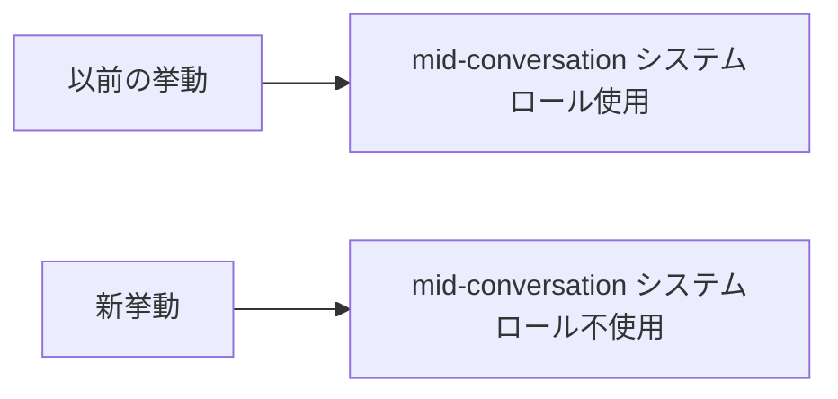

# Claude Code v2.1.201 アップデートまとめ

> 出典: https://code.claude.com/docs/en/changelog#2-1-201

## 💡 注目ポイント

### 1. Sonnet 5 セッションでのシステムロール変更

Claude Sonnet 5 セッションにおいて、mid-conversation システムロールがハーネスリマインダーに使用されなくなりました。これにより、セッション中のリマインダーの挙動が変更されます。

この変更により、ユーザーはセッション中に異なるリマインダーの挙動を経験することになります。特に、長時間のセッションではこの変更が顕著に感じられるでしょう。

## 📋 変更一覧

### ✨ 新機能

| 変更 | 誰にどう嬉しいか |
|---|---|
| Sonnet 5 セッションでのシステムロール変更 | セッション中のリマインダー挙動が改善 |

### 📝 その他

| 変更 | 誰にどう嬉しいか |
|---|---|
| Sonnet 5 セッションでのシステムロール変更 | セッション中のリマインダー挙動が改善 |
