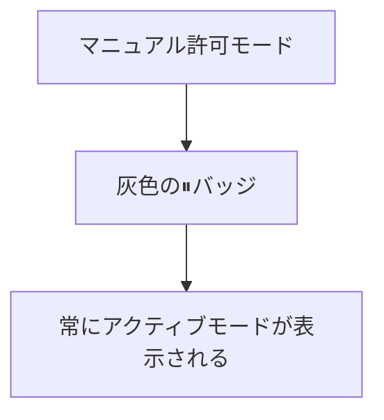

# Claude Code v2.1.203 アップデートまとめ

> 出典: https://code.claude.com/docs/en/changelog#2-1-203

## 💡 注目ポイント

### 1. ログイン期限切れの警告追加

ログインが期限切れになる前に警告が表示されるようになり、バックグラウンドセッションが中断される前に再認証できるようになりました。

### 2. マニュアル許可モードの表示改善

マニュアル許可モード時にフッターに灰色の⏸バッジを追加し、常にアクティブモードが表示されるようになりました。

### 3. セッションの追加作業ディレクトリの表示

セッションの追加作業ディレクトリが MCP `roots/list` に追加され、セットが変更されると `notifications/roots/list_changed` が送信されるようになりました。

### 4. バックグラウンドセッションの復旧改善

デーモンのセッショントークンが古くなった場合、バックグラウンドセッションが永続的に応答しなくなる問題が修正され、セッションが自動的に復旧するようになりました。

### 5. メモリとCPU使用の改善

対話型セッションでのメモリとCPU使用の回帰が修正され、コンテキスト使用量インジケータが毎ターン後にトランスクリプト全体を再分析しなくなりました。

## 📋 変更一覧

### ✨ 新機能

| 変更 | 誰にどう嬉しいか |
|---|---|
| ログイン期限切れの警告追加 | セッション中断前に再認証できる |
| マニュアル許可モードの表示改善 | 常にアクティブモードが表示される |
| セッションの追加作業ディレクトリの表示 | 作業ディレクトリの変更を把握しやすい |
| [VSCode] 全セッションのリモート制御を有効にする設定トグルの追加 | リモート制御のオン/オフが簡単になる |

### ⬆️ 改善

| 変更 | 誰にどう嬉しいか |
|---|---|
| セッショントークンの自動復旧 | バックグラウンドセッションが安定する |
| メモリとCPU使用の改善 | セッションがよりスムーズに動作する |
| バイナリサイズと起動メモリの削減 | 起動が速くなり、メモリ使用量が減る |
| レスポンシブ性の向上 | 長いレスポンスがストリーミング中に画面が再レンダリングされない |
| サブエージェントの動作改善 | サブエージェントがタスクを再委任する頻度が減る |

### 🐛 バグ修正

| 変更 | 誰にどう嬉しいか |
|---|---|
| macOSでのバックグラウンドエージェントセッションの切り替え時の15-20秒の停止修正 | セッション切り替えが速くなる |
| デーモンのセッショントークンが古くなった場合のバックグラウンドセッションの復旧 | セッションが安定する |
| `claude agents` に戻った際にサブエージェントが再起動しないように修正 | 作業の連続性が保たれる |
| Bashが多くのgit worktreeを持つリポジトリで"argument list too long"エラーを修正 | 大きなリポジトリでも問題なく動作する |
| ワークツリー分離されたサブエージェントが親チェックアウトでシェルコマンドを実行してしまう問題を修正 | 正しいワークツリーでコマンドが実行される |
| マルチリポジトリワークスペースでのネストされたリポジトリのワークツリー作成を拒否する問題を修正 | バックグラウンドセッションが正しく分離・編集できる |
| バックグラウンドエージェントの作業ディレクトリが削除・ファイルに置き換え・無効なパスになった場合のクラッシュループを修正 | 明確なエラーメッセージが表示される |
| バックグラウンドデーモンの自動アップグレード失敗による実行中のバックグラウンドセッションの終了を修正 | セッションが中断されない |
| `TaskStop`と`TaskOutput`が別のエージェントによって生成されたバックグラウンドエージェントを見つけられない問題を修正 | エラーメッセージに実行中のエージェントのIDと説明が表示される |
| `claude agents`コンポーザーがスラッシュコマンドが利用できない場合に入力したメッセージを破棄する問題を修正 | 入力したメッセージが保持される |
| 停止したセッションの会話が別のセッションですでに開かれている場合のエージェントリストのクラッシュを修正 | セッションが開けるようになる |
| 質問が既に回答された後もバックグラウンドセッションがエージェントリストに"Needs input"と表示される問題を修正 | 正しいステータスが表示される |
| バックグラウンドエージェントの起動失敗が"exit_with_message"のみを表示する問題を修正 | 実際のエラーメッセージが表示される |
| バックグラウンドセッションが`settings.json`の`effortLevel`の変更を無視する問題を修正 | `effortLevel`の変更が反映される |
| 接続されたバックグラウンドセッションが`CLAUDE_CODE_DISABLE_MOUSE`と`CLAUDE_CODE_DISABLE_MOUSE_CLICKS`のオプトアウトを無視する問題を修正 | マウス操作が無効になる |
| `/exit`がすべての名前付きエージェントが完了した後も実行中のバックグラウンドエージェントについて誤って警告する問題を修正 | 正しい警告が表示される |
| 非gitディレクトリから開始されたバックグラウンドセッションが`WorktreeCreate`フックが設定されている場合にファイルを編集できない問題を修正 | ファイルを編集できるようになる |
| `claude agents`の`@`ディレクトリピッカーが登録されたgit worktreeを表示しない問題を修正 | 正しいディレクトリが選択できるようになる |
| Windowsでのバックグラウンドタスク出力が`/clear`後に空のファイルによって永続的に置き換えられる問題を修正 | 正しい出力が表示される |
| 長いトランスクリプト履歴をスクロールアップする際のコンテンツジャンプを修正 | スクロールがスムーズになる |
| bashモードでシェル履歴の提案が表示されている際に端末がちらつきジャンプする問題を修正 | 入力がスムーズになる |
| バックグラウンドセッションに再接続する際に`^[[I`/`^[[O`エスケープコードが印刷される問題を修正 | 正しい表示になる |
| LSPのみのプラグインが言語サーバーが診断を提供したりナビゲーション要求に応答したりする際に誤って未使用とフラグが立てられる問題を修正 | プラグインが正しく機能する |

### 📝 その他

| 変更 | 誰にどう嬉しいか |
|---|---|
| 左矢印がバックグラウンドタスク、diff、ワークフロー詳細ビューを閉じないように変更 | Escキーでビューを閉じられる |
| 空の`claude agents`ビューが常に整理されたセクション（Needs input / Working / Completed）と説明を表示するように変更 | ビューがわかりやすくなる |
| 起動時の"claude command missing or broken"警告を削除 | `/doctor`と`/status`で警告が表示される |
| `claude agents`フッターから冗長なナビゲーションヒントを削除 | フッターがすっきりする |
