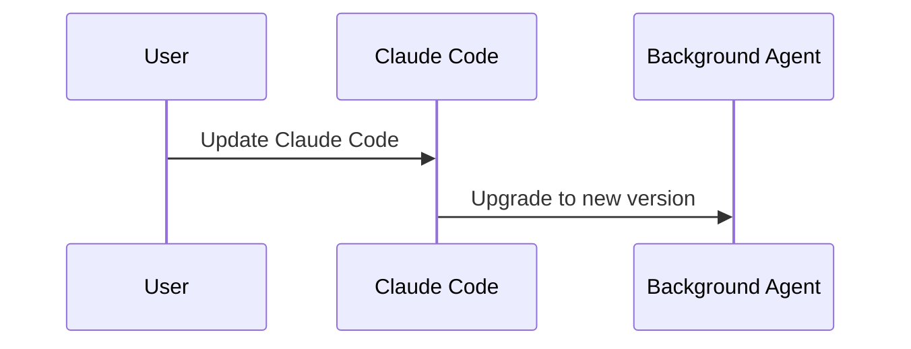

# Claude Code v2.1.206 アップデートまとめ

> 出典: https://code.claude.com/docs/en/changelog#2-1-206

## 💡 注目ポイント

### 1. `/cd` コマンドにディレクトリパス提案機能を追加

`/add-dir` コマンドと同様に、`/cd` コマンドでもディレクトリパスの候補を提示するようになりました。これにより、ディレクトリ移動がよりスムーズに行えるようになります。

### 2. `/doctor` コマンドで `CLAUDE.md` ファイルのトリミング提案

`/doctor` コマンドを実行すると、コードベースから推測できる内容を含む `CLAUDE.md` ファイルをトリミングする提案が表示されるようになりました。これにより、不要な情報の削除が容易になります。

### 3. `/commit-push-pr` コマンドの `git push` 自動許可機能の拡張

`/commit-push-pr` コマンドが、リポジトリの設定されたプッシュ先（`remote.pushDefault` または唯一のリモート）への `git push` を自動で許可するようになりました。これにより、プッシュ操作がより便利になりました。

### 4. `/login` コマンドで Anthropic 運営のパブリックゲートウェイエンドポイントをサポート

`/login` コマンドが、Anthropic が運営するパブリックゲートウェイエンドポイントをサポートするようになりました。これにより、ログインオプションが増え、より柔軟な認証が可能になりました。

### 5. バックグラウンドエージェントのバージョンアップグレードの改善

バックグラウンドエージェントが、Claude Code の更新直後にバックグラウンドで新しいバージョンにアップグレードされるようになりました。これにより、セッションのアップグレードがよりスムーズに行えるようになりました。

## 📋 変更一覧

### ✨ 新機能

| 変更 | 誰にどう嬉しいか |
|---|---|
| `/cd` コマンドにディレクトリパス提案機能を追加 | ディレクトリ移動がよりスムーズに |
| `/doctor` コマンドで `CLAUDE.md` ファイルのトリミング提案 | 不要な情報の削除が容易に |
| `/commit-push-pr` コマンドの `git push` 自動許可機能の拡張 | プッシュ操作がより便利に |
| `/login` コマンドで Anthropic 運営のパブリックゲートウェイエンドポイントをサポート | ログインオプションが増え、より柔軟な認証が可能に |

### ⬆️ 改善

| 変更 | 誰にどう嬉しいか |
|---|---|
| バックグラウンドエージェントのバージョンアップグレードの改善 | セッションのアップグレードがよりスムーズに |
| `/code-review` の品質改善 | コードレビューの精度が向上 |
| agents view のステータス列の改善 | ステータス表示がより見やすく |

### 🐛 バグ修正

| 変更 | 誰にどう嬉しいか |
|---|---|
| 期限切れのログインが誤ったエラーメッセージを表示する問題を修正 | 正確なエラーメッセージが表示され、問題の解決が容易に |
| `claude --resume` と `--continue` がキーボード入力に応答しない問題を修正 | キーボード入力が正しく反応し、操作がスムーズに |
| MCP サーバーのタイムアウト設定が無視される問題を修正 | タイムアウト設定が正しく反映され、長時間の操作が可能に |
| `CLAUDE_CODE_EXTRA_BODY` が無視される問題を修正 | 環境変数が正しく反映され、カスタマイズが可能に |
| OAuth MCP サーバーの再認証が必要な問題を修正 | 自動再認証が可能になり、操作が中断されずに済む |
| `--permission-prompt-tool` がクラッシュする問題を修正 | クラッシュせずに正常に動作し、操作が安定する |
| `/model` ピッカーの価格表示が誤っている問題を修正 | 正確な価格が表示され、選択が容易に |
| `/model` ピッカーのモデル行の配置が誤っている問題を修正 | 正しい位置にモデルが表示され、選択が容易に |
| デスクトップセッションが "running" のままになる問題を修正 | 正常に終了し、次の操作が可能に |
| Windows でキーボード入力が無視される問題を修正 | キーボード入力が正しく反応し、操作がスムーズに |
| `claude rm` で削除されたジョブが再表示される問題を修正 | 正しく削除され、リストから消える |
| `/remote-control` がログアウト時に "Unknown command" を表示する問題を修正 | 正しい説明が表示され、操作が容易に |
| ワークフロー詳細ビューで左矢印が機能しない問題を修正 | 正しく機能し、操作がスムーズに |
| `/status` が同じ警告を二重に表示する問題を修正 | 重複した警告が表示されなくなり、読みやすくなる |
| 不正な "disused plugin" のヒントと LSP プラグインの使用統計の歪みを修正 | 正確なヒントが表示され、統計が正確に |
| `/doctor` の更新チェックが Homebrew インストールと cask のチャンネルを比較するように修正 | 正しいバージョン比較が行われ、更新が容易に |
| フルスクリーンのジャンプトゥボトムピルが macOS で Ctrl+End を提案する問題を修正 | 正しいショートカットが表示され、操作がスムーズに |
| Bedrock で `awsCredentialExport` ヘルパーを使用する際の多分間の起動ハングを修正 | 正常に起動し、操作が可能に |
