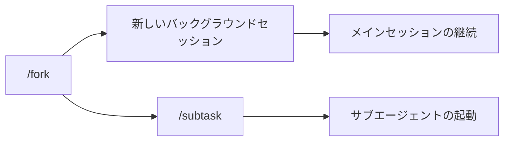

# Claude Code v2.1.212 アップデートまとめ

> 出典: https://code.claude.com/docs/en/changelog#2-1-212

## 💡 注目ポイント

### 1. `/fork` コマンドの挙動変更 — バックグラウンドセッションの分岐が可能に

`/fork` コマンドは、会話を新しいバックグラウンドセッションにコピーするようになりました。これにより、メインセッションを継続しながら別の作業を行うことができます。以前は `/fork` がサブエージェントを起動していましたが、これは `/subtask` コマンドに変更されました。

### 2. セッション全体の WebSearch ツール呼び出し制限 — 無限ループを防止

WebSearch ツールの呼び出しにセッション全体の制限を追加しました（デフォルトは 200 回、`CLAUDE_CODE_MAX_WEB_SEARCHES_PER_SESSION` で調整可能）。これにより、無限の検索ループを防止できます。

### 3. サブエージェント生成のセッション制限 — 無限委譲を防止

サブエージェントの生成にもセッション制限を追加しました（デフォルトは 200 個、`CLAUDE_CODE_MAX_SUBAGENTS_PER_SESSION` で調整可能）。これにより、無限の委譲ループを防止できます。`/clear` コマンドで制限をリセットできます。

### 4. 長時間実行中の MCP ツールの自動バックグラウンド化 — セッションの利用可能性を維持

MCP ツールが 2 分以上実行されている場合、自動的にバックグラウンドに移動するようになりました。これにより、セッションが利用可能状態を保ちます。閾値は `CLAUDE_CODE_MCP_AUTO_BACKGROUND_MS` で設定可能です。

### 5. `/resume` コマンドの改善 — 過去のセッションを簡単に再開

エージェントビューで `/resume` と入力すると、過去のセッション（削除されたセッションを含む）のピッカーが開き、選択したセッションをバックグラウンドで再開できます。

## 📋 変更一覧

### ✨ 新機能

| 変更 | 誰にどう嬉しいか |
|---|---|
| `claude auto-mode reset` コマンドの追加 | デフォルトの自動モード設定を復元できる |
| `/resume` コマンドの改善 | 過去のセッションを簡単に再開できる |

### ⬆️ 改善

| 変更 | 誰にどう嬉しいか |
|---|---|
| WebSearch ツールの呼び出し制限 | 無限ループを防止し、セッションの安定性を向上 |
| サブエージェント生成の制限 | 無限委譲を防止し、セッションの安定性を向上 |
| 長時間実行中の MCP ツールの自動バックグラウンド化 | セッションが利用可能状態を保ち、作業の効率を向上 |
| プロンプトキャッシングの改善 | LLM ゲートウェイやカスタムベース URL でもプロンプトキャッシングが機能する |
| バックグラウンドエージェントアタッチの改善 | セッション起動中にフォーマットされたトランスクリプトを即座に表示 |

### 🐛 バグ修正

| 変更 | 誰にどう嬉しいか |
|---|---|
| ファイル修正 Bash コマンドの実行時の権限プロンプト不足の修正 | セキュリティが向上し、意図しないファイル操作を防止 |
| `.claude/worktrees` のシンボリックリンクに続くワークツリー作成の修正 | リポジトリ外のファイル作成を防止 |
| `continue:false` フックの修正 | フックの正常な動作が保証され、エラー報告が改善 |
| SIGTERM による Bash ツールのプロセスツリーの孤立の修正 | コマンドが正しく終了し、プロセスツリーが適切にクリーンアップ |
| Windows での PowerShell 5.1 ブロック時の `/background` と `claude --bg` の修正 | Windows 環境でのバックグラウンドセッションの作成が可能に |
| シェルモードでのファイルパスを含むコマンドの実行不能の修正 | シェルモードでファイルパスを含むコマンドが正しく実行可能に |
| 自動モード拒否通知の文字化け修正 | 通知が正しく表示され、ユーザーエクスペリエンスが向上 |
| Ctrl+J による改行挿入の修正 | エージェントビューで改行が正しく挿入され、入力がスムーズに |
| `/ultrareview` コマンドの様々な修正 | PR レビューが正しく機能し、エラーメッセージが改善 |
| ホスト管理セッションの起動失敗の修正 | セッションが正しく起動し、エラーメッセージが改善 |
| その他の多数のバグ修正 | システムの安定性とユーザーエクスペリエンスの向上 |
