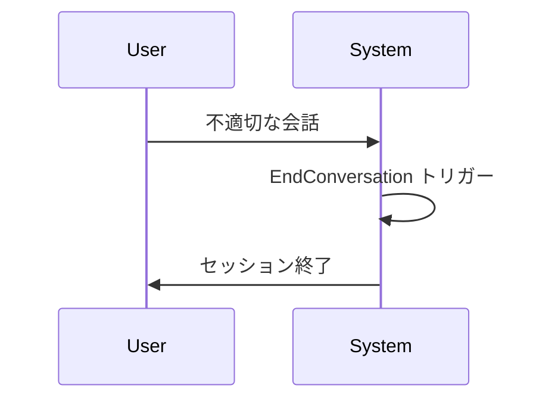

# Claude Code v2.1.214 アップデートまとめ

> 出典: https://code.claude.com/docs/en/changelog#2-1-214

## 💡 注目ポイント

### 1. 悪意のある会話の自動終了

EndConversation ツールが追加され、高度に不適切なユーザーや脱獄試行に対してセッションを自動終了できるようになりました。これにより、不適切な会話を早期に遮断し、システムの健全性を維持できます。

### 2. 長時間実行ツールコールの進捗ハートビート

長時間実行するツールコールに定期的な進捗ハートビートが追加され、以前のようにサイレントになることがなくなりました。これにより、長時間の操作中も進捗状況を把握できます。

### 3. メモリファイルに ISO 修正タイムスタンプを追加

メモリファイルのフロントマターに ISO 形式の `modified` タイムスタンプが追加されました。これにより、メモリファイルの更新履歴をより正確に追跡できます。

### 4. OpenTelemetry ログイベントに追加属性

`message.uuid`、`client_request_id`、`tool_source` の属性が OpenTelemetry ログイベントに追加され、メッセージレベルの相関とツールのプロベナンスを可能にしました。これにより、ログのトレーサビリティが向上します。

### 5. 権限プロンプトの改善

複数の `docker` コマンドや Bash コマンドに対して、権限プロンプトが追加または改善されました。これにより、潜在的なセキュリティリスクを軽減し、ユーザーの操作をより安全にします。

## 📋 変更一覧

### 🚨 セキュリティ修正

| 変更 | 誰にどう嬉しいか |
|---|---|
| Windows PowerShell 5.1 セッションでの実行コマンドに対する権限チェックバイパスを修正 | セッションのセキュリティが向上 |
| Bash パーミッションチェックが file-descriptor redirect 形式で失敗する問題を修正 | Bash スクリプトの安全性が向上 |
| 非常に長いコマンド（10,000 文字以上）が自動実行されるのを修正 | 長いコマンドの実行がより安全に |

### ✨ 新機能

| 変更 | 誰にどう嬉しいか |
|---|---|
| EndConversation ツールの追加 | 不適切な会話を自動終了 |
| 長時間実行ツールコールの進捗ハートビートの追加 | 長時間操作中の進捗状況の把握 |
| メモリファイルに ISO `modified` タイムスタンプの追加 | メモリファイルの更新履歴の追跡 |
| OpenTelemetry ログイベントに `message.uuid`、`client_request_id`、`tool_source` 属性の追加 | ログのトレーサビリティの向上 |
| `docker` コマンドや Bash コマンドに対する権限プロンプトの追加 | 潜在的なセキュリティリスクの軽減 |

### ⬆️ 改善

| 変更 | 誰にどう嬉しいか |
|---|---|
| `dir/**` フックの `if:` 条件を `<cwd>/dir` に一致するように変更 | フックの動作がより予測可能に |
| `-m`/`--magic-file` または `-f`/`--files-from` を使用する `file` コマンドに権限を要求 | ファイル操作の安全性が向上 |
| 古い接続エラー後に keep-alive 接続プーリングを無効化 | 接続の安定性が向上 |
| SessionStart フックがフォークとして開始されたセッションを `"fork"` として報告 | セッションの開始方法がより明確に |

### 🐛 バグ修正

| 変更 | 誰にどう嬉しいか |
|---|---|
| GrowthBook 機能が null を評価したときのクラッシュを修正 | システムの安定性が向上 |
| マルフォームなフラグペイロードがキャッシュされた機能フラグを消去するバグを修正 | 機能フラグの正確性が向上 |
| `pkill -f` パターンが CLI 自身のプロセスに誤ってマッチしたときのクラッシュを修正 | セッションの安定性が向上 |
| `--settings` がデバイスファイルやマルチGBファイルを指すときの無限メモリ成長を修正 | メモリ使用量が制御可能に |
| 企業プロキシの後ろでストリーミングターンが "Socket is closed" で失敗する問題を修正 | ストリーミングの安定性が向上 |
| 遅い読み取り SDK/パイプライン消費者のためのストリーム JSON 出力の切り捨てを修正 | 出力の完全性が向上 |
| スケジュールされたタスクが自身の設定されたプロンプトを不信任入力として拒否する問題を修正 | タスクの正確性が向上 |
| 子プロセスが標準入力を待機しているときに PowerShell ツールコマンドがハングする問題を修正 | PowerShell ツールの安定性が向上 |
| PowerShell ツールで Python スクリプトが UnicodeDecodeError でクラッシュする問題を修正 | Python スクリプトの互換性が向上 |
| PowerShell ツールで Python スクリプトが UnicodeEncodeError でクラッシュする問題を修正 | Python スクリプトの互換性が向上 |
| PowerShell ツールが `where.exe`、`fc.exe`、`diff.exe` をエラーとして報告する問題を修正 | PowerShell ツールの正確性が向上 |
| PowerShell ツールが Windows PowerShell 5.1 で UTF-16LE ファイルを書き出す問題を修正 | ファイル互換性が向上 |
| 置換されたバックグラウンドデーモンがシャットダウン時に後継のコントロールソケットを削除する問題を修正 | バックグラウンドデーモンの安定性が向上 |
| アイドル状態のバックグラウンドセッションがバックグラウンドデーモンとワーカープロセスを無期限に alive にする問題を修正 | バックグラウンドセッションの管理が改善 |
| アイドル状態のバックグラウンドサービスで完了したバックグラウンドセッションを削除できない問題を修正 | バックグラウンドセッションの管理が改善 |
| 非 git フォルダからディスパッチされたバックグラウンドセッションをエージェントビューから削除できない問題を修正 | バックグラウンドセッションの管理が改善 |
| 停止したバックグラウンドセッションを再開したときに保存された会話を復元できない問題を修正 | バックグラウンドセッションの復元が改善 |
| Remote Control が明示的に有効でないセッションで "session ready" プッシュ通知が送信される問題を修正 | Remote Control の通知が適切に |
| `/install-github-app` と `/mcp` 設定メニューがエージェントビューセッションでブロックされる問題を修正 | 設定メニューのアクセスが改善 |
| `--settings` CLI フラグで有効化されたプラグインがロードされない問題を修正 | プラグインのロードが改善 |
| 長時間実行セッションで OAuth トークンが回転した後に機能フラグが古くなる問題を修正 | 機能フラグの正確性が向上 |
| `/ultrareview` がマージベースのないリポジトリで拒否される問題を修正 | `/ultrareview` の使用が改善 |
| `claude update` と `claude doctor` がシェル設定パスがディレクトリのときにハングする問題を修正 | コマンドの実行が改善 |
| メモリファイルが保存されるときにインライン `#` でメモリフロントマターの値が切り捨てられる問題を修正 | メモリファイルの保存が改善 |
| 複数の累積 `message_delta` フレームを発行するストリームでセッションコストとトークンテレメトリが二重カウントされる問題を修正 | テレメトリの正確性が向上 |
| アドバイザーが思考中に表示される不要な "ネットワークを確認してください" 警告を修正 | ユーザーエクスペリエンスの向上 |
| フックの stdout JSON がスキーマ検証に失敗したときに exit code 2 がブロックしない問題を修正 | フックの動作が改善 |
| ターンの非同期コンテキスト外で発行された OTel ログイベントがインタラクションスパンのトレースコンテキストを欠落する問題を修正 | ログイベントの正確性が向上 |
| プロンプト/リソースのリフレッシュ中の MCP の一時的なエラーがサーバーのスラッシュコマンドとリソースをクリアする問題を修正 | MCP の安定性が向上 |
| `claude rc` ワークスペーストラストエラーをホームディレクトリで改善 | ワークスペーストラストの説明が明確に |
