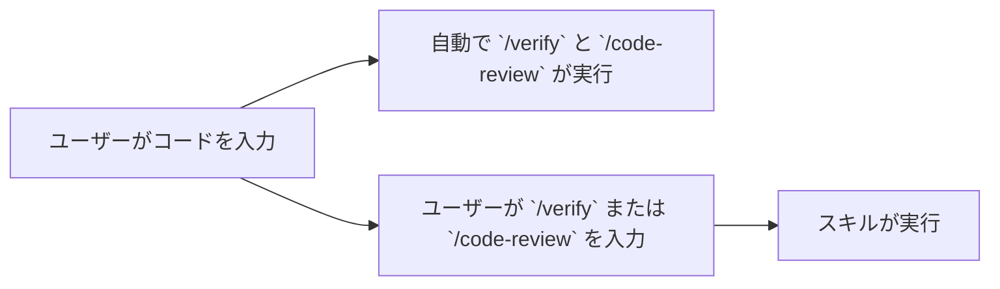

# Claude Code v2.1.215 アップデートまとめ

> 出典: https://code.claude.com/docs/en/changelog#2-1-215

## 💡 注目ポイント

### 1. `/verify` と `/code-review` スキルの自動実行停止

これまで自動で実行されていた `/verify` と `/code-review` スキルが、このバージョンから自動実行されなくなりました。これらのスキルを利用したい場合は、`/verify` または `/code-review` コマンドを明示的に入力する必要があります。

これまでの自動実行では、不要なスキルの実行によって処理時間が長くなることがありました。この変更により、ユーザーは必要な時にのみスキルを実行できるようになり、処理時間の短縮が期待できます。

## 📋 変更一覧

### ⬆️ 改善

| 変更 | 誰にどう嬉しいか |
|---|---|
| `/verify` と `/code-review` スキルの自動実行停止 | 不要なスキルの実行による処理時間の長さが解消される |

### 📝 その他

| 変更 | 誰にどう嬉しいか |
|---|---|
| `/verify` と `/code-review` スキルは明示的にコマンド入力が必要に | スキルの実行をコントロールできるようになる |
