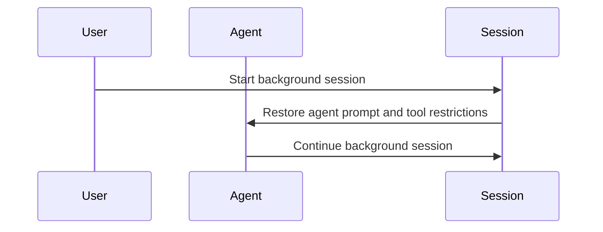

# Claude Code v2.1.216 アップデートまとめ

> 出典: https://code.claude.com/docs/en/changelog#2-1-216

## 💡 注目ポイント

### 1. 長時間セッションのパフォーマンス改善

長時間のセッションでメッセージ正規化コストがターン数に応じて二乗関数的に増大し、マルチセカンドの停止や遅い再開を引き起こす問題を修正しました。これにより、長時間のセッションでもスムーズな操作が可能になります。

### 2. ファイルシステム分離のスキップ設定追加

`sandbox.filesystem.disabled` 設定を追加し、ネットワークの出力制御を維持しながらファイルシステムの分離をスキップできるようになりました。これにより、ファイルシステムの分離が不要な場合でもネットワーク制御を維持できます。

### 3. バックグラウンドセッションの改善

バックグラウンドセッションでエージェントのプロンプトとツール制限が復元されるようになりました。また、バックグラウンドセッションがデフォルトエージェントに戻る問題を修正しました。

### 4. `/ultrareview` エラーメッセージの改善

`/ultrareview` コマンドで diff が大きすぎる場合のエラーメッセージが改善され、設定された制限、測定された diff サイズ、および最大の寄与ファイルが表示されるようになりました。

### 5. クラウドセッションの安定性向上

クラウドセッションでコンテナが再起動中に in-flight メッセージがドロップされる問題を修正しました。中断されたターンは再開時に再実行されるようになり、セッションが応答しなくなる問題が解消されました。

## 📋 変更一覧

### ✨ 新機能

| 変更 | 誰にどう嬉しいか |
|---|---|
| `sandbox.filesystem.disabled` 設定の追加 | ファイルシステム分離をスキップできる |

### ⬆️ 改善

| 変更 | 誰にどう嬉しいか |
|---|---|
| 長時間セッションのパフォーマンス改善 | 長時間のセッションでもスムーズな操作が可能 |
| バックグラウンドセッションのエージェントプロンプトとツール制限の復元 | バックグラウンドセッションが正しく動作 |
| `/ultrareview` エラーメッセージの改善 | diff が大きすぎる場合の原因がわかりやすくなった |
| `/code-review ultra` 空 diff メッセージの改善 | ベースリファレンスが明示され、適切なベースの指定が提案される |
| spend limit 調整プロンプトの改善 | サーバー側の理由が表示され、変更が拒否された場合の理解が深まる |
| `/context` と `/compact` のエラー表示の改善 | コンテキストウィンドウの超過や `/compact` の失敗が明示的に表示される |
| `/rewind` の改善 | シンボリックリンクやハードリンクを通じてファイルを復元または削除しないようになり、スキップしたパス数が報告される |
| バックグラウンドセッションの `/mcp` と `/install-github-app` の改善 | "needs input" リクエストがエージェントビューにパークされる |
| バンドルされた dataviz スキルの更新 | デフォルトのチャートパレットの再配置と 4 シリーズチャートへの直接ラベルのガイダンスの修正 |

### 🐛 バグ修正

| 変更 | 誰にどう嬉しいか |
|---|---|
| auto mode での "HTTP 401" 分類子エラーの修正 | OAuth トークンが期限切れまたはセッション中にローテーションされた後もコマンドが拒否されなくなる |
| AskUserQuestion の修正 | 自由形式の回答が中立的な言葉で表示されるようになる |
| アイドル状態のセッションでの質問の再表示と回答の破棄の修正 | セッションがアイドル状態になった後も正しい質問と回答が維持される |
| @-mentions の修正 | ファイル修正フック、vim の dot-repeat、ペースト、ステータスラインの再開時の二重実行、および再開ピッカーの失敗時のハングが修正される |
| worktree-isolated サブエージェントの git リダイレクトの修正 | git が共有チェックアウトにリダイレクトされなくなる |
| 作業ディレクトリが選択されたプロジェクトと一致しない場合の worktree セッションの修正 | 別のプロジェクトの残りの worktree に着地しなくなる |
| git リポジトリがない worktree のバックグラウンドセッションの削除不可の修正 | バックグラウンドセッションが正しく削除可能になる |
| `claude daemon stop --any` による無関係なプロセスの終了の修正 | 古いレガシーデーモンロックファイルによる無関係なプロセスの終了が防止される |
| アイドルプロンプトでの Esc-Esc によるリワインドピッカーの開かない問題の修正 | 長時間実行セッションでバックグラウンドタスクがある場合でもリワインドピッカーが開くようになる |
| Bash コマンドの複合ステートメントのパーミッションチェックの修正 | `&&` リストや否定内のリダイレクトを含む複合ステートメントのパーミッションチェックが正しく行われる |
| エージェントリストでの Ctrl+X 二回押しによるセッション削除の失敗と削除されたセッションの再表示の修正 | セッションが正しく削除され、再表示されなくなる |
| 高優先度のメッセージ到着時のバックグラウンドサブエージェントのキャンセルの修正 | バックグラウンドサブエージェントが正しく動作するようになる |
| GUI エディタが開いている間のターミナルでのマウスとフォーカスのガベージの修正 | `/memory` がエディタの閉鎖を待たなくなる |
| Claude-in-Chrome の再接続時の 403 ループの修正 | セッションの OAuth トークンに必要なスコープが不足している場合でもループしなくなる |
| `.claude` のシンボリックリンクに従うワークフロー保存とスケジュールされたタスクの書き込みの修正 | プロジェクト外への書き込みが防止される |
| MCP の再認証による有効な認証情報の取り消しの修正 | 再接続の needs-auth メッセージが正しいコマンドを指すようになる |
| Windows での読み取り専用コマンドによるネットワークパスへのアクセスの修正 | パーミッションプロンプトが表示されるようになる |
| Bash コマンドの非 ASCII 文字のパーシングの修正 | 実際のシェルワード境界に一致するようになる |
| PowerShell ツールの不可視 Unicode 文字を含むコマンドのパーミッション検証の修正 | 正しいパーミッション検証が行われるようになる |
| フルスクリーンモードでのダイアログの右端パネルを超えての伸びの修正 | ダイアログが正しく表示されるようになる |
| フルスクリーンモードでの `/config` 設定リストのキーボードヒントフッターのクリッピングの修正 | キーボードヒントフッターが正しく表示されるようになる |
| 104 列より狭いターミナルでのトランスクリプトモード (Ctrl+O) フッターヒントのラッピングの修正 | フッターヒントが正しく表示されるようになる |
| Prometheus メトリクスエンドポイントの無効な `# UNIT` 行の排出の修正 | メトリクスエンドポイントが正しく動作するようになる |
| セッション中のスキルとコマンドの変更がスラッシュメニューに反映されない問題の修正 | セッション中のスキルとコマンドの変更がスラッシュメニューに正しく反映されるようになる |
| `name` フロントマターフィールドを持つプラグインスキルがスラッシュコマンドオートコンプリートでプラグインプレフィックスを失う問題の修正 | プラグインスキルが正しいプレフィックスで表示されるようになる |
| テレメトリによるパーミッション拒否の誤報告の修正 | 失敗したパーミッションプロンプトリクエストはユーザー拒否としてカウントされなくなり、ユーザー中断はユーザー中断として報告されるようになる |
| VSCode での右から左へのテキスト (アラビア語、ヘブライ語、ペルシャ語) の英語やコードと混在した際の逆順レンダリングの修正 | 右から左へのテキストが正しくレンダリングされるようになる |
