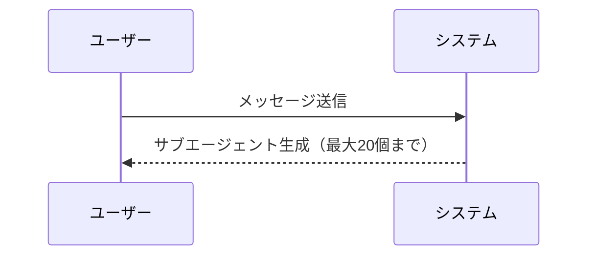

# Claude Code v2.1.217 アップデートまとめ

> 出典: https://code.claude.com/docs/en/changelog#2-1-217

## 💡 注目ポイント

### 1. 絵文字ショートコードのオートコンプリート機能

プロンプト入力時に絵文字ショートコードを入力すると、候補が表示される機能が追加されました。例えば、`:heart:` と入力すると ❤️ が挿入されます。`emojiCompletionEnabled` 設定で無効化できます。

### 2. トランスクリプト書き込み失敗時の警告

ディスク容量不足やセッション保存がオフになっている場合、トランスクリプト書き込みが失敗してもサイレントに失敗するのではなく、警告が表示されるようになりました。

### 3. サブエージェントの同時実行上限の導入

同時に実行できるサブエージェントに上限（デフォルト20）を設け、1つのメッセージが無制限にバックグラウンドエージェントを生成することを防ぎました。`CLAUDE_CODE_MAX_CONCURRENT_SUBAGENTS` で上限を変更できます。

### 4. サブエージェントのネスト制限の変更

デフォルトでサブエージェントのネストが禁止され、`CLAUDE_CODE_MAX_SUBAGENT_SPAWN_DEPTH` 設定でネストを許可する深さを設定できるようになりました。

### 5. 予算上限の適用範囲拡大

`--max-budget-usd` オプションで設定した予算上限が、バックグラウンドサブエージェントにも適用されるようになりました。上限に達すると新規の生成は拒否され、実行中のエージェントも停止されます。

## 📋 変更一覧

### ✨ 新機能

| 変更 | 誰にどう嬉しいか |
|---|---|
| 絵文字ショートコードのオートコンプリート | 絵文字の挿入が簡単になる |
| トランスクリプト書き込み失敗時の警告 | 書き込み失敗の原因がわかりやすくなる |

### ⬆️ 改善

| 変更 | 誰にどう嬉しいか |
|---|---|
| footer PR badge リンクの改善 | ターミナルサポートが検出できない環境でもリンクがクリック可能になる |
| ログイン有効期限警告のタイミング変更 | 有効期限が近づいたタイミングで警告が表示される |
| frontend-design プラグイン提案の制限 | 同じ提案が繰り返し表示されなくなる |

### 🐛 バグ修正

| 変更 | 誰にどう嬉しいか |
|---|---|
| メモリリークの修正 | セッション中のメモリ使用量が減少する |
| Windows 自動更新失敗の修正 | 更新失敗による `claude.exe` の欠落が解消される |
| シンボリックリンクの正規化修正 | セッションがワークスペースフォルダから脱出する問題が解消される |
| `/compact` コマンドの修正 | Claude Opus 4.8 で `/compact` コマンドが正しく動作するようになる |
| 設定無視の問題修正 | デスクトップセッションで設定が正しく反映されるようになる |
| 画面読み上げモードの修正 | 起動時のアナウンスが正しく行われるようになる |
| テレメトリ設定の修正 | 設定が正しく適用されるようになる |
| マルフォームドな添付ファイルエントリの問題修正 | `/resume` コマンドが正しく動作するようになる |
| リモートコントロールセッションの修正 | 接続後に権限プロンプトが表示されるようになる |
| バックグラウンドシェルの停止不能問題の修正 | バックグラウンドシェルが正しく停止できるようになる |
| フロントマター値の brace expansion 制限 | CLI の起動が安定する |
| トランスクリプトプレビューのレイアウト修正 | トランスクリプトが正しく表示されるようになる |
| `--max-budget-usd` の適用範囲拡大 | 予算上限が正しく適用されるようになる |
