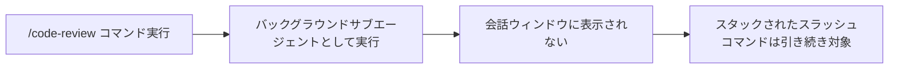

# Claude Code v2.1.218 アップデートまとめ

> 出典: https://code.claude.com/docs/en/changelog#2-1-218

## 💡 注目ポイント

### 1. `/code-review` がバックグラウンドサブエージェントとして実行されるように変更

これまでは `/code-review` コマンドを実行すると、レビュー作業が会話ウィンドウに表示され、スタックされたスラッシュコマンドがレビューの対象となっていました。今回の変更により、レビュー作業はバックグラウンドサブエージェントとして実行されるようになり、会話ウィンドウがレビュー作業で埋まることがなくなりました。また、スタックされたスラッシュコマンドは引き続きレビューの対象となります。

### 2. 削除テキストのスクリーンリーダーアナウンスが追加

`--ax-screen-reader` モードで、単語や行の削除（`Option+Delete`、`Ctrl+W`、`Cmd+Backspace`、`Ctrl+U`、`Ctrl+K`）を行った際に、削除されたテキストがスクリーンリーダーでアナウンスされるようになりました。

### 3. Windows パスの `\u` プレフィックスセグメントが CJK 文字に変換される問題を修正

ツール入力で Windows パスの `\u` プレフィックスセグメント（例：`C:\Users\unicorn`）が CJK 文字に変換され、ファイルにアクセスできなくなっていた問題を修正しました。

### 4. 左矢印キーで会話を破棄する問題を修正

編集後に左矢印キーを押すと会話が破棄され、元に戻せない問題を修正しました。現在は編集後に左矢印キーを押すと確認を求め、エージェントビューで Esc を押すとバックグラウンドにした会話に戻ります。

### 5. `/ultrareview` コマンドの改善

`/ultrareview` コマンドに説明的な引数（例：`review my auth changes`）を指定すると、現在のブランチのレビューが実行され、テキストが結果にメモとして適用されるようになりました。また、エラーフィードバックが改善され、無効な引数を修正して再試行するようになりました。

## 📋 変更一覧

### ✨ 新機能

| 変更 | 誰にどう嬉しいか |
|---|---|
| 削除テキストのスクリーンリーダーアナウンス | 視覚障害のあるユーザーが削除操作をより把握しやすくなる |
| HTTP ステータスとエラーテキストを `claude mcp list` と `/mcp` に追加 | サーバー接続失敗時のエラー情報がわかりやすくなる |
| 隠れた先頭または末尾の空白を含む MCP 設定値に警告を表示 | 設定値の誤りを防ぐことができる |

### ⬆️ 改善

| 変更 | 誰にどう嬉しいか |
|---|---|
| `/ultrareview` コマンドの改善 | コマンドの使いやすさと結果の正確性が向上する |
| auto モードの改善 | 安全性チェックが自動で行われ、ユーザーの操作が簡素化される |
| サンドボックスコマンド制限の改善 | IDE との対話がより安全になる |
| 信頼ダイアログの改善 | 付与される権限の範囲が明確になる |

### 🐛 バグ修正

| 変更 | 誰にどう嬉しいか |
|---|---|
| Windows パスの `\u` プレフィックスセグメントが CJK 文字に変換される問題を修正 | Windows ユーザーが正しいパスでファイルをアクセスできるようになる |
| 左矢印キーで会話を破棄する問題を修正 | 誤って会話を破棄してしまうリスクが減少する |
| マルチラインペーストが 1 行に折り畳まれる問題を修正 | ペーストした内容が正しく表示されるようになる |
| `/context` コマンドのトークン使用量報告が古いままになる問題を修正 | 正確なトークン使用量が把握できるようになる |
| `/code-review ultra` コマンドが非対話型セッションでローカルレビューを実行する問題を修正 | クラウドレビューが正しく実行されるようになる |
| ゲートウェイ支出計測の Bedrock アプリケーションインフェレンスプロファイル ARN とその他の設定マッピング上流モデル ID の価格設定を修正 | 正確な価格設定が行われるようになる |
| 長い IDE 選択が途中で絵文字で切り捨てられると文字化けする問題を修正 | 正しい文字列が表示・選択できるようになる |
| ツール実行エラーがサイレントでドロップされる可能性がある問題を修正 | エラーが正しく表示され、対処できるようになる |
| エンジンの終了時にファントムターンが開始され放棄される可能性がある問題を修正 | 安定した動作が期待できるようになる |
| 中断されたツール呼び出し後に "[Request interrupted by user]" メッセージが表示される問題を修正 | 正確なエラーメッセージが表示されるようになる |
| VoiceOver が入力の末尾のスペースを "new line" と読み上げる問題を修正 | 正確な読み上げが行われるようになる |
| プラグインと設定パネルがターミナルカーソルをフォーカスした行に移動しない問題を修正 | スクリーンリーダーや拡大鏡が正しく動作するようになる |
| 深くネストされた監視ディレクトリツリーが削除または移動された際にクラッシュする問題を修正 | 安定した動作が期待できるようになる |
| セッションが終了した直後にプルリクエストイベントが稀に失われる問題を修正 | プルリクエストイベントが正しく記録されるようになる |
| Bedrock セットアップウィザードがパーティション AWS リージョンやプロキシ専用ネットワークでプロファイル検証に失敗する問題を修正 | 正しくプロファイル検証が行われるようになる |
| システムクロック調整後にターンの期間測定が負または不正確になる問題を修正 | 正確なターン期間が測定されるようになる |
| "N MCP サーバーが認証を必要とする" スタートアップ通知が claude.ai コネクタを過剰にカウントする問題を修正 | 正確なカウントが行われるようになる |
| プロンプト履歴エントリが競合または失敗した書き込みでドロップまたは複製される問題を修正 | 正確なプロンプト履歴が保持されるようになる |
| コンテキストオーバーフローエラー後に同一の失敗リクエストを再送信する再試行ループを修正 | 正しいリクエストが送信されるようになる |
| エージェントフロンターフックが信頼されていないフォルダから実行される問題を修正 | エージェントファイル自体のフォルダがワークスペースの信頼を受けている必要がある |
| コンパクト化後にフォークシージョンのリネージが失われる問題を修正 | 正しいリネージが保持されるようになる |
| 履歴に不正なデルタアタッチメントが含まれていると再開セッションが失敗またはクラッシュする問題を修正 | 安定した動作が期待できるようになる |
| リモートセッションがワーカーが置き換えられた後もハートビートを送信し続ける問題を修正 | 長寿命のデスクトップや IDE プロセスが拒否されたリクエストを数秒ごとに永遠に再試行しなくなる |
