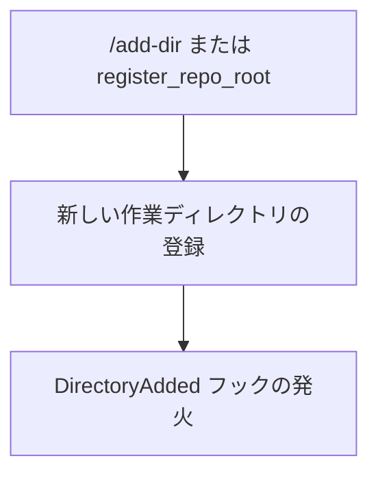

# Claude Code v2.1.219 アップデートまとめ

> 出典: https://code.claude.com/docs/en/changelog#2-1-219

## 💡 注目ポイント

### 1. Claude Opus 5 の追加とデフォルトモデル化

新たに Claude Opus 5 (`claude-opus-5`) が追加され、デフォルトの Opus モデルとなりました。1M のコンテキストを持ち、fast モードでは $10/$50 の価格で提供されます。これにより、より高速かつ大規模なコンテキストでの処理が可能になります。

### 2. `DirectoryAdded` フックの追加

`/add-dir` コマンドや SDK の `register_repo_root` コントロールリクエストで新しい作業ディレクトリを登録した際に発火する `DirectoryAdded` フックが追加されました。これにより、セッション中に新しいディレクトリが追加されたことを検知し、適切な処理を行うことができます。

### 3. 動的ワークフローのサイズガイドラインの変更

動的ワークフローのデフォルトのサイズガイドラインが変更され、中サイズ（15 エージェント未満）がデフォルトとなりました。`/config` で他のサイズや無制限に変更可能です。

### 4. サブエージェントのネスト深さの増加

サブエージェントはデフォルトで最大深さ 3 までネスト可能になりました（以前は 1）。`CLAUDE_CODE_MAX_SUBAGENT_SPAWN_DEPTH=1` を設定してネストを無効にすることもできます。

### 5. `/model` ピッカーの改善

`/model` ピッカーで、最新のモデル名のみがハイライトされるようになりました。これにより、新規リリースが明確に表示されます。

## 📋 変更一覧

### ✨ 新機能

| 変更 | 誰にどう嬉しいか |
|---|---|
| `claude-opus-5` の追加 | より高速かつ大規模なコンテキストでの処理が可能に |
| `sandbox.network.strictAllowlist` 設定の追加 | サンドボックスコマンドで許可リスト外のホストを拒否可能に |
| `DirectoryAdded` フックの追加 | 新しい作業ディレクトリの追加を検知可能に |
| `mcp_server_errors` の追加 | ヘッドレス stream-json 初期イベントで `--mcp-config` エントリのスキップを一覧表示 |
| `workflowSizeGuideline` 設定キーの追加 | 動的ワークフローサイズガイドラインを設定ファイルから設定可能に |
| ネストされたサブエージェントの転送の追加 | 深さ 2 以上のサブエージェントが `--forward-subagent-text` 設定で表示可能に |

### ⬆️ 改善

| 変更 | 誰にどう嬉しいか |
|---|---|
| `/model` ピッカーの改善 | 最新モデルが明確に表示されるように |
| `claude --teleport` の改善 | 現在のチェックアウト先リポジトリを表示 |

### 🐛 バグ修正

| 変更 | 誰にどう嬉しいか |
|---|---|
| `claude -p` テキスト出力のバグ修正 | 中断エラー時に既に出力された回答が失われないように |
| `claude mcp list` と `/mcp` のエラー表示の改善 | HTTP ステータスとエラーテキストを表示 |
| 許可されたアクションの保持修正 | セルフホステッドランナーの再起動中に許可されたアクションが失われないように |
| Fable モデル行の表示修正 | プランに含まれているにも関わらず "Requires usage credits" と表示されるバグを修正 |
| セルフホステッドランナーの終了処理の改善 | SIGTERM が到着した際にクリーンに登録解除されるように |
| コピーオンセレクトのバグ修正 | GNU screen 内で選択したテキストを正しくコピーできるように |
| Remote Control クライアントのステータス修正 | モデル切り替えや再接続後に正しい fast-mode ステータスを保持するように |
| `CLAUDE_CODE_GIT_BASH_PATH` のバグ修正 | Windows で bash/sh バイナリでない場合に無視されるように |
| Vim モードのバグ修正 | 空のプロンプトで ← を押した際に正しくエージェントビューに戻るよう |
| スクリーンリーダーモードのバグ修正 | 入力行全体を書き換えずに入力された文字のみをエコーするように |
| エラーメッセージの改善 | "Remote Control is only available via api.anthropic.com" エラーに原因となる設定を表示 |

### 📝 その他

| 変更 | 誰にどう嬉しいか |
|---|---|
| 動的ワークフローのデフォルトサイズ変更 | 中サイズ（15 エージェント未満）がデフォルトに |
| MCP allowlist/denylist の変数解決の変更 | 起動環境と管理設定環境から解決するように |
| `/model` ピッカーのハイライト変更 | 最新モデルのみがハイライトされるように |
| 実行中のワークフローステータスラインにデフォルトワークフローサイズを追加 | 現在のデフォルトワークフローサイズを表示 |
| Opus 4.7 の fast モードからの削除 | `/fast` は Opus 5 と Opus 4.8 に適用されるように |
| claude-api スキルのデフォルトモデル変更 | Claude Opus 5 に変更、Opus 4.8 からの移行パスを提供 |
