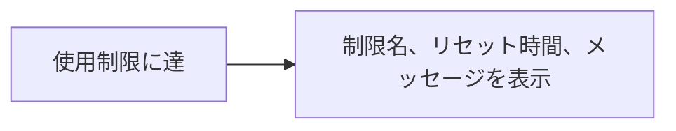

# Claude Code v2.1.225 アップデートまとめ

> 出典: https://code.claude.com/docs/en/changelog#2-1-225

## 💡 注目ポイント

### 1. ゲートウェイの使用制限サポート追加

ゲートウェイの使用制限に対応し、制限に達した際には制限名、リセット時間、およびオペレーターのメッセージが表示されるようになりました。これにより、ユーザーは制限の詳細を把握し、適切な対応を取ることができます。

### 2. ワークスペースの信頼性プロンプト追加

`claude agents` コマンドで、信頼されていないディレクトリに対してワークスペースの信頼性プロンプトが表示されるようになりました。これにより、ユーザーは安全に操作を行うことができます。

### 3. 一時的な 401 エラーの修正

長時間有効な `CLAUDE_CODE_OAUTH_TOKEN` を短時間有効なトークンに置き換える際の一時的な 401 エラーが修正されました。これにより、ヘッドレスセッションが再起動するまで中断されることがなくなりました。

### 4. Remote Control の改善

Remote Control で、Claude アプリから添付された写真が直接表示されるようになりました。これにより、別のツールコールを使用してディスクから読み込む必要がなくなりました。

## 📋 変更一覧

### ✨ 新機能

| 変更 | 誰にどう嬉しいか |
|---|---|
| ゲートウェイの使用制限サポート追加 | 制限の詳細を把握し、適切な対応を取れる |
| ワークスペースの信頼性プロンプト追加 | 安全に操作を行う |

### ⬆️ 改善

| 変更 | 誰にどう嬉しいか |
|---|---|
| Remote Control の改善 | 写真が直接表示され、別のツールコール不要 |

### 🐛 バグ修正

| 変更 | 誰にどう嬉しいか |
|---|---|
| 一時的な 401 エラーの修正 | ヘッドレスセッションが中断されない |
| MCP OAuth サーバーの 401 エラー修正 | macOS での認証問題が解消 |
| 安全フィルターの拒否修正 | モデルが正しく動作する |
| クロスセッションメッセージの修正 | メッセージが適切に管理される |
| 会話履歴の修正 | 長い会話でも正しく再開される |
| エージェントリストのディレクトリ変更修正 | 正しいディレクトリでエージェントが開始される |
| `claude self-hosted-runner` のエラー修正 | 明確なエラーメッセージが表示される |
| Web セッションの誤報告修正 | セッションが正しく報告される |
| VSCode の Focus view の折りたたみ修正 | 最新の To-Do リストやコンテキストが表示 |
| SendMessage の改善 | リモートコントロールセッションに直接メッセージ送信可能 |
| SendMessage の受信者確認修正 | 同名セッションとの誤認を防ぐ |
