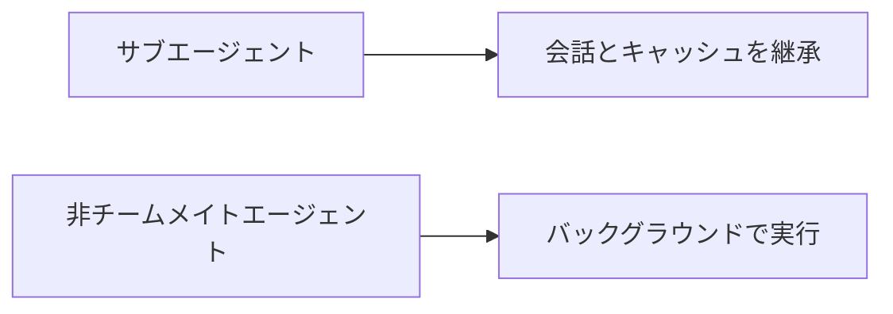
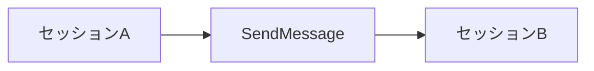

# Claude Code v2.1.232 アップデートまとめ

> 出典: https://code.claude.com/docs/en/changelog#2-1-232

## 💡 注目ポイント

### 1. サブエージェントのフォーキングがデフォルトで有効に

`subagent_type: "fork"` のサブエージェントは、フルの会話とプロンプトキャッシュを継承します。また、チームメイト以外のエージェントは、インタラクティブセッションでデフォルトでバックグラウンドで実行されます。

これまでは、サブエージェントのフォーキングを手動で有効にする必要がありましたが、今後はデフォルトで有効になります。これにより、サブエージェント間の会話の継続性が向上し、非チームメイトエージェントの処理がバックグラウンドで行われるため、メインセッションのパフォーマンスが向上します。

### 2. セッション間の直接メッセージ送信が可能に

プロンプトに `@` と入力して、別の Claude セッションの名前を指定すると、Claude が `SendMessage` を使用してそのセッションに直接メッセージを送信します。

これまでは、別のセッションにメッセージを送信する際に、確認用のリファレンスを要求されていましたが、今後は正確に一致するセッション名を指定するだけで直接メッセージを送信できるようになります。これにより、セッション間のコミュニケーションがよりスムーズになります。

### 3. クロスセッションメッセージの設定追加

`/config` に「ダイアログ有効期限」と「他のセッションからのメッセージ」の設定行が追加されました。これにより、クロスセッションの受信メッセージを承認/保留/拒否することができます。

### 4. GitLab トークンのシークレットレッドアクションとサポート追加

GitLab トークンファミリー (`glrt-`, `gloas-`, `glptt-`, `glagent-`, `glimt-`, `glsoat-`, `glcbt-`, `glft-`, `glffct-`) のシークレットレッドアクションと、`glpat-`/`gldt-` トークンのフルレッドアクションが追加されました。また、`glab` CLI の設定ストアに `gh` と同じサンドボックスとクレデンシャルパスの保護が追加されました。

### 5. リモートコントロールセッションの改善

リモートコントロールセッションの再開時やアイドル状態での接続問題が修正され、セッションの復元が改善されました。また、クラウドセッション内のブリッジによってホストされるリモートコントロールセッションが、そのセッションのトランスクリプトやクレデンシャルを継承しないようになりました。

## 📋 変更一覧

### ✨ 新機能

| 変更 | 誰にどう嬉しいか |
|---|---|
| サブエージェントのフォーキングがデフォルトで有効に | サブエージェント間の会話の継続性が向上 |
| セッション間の直接メッセージ送信が可能に | セッション間のコミュニケーションがスムーズに |
| `/config` に「ダイアログ有効期限」と「他のセッションからのメッセージ」の設定行追加 | クロスセッションの受信メッセージを管理可能に |
| GitLab トークンのシークレットレッドアクションとサポート追加 | GitLab トークンのセキュリティが向上 |
| GitLab サポートをプラグインマーケットプレイスに追加 | GitLab リポジトリのクローンが容易に |

### ⬆️ 改善

| 変更 | 誰にどう嬉しいか |
|---|---|
| フルスクリーンストリーミングの改善 | 長いセッションでもレスポンシブに |
| マネージド設定承認ダイアログの改善 | エンドポイントURLの表示、テレメトリ変更の明確な表現 |
| `/feedback` と `/bug` がレスポンス中に即座に開くように | フィードバックの送信がスムーズに |
| `/plugin install plugin@marketplace` がマーケットプレイスを自動更新 | 新しく公開されたプラグインをすぐにインストール可能に |
| `/code-review` がバックグラウンドエージェントで実行 | コードレビューの処理がバックグラウンドで行われるように |
| リモートコントロールセッションの再接続ロジックの改善 | ネットワークの不安定さに強く |

### 🐛 バグ修正

| 変更 | 誰にどう嬉しいか |
|---|---|
| PowerShell のパーミッションバイパスの修正 | コマンドの実行が正しく制御されるように |
| Windows のパーミッションバイパスの修正 | ファイルアクセスが正しく制御されるように |
| ネストされた git リポジトリの信頼継承の修正 | 各リポジトリが独自の信頼確認を必要とするように |
| MCP 接続のハング修正 | 接続のタイムアウトが正しく処理されるように |
| リモートコントロールセッションのトランスクリプト/クレデンシャルの継承修正 | セッションが正しく分離されるように |
| リモートコントロールセッションの再開時の再接続修正 | セッションが正しく再接続されるように |
| リモートコントロールセッションのアイドル状態での接続修正 | セッションが正しく接続されるように |
| リモートコントロールセッションの復元修正 | セッションの復元が正しく行われるように |
| クラウドゲートウェイ `/login` の修正 | マネージド設定の読み込みエラーが正しく表示されるように |
| ボイスモードの修正 | ボイスサービスの接続拒否が即座に表示されるように |
| mTLS クライアント証明書ローテーションの修正 | 証明書のローテーションが自動で行われるように |
| AWS または Vertex リージョン値の修正 | 不正なリージョン値がデフォルトリージョンにフォールバックするように |
| ストリームアイドルタイムアウトエラーの修正 | エラーが発生してもリクエストが回復するように |
| コンテンツサイズオーバーレイのレンダリング修正 | テキストが正しく表示されるように |
| シェルコマンドやエージェント説明のプレビューの修正 | プレビューが正しく表示されるように |
| プラグインマーケットプレイスの登録解除の修正 | プラグインマーケットプレイスが正しく登録されるように |
| `/update` と `/tui` の再起動拒否の修正 | 再起動が正しく行われるように |
| 使用制限ガイダンスの修正 | 利用可能なスラッシュコマンドが正しく提案されるように |
| インタラクティブ `--advisor fable` 起動の同意メッセージの修正 | 正しいコマンドが提案されるように |
| エージェントパネルの更新 | 完了したサブエージェントが即座に非表示になり、オーバーフローインジケータが左に移動 |
| リモートコントロールセッションの終了メッセージの改善 | セッションの終了理由が正しく表示されるように |
| Bash 入力リダイレクトのパーミッションチェックの修正 | リダイレクトが正しく制御されるように |
| 完了したバックグラウンドエージェントの再開メッセージの短縮 | メッセージが簡潔になるように |
| Cowork セッションの外部 @-import のインライン化の修正 | 外部ファイルのインポートが正しく制御されるように |
| クロスセッションメッセージングソケットディレクトリの強化 | セキュリティが向上 |
| Linux ファイルシステムサンドボックスの保護パスバイパスの修正 | セキュリティが向上 |
| `sandbox.ripgrep` の設定変更 | プロジェクト設定がサンドボックスの ripgrep バイナリをオーバーライドできなくなるように |
| カスタムサブエージェントの作成を提案するスタートアップチップの削除 | 不要な通知が削除されるように |
