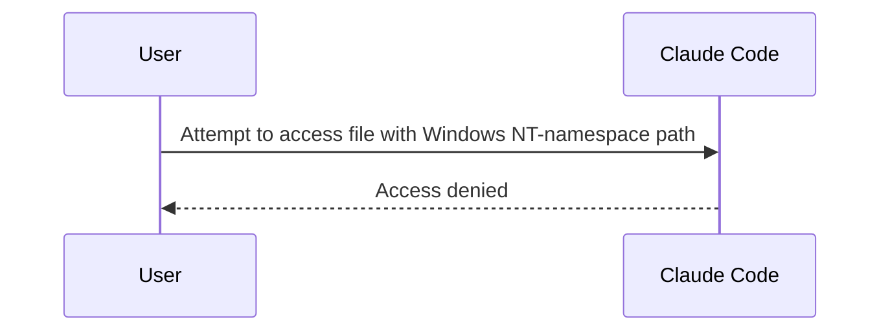

# Claude Code v2.1.234 アップデートまとめ

> 出典: https://code.claude.com/docs/en/changelog#2-1-234

## 💡 注目ポイント

### 1. セッション自動継続機能の追加

Claude Code は、claude.ai の使用制限がリセットされると、セッションを自動的に継続するようになりました。この機能は `/config` でオフにできます。長時間の作業を中断せずに続けられるようになります。

### 2. `selection:clear` キーバインドアクションの追加

選択したテキストをクリアするキーバインドアクションが追加されました。アプリ内のテキスト選択やエージェントビューで動作します。誤った選択を素早く解除できます。

### 3. GitLab マージリクエストバッジの追加

GitLab リモートと認証済みの glab CLI を持つリポジトリでは、フッターとステータスラインに MR!N のバッジが表示され、ドラフト/保留/緑の状態を示します。GitLab ユーザーは PR のステータスを一目で確認できます。

### 4. セキュリティ強化：Windows NT-namespace パスの拒否

リモートファイル読み込み、セッション復元、CLAUDE.md インクルード、ワークフロースクリプト、ファイルアップロードで Windows NT-namespace (`\??\`) パスが拒否されるようになりました。NTLM クレデンシャルリークベクトルに対する残りの事前承認ファイルアクセスが強化されます。

### 5. リモートコントロールの改善

リモートコントロールセッションで、別の claude.ai アカウントや組織にサインインすると、実行中のセッションが数秒以内に停止し、理由が表示されます。また、セッションの権限モードやモデルの変更が、接続されたクライアントに公開されます。

## 📋 変更一覧

### ✨ 新機能

| 変更 | 誰にどう嬉しいか |
|---|---|
| `CLAUDE_CODE_PROJECT_DIR_NAME` 環境変数の追加 | セッションごとに独自の設定ディレクトリを持つホストが、プロジェクトごとのトランスクリプトディレクトリに短い名前を選べる |
| `selection:clear` キーバインドアクションの追加 | アプリ内のテキスト選択やエージェントビューで選択をクリアできる |
| GitLab マージリクエストバッジの追加 | GitLab ユーザーは PR のステータスを一目で確認できる |
| セッション自動継続機能の追加 | 長時間の作業を中断せずに続けられる |

### ⬆️ 改善

| 変更 | 誰にどう嬉しいか |
|---|---|
| トランスクリプトの改善：自身のプロンプトがマークダウンでレンダリングされる | 自身のプロンプトと返信が同じように表示される |
| "API が空または不正な応答を返しました" エラーメッセージの改善 | 何が返ってきたか（コンテンツタイプ、ボディの種類、サイズ、リクエストID）と、元のストリーミングリクエストが失敗した理由が表示される |
| 自動生成されたセッションタイトルの改善 | 短く具体的な名前（例： "Login button bug"）で表示される |
| 組み込み `claude-api` スキルのコンテキストコスト削減 | リファレンスドキュメントをオンデマンドで読み込むことで、~200k+ トークンから ~25k に削減 |

### 🐛 バグ修正

| 変更 | 誰にどう嬉しいか |
|---|---|
| auto モードで非常に長いセッションでサンドボックスコマンドのネットワークアクセスを繰り返し再チェックし否定する問題の修正 | 長時間のセッションでコマンドが正しく実行される |
| セッションスコープの権限回答がバックグラウンドサブエージェントツールの権限プロンプトでドロップされる問題の修正 | 権限プロンプトが正しく処理される |
| 非ストリーミングフォールバックパスで API レスポンスが思考ブロックまたはテキストブロックのフィールドを欠いている場合のクラッシュの修正 | API レスポンスが正しく処理される |
| 特殊な Unicode シーケンスを含むメッセージのマークダウンレンダリングが極めて遅くなる問題の修正 | マークダウンが正しくレンダリングされる |
| `SendMessage` が `ListAgents` からコピーした受信者を拒否する問題の修正 | 長いセッション名や絵文字が多いセッション名でも正しく動作する |
| リポジトリ検出が git リモートのホストを誤読する問題の修正 | 正しいホストでリポジトリ固有の動作が行われる |
| MCP 診断が解決済みのシークレットを印刷する問題の修正 | スコープの競合警告が設定された `${VAR}` 形式で表示される |
| `strictKnownMarketplaces` が SCP スタイルの git マーケットプレイスソースを受け入れる問題の修正 | 正しいホストに接続される |
| モーダルテキストがフルスクリーンでコピーされる際に文字が失われる問題の修正 | モーダルテキストが正しくコピーされる |
| レンダリングされたマークダウンの `---` 水平ルールが次の行に影響する問題の修正 | マークダウンが正しくレンダリングされる |
| 連続するシェルコマンドが todo/task 更新が挟まれていると複数の "Ran 1 shell command" 行に分割される問題の修正 | シェルコマンドが正しく表示される |
| `!` シェルコマンドが実行中に `/permissions` のようなダイアログが開かれ、コマンドが終了すると解除される問題の修正 | ダイアログが正しく表示される |
| キューに入れられた `!` シェルコマンドが上矢印で編集するとプレーンテキストとしてモデルに送信される問題の修正 | コマンドが正しく送信される |
| キューに入れられたメッセージがプロンプト履歴に再表示される問題の修正 | メッセージが正しく表示される |
| "Try the new fullscreen renderer?" プロンプトを受け入れる際にセッションの権限モードがリセットされる問題の修正 | セッションの権限モードが保持される |
| `/tui` が起動時の `--allowed-tools`/`--disallowed-tools` ルールをドロップする問題の修正 | セッションの制限が保持される |
| 信頼プロンプトがリポジトリワイドスコープの警告を省略する問題の修正 | 正しい警告が表示される |
| IDE の diff タブが閉じる際に許可プロンプトが新しい入力で回答される問題の修正 | プロンプトが正しく回答される |
| Remote Control セッションでファイルをユーザーに送信する際にアップロードされない問題の修正 | ファイルが正しく開かれる |
| `/login` 後に `CLAUDE_CODE_OAUTH_TOKEN` が設定されている際に古いトークンのリマインダーが漏れる問題の修正 | リマインダーが正しく表示される |
| 権限プレビューがチャンネルサーバーに中継される際に認可ゲートを通過しない問題の修正 | 権限プレビューが正しく中継される |
| 権限プレビューでクレデンシャルマスキングがコマンドやパスを隠す問題の修正 | コマンドやパスが正しく表示される |
| プロバイダー API トークンがシェルデリミタの直後にマスクされない問題の修正 | トークンが正しくマスクされる |
| Claude Desktop のセッション間でのメッセージがサイレントにドロップされる問題の修正 | メッセージが正しく送信される |
| Remote Control セッションで別の claude.ai アカウントや組織にサインインすると、実行中のセッションが停止され、理由が表示される | セッションが正しく停止され、理由が表示される |
| Remote Control セッションで権限モードやモデルが更新されない問題の修正 | 権限モードやモデルが正しく更新される |
| `SendMessage` と `ListAgents` がセッションリストが長すぎて完全にチェックできない際にエラーを返さない問題の修正 | セッションリストが正しくチェックされる |
| 期限切れの Anthropic プロファイルクレデンシャルが `/login` を指示しない問題の修正 | `/login` が正しく指示される |
| `/permissions` が Claude が作業中に開けない問題の修正 | `/permissions` が正しく開かれる |
| `/add-dir`、`/autocompact`、`/theme`、`/help`、`/config`、`/advisor` ダイアログが作業中に開けない問題の修正 | ダイアログが正しく開かれる |
| `/goal` が回復不能なエラーでターンが死んだ際にクリアされない問題の修正 | `/goal` が正しくクリアされる |
| `/goal` がバックグラウンドタスクが 30 分以上待機している際にチェックインしない問題の修正 | `/goal` が正しくチェックインする |
| `claude setup-token` が予期せぬ追加引数を拒否しない問題の修正 | `claude setup-token` が正しく動作する |
| フルスクリーンモードでの Esc がマウスのテキスト選択をクリアする問題の修正 | 選択が正しく保持される |
| auto モードがすべての Agent ツールコールの下に "Allowed by auto mode classifier" 行を表示する問題の修正 | 不要な行が表示されなくなる |
| "Default teammate model" 設定が `/config` から削除された問題の修正 | エージェントチームのチームメイトがリーダーのモデルを使用する |
| 実行中のツールヘッダーの経過時間カウンターが太字のカウントと競合する問題の修正 | 経過時間カウンターが正しく表示される |
| ターン間で配信されるバックグラウンドタスク通知が `<system-reminder>` タグでモデルに送信されない問題の修正 | 通知が正しく送信される |
| Mantle が main-loop モデルが既に選択されている際に admin-pin の可用性プローブをスキップしない問題の修正 | admin-pin の可用性プローブが正しくスキップされる |
| Windows が `~/.claude.json` が読み取り専用の際に起動が繰り返しリネーム試行で停止する問題の修正 | 起動が正しく行われる |
