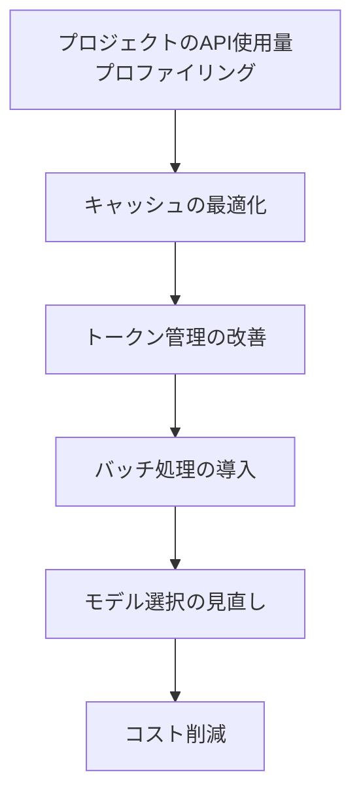

# Claude Code v2.1.247 アップデートまとめ

> 出典: https://code.claude.com/docs/en/changelog#2-1-247

## 💡 注目ポイント

### 1. `SendFeedback` ツールの追加 — セッションで問題が発生した際にフィードバックレポートを簡単に作成

セッション中に問題が発生した場合、`SendFeedback` ツールを利用してフィードバックレポートを簡単に作成できるようになりました。`/feedback` からレビューと送信が可能で、`feedbackDrafts` 設定で無効化できます。

### 2. `/claude-api cost-optimize` コマンドの追加 — プロジェクトの Claude API コストを最適化

既存のプロジェクトの Claude API 使用量をプロファイリングし、キャッシュ、トークン管理、バッチ処理、モデル選択などのコスト削減レバーを1つずつ測定しながら最適化できます。

### 3. `/claude-api` スキルの更新 — Admin API のカバレッジ拡大

組織メンバー、招待、ワークスペース、APIキー、レート制限レポート、ワークロードアイデンティティフェデレーション、CMEK などの Admin API 機能が `/claude-api` スキルに追加されました。

### 4. セキュリティと安定性の向上 — 複数の重要なバグ修正

複数の重要なバグが修正され、セキュリティと安定性が向上しました。例えば、矢印キーとEnterの組み合わせで履歴検索が誤動作する問題、サブエージェントがモデル404エラーで死亡する問題、大量のエラー出力でセッションが停止する問題などが修正されています。

## 📋 変更一覧

### ✨ 新機能

| 変更 | 誰にどう嬉しいか |
|---|---|
| `SendFeedback` ツールの追加 | 問題発生時のフィードバック作成が簡単になる |
| `/claude-api cost-optimize` コマンドの追加 | プロジェクトのAPIコストを最適化できる |
| `/claude-api` スキルの更新 | Admin API機能が利用可能になる |

### ⬆️ 改善

| 変更 | 誰にどう嬉しいか |
|---|---|
| Sonnet 5 のデフォルト auto-compact ウィンドウを 1M コンテキストに変更 | セッションがより効率的に動作する |
| クロスセッションピアメッセージをデフォルトで折りたたむように変更 | メッセージ一覧が読みやすくなる |
| ターミナルハイパーリンクのレンダリングを変更 | 安全なリンクのみが表示される |

### 🐛 バグ修正

| 変更 | 誰にどう嬉しいか |
|---|---|
| 矢印キーとEnterの組み合わせで履歴検索が誤動作する問題を修正 | 正確な履歴検索が可能になる |
| サブエージェントがモデル404エラーで死亡する問題を修正 | セッションが安定して動作する |
| 大量のエラー出力でセッションが停止する問題を修正 | セッションが停止せずに動作する |
| Ctrl キーボードショートカットが非ラテンキーボードで動作しない問題を修正 | 様々なキーボードレイアウトでショートカットが使える |
| マウスレポートがプロンプトに不正な文字列を挿入する問題を修正 | プロンプトが正しく表示される |
| Bash サンドボックスのクリーンアップが dotfile 管理の設定ファイルを削除する問題を修正 | 設定ファイルが正しく管理される |
| `/terminal-setup` が Zed の keymap.json を上書きする問題を修正 | keymap.json が正しくマージされる |
| `/rename` がセッションレジストリを更新できない場合にサイレントで確認する問題を修正 | セッション名の変更が正しく通知される |
| `/compact` と "Summarize from here" がデフォルトのシステムプロンプトで要約する問題を修正 | 会話のプロンプトで正しく要約される |
| バックグラウンドセッションが "opening…" と永遠に表示される問題を修正 | セッションが正しく終了し、再起動できる |
| フックまたはバックグラウンドタスクの出力ファイルが書き込めない場合の無制限のメモリ成長を修正 | 出力ファイルの損失位置が記録される |
| `/install-github-app` が SSH で正しく動作しない問題を修正 | 正しいサインインURLが表示される |
| フォアグラウンドから引き継がれたシェルコマンドがバックグラウンドセッションで内部エラーをログに記録する問題を修正 | コマンドが正しく終了する |
| バージョンなしのマーケットプレイスプラグインのライブキャッシュディレクトリが削除される問題を修正 | セッションが正しく動作する |
| `/remote-control` で開始されたリモートコントロールセッションがワーキングツリーの差分を報告しない問題を修正 | 差分が正しく報告される |
| セルフホステッドランナーセッションが Claude Code の開始前に `running` と報告する問題を修正 | 正しい通知が送られる |
| 初回セットアップが Anthropic サービスに接続できない場合に終了する問題を修正 | セットアップが正しく完了する |
| クラウドセッションがモードを切り替えた直後に前の権限モードを表示する問題を修正 | 正しい権限モードが表示される |
| クラウドセッションがコンテナの再起動中にサイレントになる問題を修正 | 失われた作業が報告される |
| プラグインマーケットプレイスの強化：制御文字や不可視文字を含む名前が拒否され、`/plugin` と `claude plugin` の出力でマーケットプレイス提供のテキストがエスケープセーフになる | セキュリティが向上する |
| Bedrock、Vertex、Foundry セッション（およびテレメトリが無効なセッション）：構成された MCP サーバーが接続に失敗した場合に Claude に通知される | エラーが正しく報告される |
| プロンプトフッターの PR バッジがターミナルの再フォーカス時に GitHub の再チェックをスキップするように変更 | 不要な再チェックが減る |
| アナリティクスが起動時からオフになるように変更（ログイン後だけでなく） | プライバシーが向上する |
| Claude アプリゲートウェイのサインインリクエストが Claude Code を識別するように変更 | 正しいユーザーエージェントが使用される |
| 組織のサインイン強制が管理者設定が読み取れない場合に開始時に終了するように変更 | 正しいエラーハンドリングが行われる |
