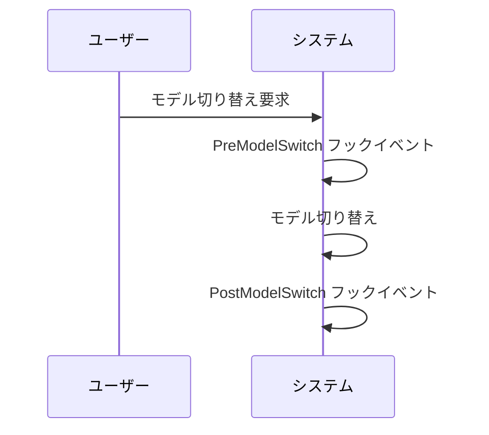

# Claude Code v2.1.251 アップデートまとめ

> 出典: https://code.claude.com/docs/en/changelog#2-1-251

## 💡 注目ポイント

### 1. `PreModelSwitch` と `PostModelSwitch` フックイベントの追加

モデル切り替えの前後にフックイベントを追加しました。これにより、モデル切り替えをブロック、確認、または注釈付けすることができます。

### 2. フォアグラウンドサブエージェントのツールコールと結果のライブストリーミング

フォアグラウンドサブエージェントのツールコールと結果がリモートコントロールクライアントにライブストリーミングされるようになりました。バックグラウンドサブエージェントは引き続きステータスのみを表示します。

### 3. 使用量ページに支出制限バーを追加

`/usage` コマンドに支出制限バーを追加し、支出制限のある開発者向けに `rate_limits.spend_limit` ステータスラインフィールドを追加しました。

### 4. セッションごとのプロンプトキャッシュラインの追加

`/cost` コマンドにセッションごとのプロンプトキャッシュライン（ヒット率、ミス、再キャッシュされたトークン、ウォーム/コールド）を追加し、ステータスラインスクリプト用の `prompt_cache` オブジェクトを追加しました。

### 5. クラウドセッションの改善

クラウドセッションでネットワークプロキシが接続を切断した際、ツール結果にホストと理由が表示されるようになりました。

## 📋 変更一覧

### ✨ 新機能

| 変更 | 誰にどう嬉しいか |
|---|---|
| `PreModelSwitch` と `PostModelSwitch` フックイベントの追加 | モデル切り替えを管理・制御できる |
| フォアグラウンドサブエージェントのツールコールと結果のライブストリーミング | リアルタイムでサブエージェントの動作を確認できる |
| `/usage` に支出制限バーを追加 | 支出制限を一目で確認できる |
| セッションごとのプロンプトキャッシュラインを `/cost` に追加 | プロンプトキャッシュの使用状況を詳細に確認できる |

### ⬆️ 改善

| 変更 | 誰にどう嬉しいか |
|---|---|
| クラウドセッションのネットワークプロキシ切断時のエラーメッセージ改善 | エラー原因が明確になり、トラブルシューティングが容易になる |

### 🐛 バグ修正

| 変更 | 誰にどう嬉しいか |
|---|---|
| シンボリックリンクの読み書きエラー修正 | 正しいファイルに読み書きできる |
| プラグインコマンドのパストラバーサルエラー修正 | 安全にプラグインコマンドを使用できる |
| プロジェクト設定のバグ修正 | 設定が正しく反映される |
| ワークフローツールのエラー修正 | 正しいスクリプトパスが使用される |
| Grep と Glob の deny ルール適用エラー修正 | 正しいファイルに deny ルールが適用される |
| 空のテキストコンテンツブロックエラー修正 | モデルが思考のみを生成してもエラーにならない |
| 初回起動時のデフォルトモード修正 | 設定に従ったモードで起動する |
| Opus 5 リクエストのエラー修正 | 正しい effort レベルが送信される |
| メッセージ配信のエラー修正 | 正しくメッセージが届く |
| TUI ラグの修正 | 並列サブエージェントでの操作がスムーズになる |
| エージェントチームのエラー修正 | チームリードに正しい最終回答が届く |
| バックグラウンドサブエージェントのメッセージエラー修正 | 正しくメッセージが届く |
| セッション中の managed-settings の修正 | セッションが正しくモードを切り替える |
| コンテキストウィンドウのヒント修正 | 不要なヒントが表示されなくなる |
| クラウドセッションのプロファイルエラー修正 | 正しいプロファイルが使用される |
| モデル変更の誤報修正 | 正確なモデル情報が反映される |
| Remote Control のエラー修正 | 正しいエラーメッセージが表示される |
| `/mcp reconnect` のエラー修正 | 正しいエラーメッセージが表示される |
| ストリームJSON形式のエラー修正 | 正しい結果が返される |
| セッショントランスクリプトの上書きエラー修正 | セッショントランスクリプトが正しく保存される |
| バックグラウンドセッションのファイル編集エラー修正 | 正しくファイルが編集できる |
| プラグインスキルのロードエラー修正 | 正しくプラグインスキルがロードされる |
| テキストの選択エラー修正 | 正しくテキストが選択できる |
| SDK とクラウドセッションのハングエラー修正 | セッションが正しく終了する |
| `/usage-credits` のエラー修正 | 正しいメッセージが表示される |
| `--worktree --tmux` のエラー修正 | 正しいリポジトリがフェッチされる |
| Ctrl+G のエラー修正 | 正しく操作できる |
| `additionalDirectories` のエラー修正 | 正しく設定が読み込まれる |
| MCP サーバーメニューのコピーショートカット修正 | 正しいメッセージが表示される |
| イタリックテキストのレンダリングエラー修正 | 正しく表示される |
| `claude mcp add` ヘルプテキストの修正 | 正しいトランスポートが示される |
| `claude ultrareview` と `/ultrareview` の修正 | 正しく終了する |
| Bash パーミッションチェックのエラー修正 | 正しくプロンプトが表示される |
| バックグラウンドセッションの Vertex/Bedrock ゲートウェイエラー修正 | 正しくリクエストが送信される |
| `claude --bg --model fable` のエラー修正 | 正しく使用クレジットが求められる |
| 一時的なオファーの修正 | 不要なオファーが表示されなくなる |
| managed-settings の承認プロンプト修正 | 正しく表示される |
| `/bug` と `/share` の修正 | 正しいエラーメッセージが表示される |
| クラウドセッション作成のエラー修正 | 正しいメッセージが表示される |

### 📝 その他

| 変更 | 誰にどう嬉しいか |
|---|---|
| CPU 使用率の改善 | セッション中の CPU 使用率が低下する |
| インストールサイズの改善 | インストールサイズが小さくなる |
| `/schedule` の改善 | エラーメッセージがわかりやすくなる |
| メッセージのフレーミング改善 | 正しい送信元が識別される |
| プロンプトプレースホルダーの改善 | 正しい情報が表示される |
| MCP サーバー名の改善 | エラーメッセージがわかりやすくなる |
| Amazon Bedrock セッション開始の改善 | セッション開始が速くなる |
| managed settings の承認ダイアログの改善 | 変更点のみが表示される |
| モデルのツールコールの再試行の改善 | 正しく再試行される |
| `/radio` の変更 | 利用可能なプラットフォームが増える |
| Chrome での Claude の変更 | 正しいパーミッションチェックが行われる |
| `CLAUDE_CODE_SUBAGENT_MODEL` の変更 | デフォルトのサブエージェントモデルが設定される |
| デフォルトのコミットトレーラーの変更 | 正しいトレーラーが使用される |
| デフォルトモデルの変更 | 正しいモデルが使用される |
| `/effort` の変更 | モデルごとにデフォルトの effort レベルが保存される |
| アナリティクスの変更 | 正しく設定が反映される |
| フッター PR バッジの変更 | 正しくバッジが表示・更新される |
| Bash コマンド出力ファイルの変更 | 正しくファイルが作成・読み込まれる |
| プラグイン/LSP インストール提案の変更 | 正しく提案が表示される |
| サーバー管理設定の変更 | 正しく設定が適用される |
| `ANTHROPIC_CUSTOM_HEADERS` の変更 | 正しくヘッダーが設定される |
| プロジェクトレベルの `.claude/settings.json` の変更 | 正しく環境変数が設定される |
| シンタックスハイライトの削除 | バイナリサイズが小さくなる |
| [VSCode] サインイン画面の修正 | 正しいページが開く |
| [VSCode] Remote Control バナーの変更 | 正しく表示される |
