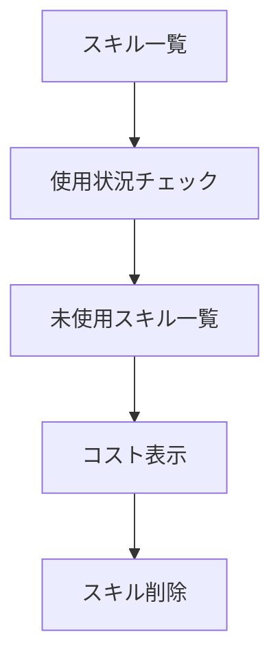

# Claude Code v2.1.261 アップデートまとめ

> 出典: https://code.claude.com/docs/en/changelog#2-1-261

## 💡 注目ポイント

### 1. `/skill-doctor` コマンドの追加 — 未使用スキルの管理とコスト削減

`/skill-doctor` コマンドは、ロードされているスキルのうち未使用のものとそのコンテキストコストを表示します。これにより、不要なスキルを削除してコンテキストコストを削減できます。

### 2. 高速入力時の文字順序修正 — タイピングの正確性向上

高速入力やキーリピート時に、入力した文字が順序が逆になったり欠落したりする問題を修正しました。これにより、タイピングの正確性が向上します。

### 3. `bashOutputMaxChars` と `taskOutputMaxChars` の追加 — コマンド出力の制限緩和

`bashOutputMaxChars` と `taskOutputMaxChars` 設定を追加し、コマンドとバックグラウンドタスクの出力を最大128K文字までインラインで受け取れるようになりました。これにより、大量の出力をファイルに保存する必要がなくなります。

### 4. Remote Control の改善 — リモートセッションの安定性向上

Remote Control セッションの安定性を向上させる複数の修正を行いました。これにより、リモートセッションの使用中に発生する問題が減少し、よりスムーズな操作が可能になります。

### 5. VS Code 統合の改善 — ユーザーエクスペリエンスの向上

VS Code 統合において、複数の改善とバグ修正を行いました。これにより、VS Code での Claude Code の使用がより快適になります。

## 📋 変更一覧

### ✨ 新機能

| 変更 | 誰にどう嬉しいか |
|---|---|
| `/skill-doctor` コマンドの追加 | 未使用スキルの管理とコスト削減 |
| `bashOutputMaxChars` と `taskOutputMaxChars` の追加 | 大量のコマンド出力をインラインで受け取れる |
| `--append-subagent-system-prompt-file` の追加 | サブエージェントシステムプロンプトをファイルから読み込める |
| VS Code: "Build a custom style" の追加 | カスタム出力スタイルを作成できる |
| VS Code: MCP サーバーの追加/削除機能の追加 | MCP サーバーを VS Code 内で管理できる |
| VS Code: セッションリストの改善 | セッションの管理がより直感的になる |

### ⬆️ 改善

| 変更 | 誰にどう嬉しいか |
|---|---|
| `/model` ピッカーと VS Code モデルピルの改善 | モデル名が分かりやすくなる |
| Google Vertex AI の起動改善 | 起動が速くなる |
| ストリーミングパフォーマンスの改善 | 描画が速くなる |
| 危険な `rm` コマンドの安全プロンプトの改善 | 誤操作を防げる |

### 🐛 バグ修正

| 変更 | 誰にどう嬉しいか |
|---|---|
| 高速入力時の文字順序修正 | タイピングの正確性が向上 |
| `/add-dir <subdirectory>` のエラー修正 | 正しいエラーメッセージが表示される |
| Bedrock セットアップウィザードの修正 | セットアップがスムーズになる |
| クラウドセッションのプラグイン同期修正 | プラグインが正しく有効化される |
| インラインイメージチップの前文字削除修正 | 正しく削除できる |
| セッション再開時のコンテキスト修正 | セッションが正しく再開される |
| Remote Control の Permission Mode 修正 | 正しいモードが表示される |
| Remote Control の停止修正 | 正しく停止される |
| Remote Control のイベントストリーム修正 | プロキシ環境でも正しく動作する |
| `gcpAuthRefresh` の修正 | 不要なブラウザ開きがなくなる |
| クラウドコネクタの修正 | セッションが正しく開始される |
| 高CPU使用の修正 | システムリソースが節約される |
| フィーチャーフラグの修正 | 正しいバージョンで適用される |
| `/usage` と VS Code 使用量パネルの修正 | 正確な使用量が表示される |
| `claude -p --resume <file>` の修正 | 正しくセッションが再開される |
| ターミナル進捗インジケーターの修正 | 正しく進捗が表示される |
| レイアウトグリッチの修正 | 正しくレンダリングされる |
| クラウドアプリゲートウェイの IP 修正 | 正しい IP が使用される |
| OpenTelemetry のエクスポート形式修正 | 正しくエクスポートされる |
| セッションのビジー状態修正 | 正しく表示される |
| Chrome のファイルアップロード修正 | 正しくアップロードされる |
| `SendMessage` のオフラインセッション修正 | 正しいステータスが表示される |
| プラグインインストールヒントの修正 | 正しく検出される |
| エージェントチームの初回ターン修正 | 正しくキャッシュされる |
| VS Code のセッションテレポート修正 | 正しく処理される |
| VS Code のセッションタブリネーム修正 | 正しくリネームされる |
| VS Code のセッションリスト修正 | 正しく表示される |
| VS Code のフォーカスビュー修正 | 正しく表示される |
| VS Code のセッションリストハイライト修正 | 正しくハイライトされる |
| VS Code のタブ再開修正 | 正しく再開される |
| VS Code のセッショングループ追加修正 | 正しくグループ化される |
| VS Code のモデルピッカー修正 | 正しくモデルが表示される |
| VS Code のタブジャンプ修正 | 正しく動作する |
| VS Code のサイド質問履歴修正 | 正しく保存される |
| VS Code の保留質問カード修正 | 正しく表示される |
| VS Code のクラウド機能修正 | 正しく表示される |
| VS Code のサインイン画面修正 | 正しく表示される |
| VS Code の権限プロンプト修正 | 正しく動作する |
| VS Code のプラグインインストールリンク修正 | 正しく動作する |
| VS Code のサイドウエージメーターの修正 | 正しく表示される |
| VS Code のセッショングループ新規作成修正 | 正しく動作する |
| VS Code のエディタタブバッジ修正 | 正しく表示される |
| VS Code のリモートコントロール有効化修正 | 正しく動作する |
| VS Code のセッションフィルタ修正 | 正しく動作する |
| VS Code のモデルピッカーUI修正 | 使いやすくなる |
