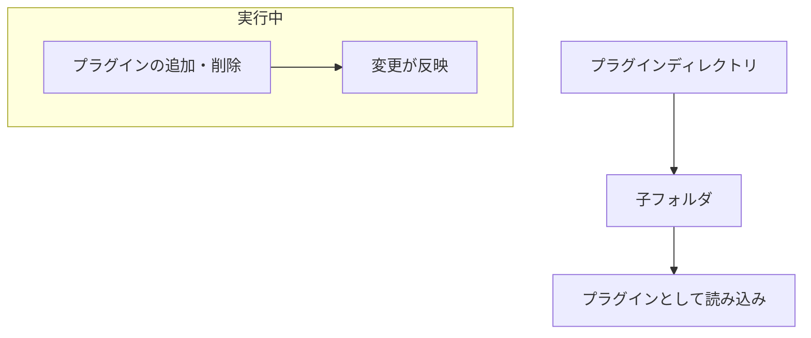
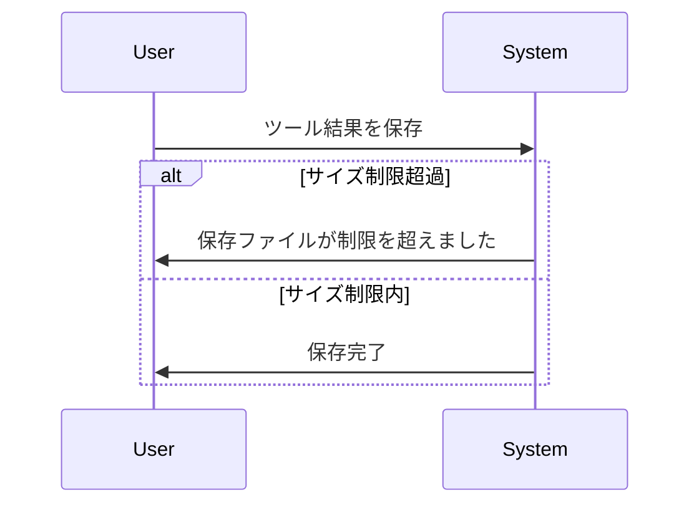
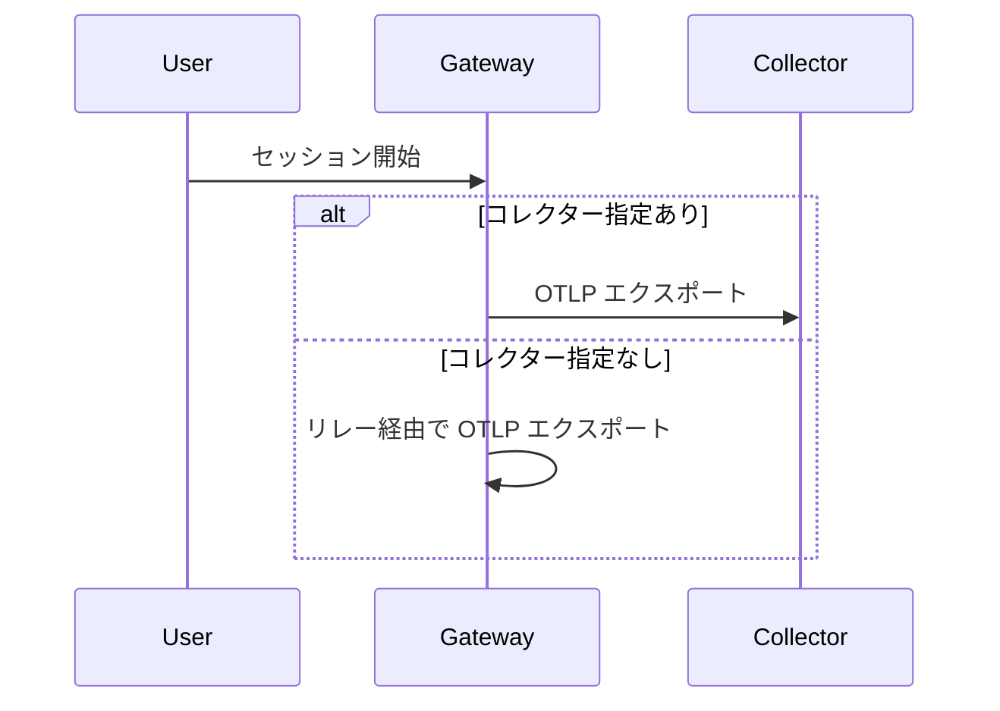

# Claude Code v2.1.265 アップデートまとめ

> 出典: https://code.claude.com/docs/en/changelog#2-1-265

## 💡 注目ポイント

### 1. プラグインディレクトリのサポート強化

`--plugin-dir` オプションで指定したフォルダ内の各子フォルダがプラグインとして読み込まれるようになります。また、実行中にプラグインを追加・削除すると、それが反映されるようになりました。

これまではプラグインを個別に指定する必要があったため、管理が煩雑でした。この変更により、プラグインの管理が容易になり、開発効率が向上します。

### 2. ツール結果の保存サイズ制限

ツール結果の保存サイズに 1 GB の制限が設けられました。保存ファイルが制限を超えると、プレビューにその旨が表示されます。

大容量のツール結果を保存しようとすると、エラーが発生していました。この制限により、保存可能なサイズが明確になり、エラーの発生を防ぎます。

### 3. クラウドアプリゲートウェイセッションの OTLP テレメトリエクスポート変更

クラウドアプリゲートウェイセッションは、管理設定で指定されたコレクターに直接 OpenTelemetry をエクスポートするようになりました。コレクターが指定されていない場合は、引き続きゲートウェイのリレーを使用します。

これまではゲートウェイのリレーを通じて OTLP テレメトリをエクスポートしていました。この変更により、直接コレクターにエクスポートするようになり、テレメトリの送信が効率化されます。

## 📋 変更一覧

### ✨ 新機能

| 変更 | 誰にどう嬉しいか |
|---|---|
| `--plugin-dir` で指定したフォルダ内の各子フォルダがプラグインとして読み込み | プラグインの管理が容易になる |
| 実行中にプラグインを追加・削除すると、それが反映される | プラグインの追加・削除が容易になる |
| VS Code でセッションを自動アーカイブ（新設定「Archive inactive sessions」、デフォルト14日） | 長期間使用していないセッションを自動的にアーカイブし、管理が容易になる |

### ⬆️ 改善

| 変更 | 誰にどう嬉しいか |
|---|---|
| `--worktree` スタートアップが大きなリポジトリで並列チェックアウト | 大きなリポジトリのチェックアウトが速くなる |
| `/workflows` エージェント詳細：ツール呼び出しの状態表示、サブエージェントのタスクリスト表示、Enter で呼び出しの入力と結果の展開 | ワークフローの管理が容易になる |
| プロンプト中のスラッシュコマンド：一致するものがリスト表示、プラグインスキルが裸の名前で見つかる | スラッシュコマンドの使用が容易になる |
| リモート MCP サーバーの認証：実際に認証するまで OAuth クライアントを登録しない | 認証の管理が容易になる |
| 長いセッションの再開時間の改善：多くのファイルを読み込むセッションの再開が速くなる | 長いセッションの再開が速くなる |
| サイズ制限超過の画像のデコードエラーメッセージの改善：原因と対処方法を示す | エラーの原因が明確になり、対処が容易になる |
| Artifact ツールの読み込み：他人が書いたアーティファクトを不審なコンテンツとして扱い、埋め込まれた指示をフラグ付け | アーティファクトの読み込みが安全になる |
| `.claude` フォルダの権限オプションの説明の更新：セッションでプロジェクトの `.claude` フォルダ（または `~/.claude`）のファイルの編集を許可 | `.claude` フォルダの権限が明確になる |

### 🐛 バグ修正

| 変更 | 誰にどう嬉しいか |
|---|---|
| テレメトリに `user.email` と `user.groups` を追加 | テレメトリデータがより詳細になる |
| ツール結果の保存サイズ制限 | 大容量のツール結果を保存しようとするエラーを防ぐ |
| フォアグラウンドで生成されたサブエージェントの再開時のツールリストとシステムプロンプトプレフィックスの変更を修正 | プロンプトキャッシュの再利用が可能になる |
| エージェントチームメイトと再開されたサブエージェントがプロンプトプレフィックスから SubagentStart フックコンテキストとプリロードスキルを移動させないように修正 | プロンプトキャッシュの再利用が可能になる |
| ツールが実行中に前のプロセスが死亡した後の再開を修正：最後のプロンプトは書き換えられなくなり、中断されたツール呼び出しは中断されたままになる | 中断されたツール呼び出しが正しく処理される |
| `/model opusplan[1m]` が「Model not found」で拒否される問題を修正 | 正しいモデルが選択される |
| 許可プロンプトやメッセージのシンタックスハイライトコードが Ruby `?`、Erlang `$`、Perl `$` シギルの後で文字を省略する問題を修正 | シンタックスハイライトが正しく表示される |
| フルスクリーントランスクリプトがスラッシュコマンドや @-ファイル提案リストが開いたり閉じたりするたびに1行ジャンプする問題を修正 | トランスクリプトの表示が安定する |
| プラグインパスにバックスラッシュが含まれていると、macOS と Linux でシンボリックリンクの制限チェックをバイパスする問題を修正 | プラグインパスが正しくチェックされる |
| プラグインディレクトリの名前が2つのドットで始まる場合、プラグインルート外にあると誤って拒否される問題を修正 | プラグインディレクトリが正しく読み込まれる |
| VS Code と SDK セッションがトークンの更新中にセッションが閉じられたときに再ログインを要求する問題を修正 | セッションが正しく再開される |
| リモートコントロールセッションが返信の最後のメッセージの前にターン終了シグナルを送信する問題を修正 | 返信が正しく表示される |
| バックグラウンド (`--bg`) セッションがアイドルタイムアウトの直前にメッセージが到着したときにターンの途中で退役する問題を修正 | セッションが正しく継続される |
| Claude Code 自身の git ステータスと diff プローブがネストされたリポジトリ内のクリーンフィルタを実行する問題を修正 | git ステータスと diff が正しく表示される |
| アドバイザツールとその指示がリクエストのモデルごとに再決定される問題を修正：決定は1回行われ、会話で変更が発表される | アドバイザツールとその指示が正しく決定される |
| アーティファクト公開がコネクタが公開していないコネクタツール名を受け入れる問題を修正：公開は宣言されたツールが存在しない場合は拒否され、一部のみ存在しない場合は警告される | アーティファクト公開が正しく行われる |
| `/add-dir <subdirectory>` が管理設定でスキルのみプラグインにロックされている場合、サブディレクトリのエージェントの読み込みを拒否する問題を修正 | サブディレクトリのエージェントが正しく読み込まれる |
| 2キーのキーボードショートカットが2秒以上遅れて2番目のキーが到着した場合、tmux内部でサイレントキャンセルされる問題を修正：3秒待機し、タイムアウト時に通知を表示する | キーボードショートカットが正しく動作する |
| フォークされたスキル (`context: fork`) がキックオフプロンプトをストリーミングせず、`--forward-subagent-text` でテキストターンをストリーム JSON の進捗イベントとしてストリーミングしない問題を修正 | フォークされたスキルが正しく動作する |
| OS がチェックできないプラグインのデフォルトコンポーネントフォルダ（シンボリックリンクループなど）がサイレントスキップされる問題を修正：`/plugin` でエラーコードと共に報告される | プラグインのデフォルトコンポーネントフォルダが正しくチェックされる |
| Claude アプリゲートウェイの OTLP テレメトリリレーがペイロードを不正形式または大きすぎると判断した後、30秒間すべてのコレクターへの転送を一時停止する問題を修正 | テレメトリリレーが正しく動作する |
| `/plugin` Discover/Browse と `claude plugin list --json --available` がマーケットプレイスプラグインのメタデータが `plugin.json` にのみ存在する場合、説明や表示名を表示しない問題を修正 | プラグインのメタデータが正しく表示される |
| `/login` が管理設定で設定された Claude アプリゲートウェイにサインインしたセッションで再実行されたときに「no gateway URL is configured」と表示される問題を修正 | `/login` が正しく動作する |
| `/model` が設定ファイルに書き込めない場合、「saved as your default」と表示される問題を修正：保存に失敗したことと理由を表示する | モデルの保存が正しく行われる |
| リモートコントロールからの `/clear` がセッションスタートフックとオープンターミナルダイアログを待ってから完了する問題を修正 | `/clear` が正しく動作する |
| `/config` ダイアログがタブを切り替えるたびに高さが変わる問題を修正 | `/config` ダイアログが正しく表示される |
| コンテナが再起動した後のワークフロー実行の再開を修正：実行ジャーナルが欠落している再開は明確なエラーで失敗する | ワークフロー実行の再開が正しく行われる |
| `claude-api` スキルのエラーコード参照が model アクセス失敗で 404、利用不可ベータヘッダーで 400 を返すように修正 | `claude-api` スキルが正しく動作する |
| 非対話型セッション (`-p` でストリーム JSON 入力、Agent SDK、クラウドセッション) が各新しいユーザーメッセージでシェル作業ディレクトリをリセットする問題を修正：`cd` はターン間で持続する | シェル作業ディレクトリが正しく持続する |
| `http` として設定された MCP サーバーがレガシー HTTP+SSE トランスポートのみを話す場合、接続できない問題を修正：Claude Code は SSE にフォールバックする | MCP サーバーが正しく接続される |
| クラウドセッションの一部の claude.ai コネクタが認証が必要と表示されるが、claude.ai で接続されている問題を修正（サーバーがサポートされていない要求に HTTP 401 で応答するサーバー） | クラウドセッションのコネクタが正しく動作する |
| リモートセッションがコネクタの承認やサインインリンクが待機中でもサンドボックスコンテナを存続させる問題を修正 | リモートセッションが正しく動作する |
| 再開されたセッションが「background task didn't finish」の通知で長いモデル向けの回復指示を表示する代わりに、短いステータスラインを表示する問題を修正 | 再開されたセッションが正しく動作する |
| Windows: Read、Write、Edit が AppContainer または制限付きトークンサンドボックス内で実行されているときにすべてのファイルを拒否する問題を修正（「symlink resolution changed after permission was checked」） | Windows で Read、Write、Edit が正しく動作する |
| VSCode: サイドバーチャットが 10 分以上開いていると、ウィンドウのリロードや再起動後に空白になる問題を修正 | VSCode のサイドバーチャットが正しく動作する |
| VSCode: 「Remote Control is active」メッセージのタイムラインドットがテキストの下に表示される問題を修正 | VSCode のタイムラインドットが正しく表示される |
