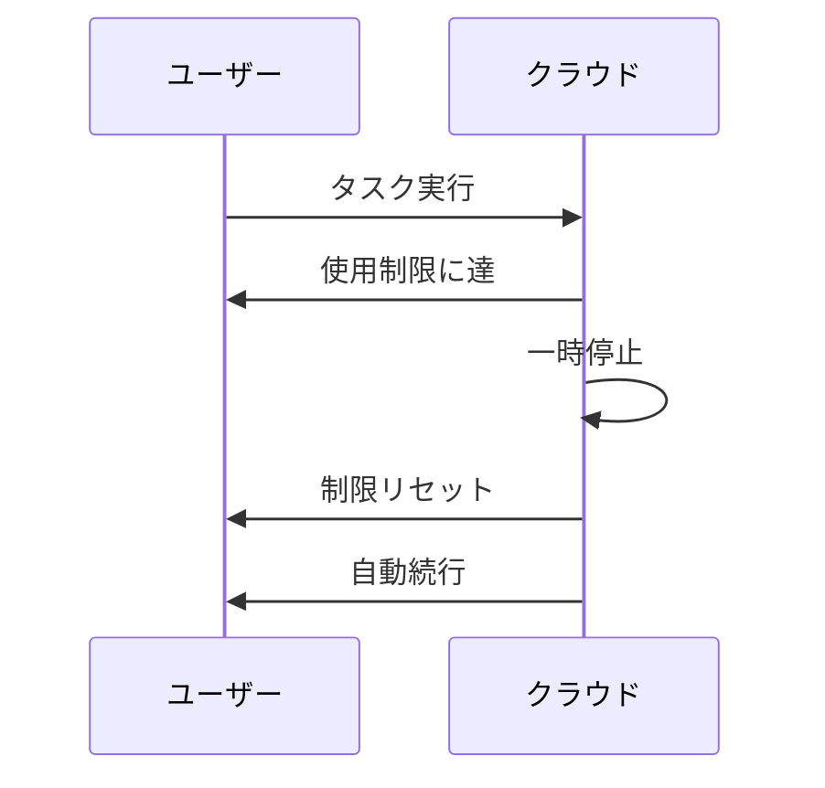

# Claude Code v2.1.271 アップデートまとめ

> 出典: https://code.claude.com/docs/en/changelog#2-1-271

## 💡 注目ポイント

### 1. リモートセッションでの fast mode 追加

組織が許可している場合、ホストの fast-mode 設定またはセッション内で `/fast` を入力することで、クラウドおよびセルフホステッドランナーで fast mode が適用されます。これにより、高速モードが利用可能な組織では、より迅速なレスポンスを得ることができます。

### 2. `/config` パネルでのマウスサポート

フルスクリーンモードで `/config` パネルを使用する際に、マウスホイールで設定リストをスクロールでき、設定値をクリックすると変更され、ポインターの下の行がハイライトされます。これにより、設定の変更がより直感的かつ効率的に行えるようになりました。

### 3. コマンドごとの `allowed_domains` の追加

Bash、PowerShell、および Monitor の auto モードでサンドボックスを使用する際に、コマンドが必要とするホストがレビューされ、そのコマンドのみに対して開放されます。他のホストは拒否されます。これにより、セキュリティが強化され、不要なホストへのアクセスを防ぎます。

### 4. `omitClaudeMd` の追加

エージェントのフロントマターと `--agents` JSON に `omitClaudeMd` を追加し、カスタムおよびプラグインサブエージェントがユーザー、プロジェクト、およびローカルの CLAUDE.md ファイルを読み込まずに実行できるようにしました。管理されたポリシーファイルは引き続き読み込まれます。

### 5. 動的ワークフローの改善

使用制限に達した際に動的ワークフローが一時停止し、制限がリセットされると自動的に続行するようになりました。これにより、影響を受けるエージェントがドロップされることがなくなり、ワークフローの継続性が向上します。

## 📋 変更一覧

### ✨ 新機能

| 変更 | 誰にどう嬉しいか |
|---|---|
| リモートセッションでの fast mode 追加 | 高速モードが利用可能な組織では、より迅速なレスポンスを得られる |
| `/config` パネルでのマウスサポート | 設定の変更がより直感的かつ効率的に行える |
| コマンドごとの `allowed_domains` の追加 | セキュリティが強化され、不要なホストへのアクセスを防ぐ |
| `omitClaudeMd` の追加 | カスタムおよびプラグインサブエージェントがユーザー、プロジェクト、およびローカルの CLAUDE.md ファイルを読み込まずに実行できる |
| PDF @-mentions の改善 | PDF のページ数が不明な場合、"page count unknown" と表示される |
| `/mobile` の改善 | 単一の QR コードで claude.ai/mobile にアクセスし、適切なアプリストアを開く |

### ⬆️ 改善

| 変更 | 誰にどう嬉しいか |
|---|---|
| ターミナルレンダリングパフォーマンスの改善 | 大規模な diff や長いトランスクリプトがより速くレンダリングされる |
| スタートアップ時間のわずかな改善 | ビルトインモデルデータの冗長な検証をスキップ |
| フックフィードバックの改善 | スピンナーがフックの実行中および待機中に経過時間を表示 |
| 動的ワークフローの改善 | 使用制限に達した際に一時停止し、制限がリセットされると自動的に続行 |
| Remote Control の改善 | 不安定なネットワークでのセットアップ失敗時に空のセッションを残さない |
| Markdown ファイルのアーティファクト公開の改善 | スタイリッシュなドキュメントページとしてレンダリング |
| アーティファクトツールの公開エラーの改善 | ファイルが存在しない場合やサポートされていないファイルタイプの場合の適切なエラーメッセージ |
| アーティファクトの監視の改善 | セッションが一度に最大 10 の公開アーティファクトを監視可能 |

### 🐛 バグ修正

| 変更 | 誰にどう嬉しいか |
|---|---|
| キャッシュされた組織ポリシーがアカウント、組織、または API キーの切り替え後に再利用される問題の修正 | 資格情報がセッション中に変更された場合、ポリシーが時間単位のチェックまで更新されない問題を解決 |
| 組織ポリシーが読み込み終了後またはセッション中に変更された後にツールとコマンドのリストが更新されない問題の修正 | 組織ポリシーの変更が反映される |
| 読み取りまたは解析できない `managed-mcp.json` が無視される問題の修正 | 排他的な MCP 制御を維持し、起動時に警告を表示 |
| `ANTHROPIC_UNIX_SOCKET` を介して設定されたサードパーティのローカルプロキシを通じて組織ポリシーがフェッチされ、拒否される問題の修正 | カスタムゲートウェイと同様に扱われる |
| セッションのワーカーが再起動した後にワークフローまたはエージェントの承認が適用された場合に、クラウドセッションがすべてのサブエージェントのツール呼び出しを拒否する問題の修正 | セッションが正しく動作する |
| `/fast off` が組織で fast mode が無効化されている場合に "Fast mode unavailable" と応答する問題の修正 | fast mode を正しくオフにできる |
| `CLAUDE_CODE_SKIP_FAST_MODE_ORG_CHECK` で開始されたセッションが API が fast mode を拒否した後も fast リクエストを再送信する問題の修正 | 拒否が維持され、その理由が表示される |
| `CLAUDE_CODE_RETRY_WATCHDOG` 下で fast mode が使用クレジット制限でターンに失敗したり、過負荷時に高速で再試行したりする問題の修正 | 標準速度にフォールバック |
| Bash の権限チェックが `fmt`、`column` などのコマンドが読み取るファイルを見逃す問題の修正 | 正しいファイルアクセス権限がチェックされる |
| Bash の権限チェックがワイルドカードがコマンドのパターンまたはオプション値にある場合に展開されるファイルを見逃す問題の修正 | 正しいファイルアクセス権限がチェックされる |
| Bash の権限チェックがシェル変数の宣言フラグが実行中のコマンドを誤って表現する問題の修正 | 正しいコマンドが実行される |
| 2 つのディレクトリ変更、サブシェル、または `cd`+`git` チェーンを含む Bash コマンドが `permissions.blockReadsOutsideWorkingDirectories` の下でプロンプトをスキップする問題の修正 | 正しいプロンプトが表示される |
| サンドボックスコマンドが開始に失敗した後に stale `.git/config.lock` が `git checkout -b`、`git push -u`、および `git config` を壊す問題の修正 (Linux) | Git コマンドが正しく動作する |
| macOS マシンでシステムファイルイベントサービスが飽和している場合にセッション外で行われた設定ファイル変更が気付かれない問題の修正 | ウォッチャーがポーリングにフォールバック |
| すべてのツールが MCP サーバーから来る `claude -p` セッションの再開が "At least one tool must have defer_loading=false" で失敗する問題の修正 | セッションが正しく再開される |
| LLM ゲートウェイが非ストリーミングの返答を `text/plain` として返す場合にターンが "API returned an empty or malformed response" で失敗する問題の修正 | 正しいレスポンスが返される |
| MCP サーバーが `list_changed` 通知をタイトなループで送信する際に持続的な高 CPU 使用率と繰り返しのツールリスト要求が発生する問題の修正 | CPU 使用率が正常化し、ツールリスト要求が減少 |
| MCP OAuth がクライアント登録を誤って扱う問題の修正 | 正しいクライアント登録が行われる |
| Claude が MCP ツールをその完全な `mcp__server__tool` 名ではなく、その裸名で選択する際にツール検索が一致しない問題の修正 | 正しいツールが選択される |
| Ctrl+O が保留中の MCP サーバー再接続をキャンセルし、リモートコントロールから送信された `/mcp` がトランスクリプトビューが開いている間に失敗する問題の修正 | MCP サーバーが正しく再接続され、`/mcp` コマンドが正しく動作する |
| Claude in Chrome プロンプトが ToolSearch が利用できない場合にモデルに ToolSearch を通じてツールをロードするよう指示する問題の修正 | 正しい指示が行われる |
| 受信セッションのパーミッションモードポリシーによって保持されるクロスセッションメッセージが痕跡を残さない問題の修正 | ヘッドレス送信者に配信通知が送られ、`SendMessage` 結果が読み込まれたことを意味しなくなる |
| 会話が圧縮された後にまだ実行中のバックグラウンドコマンド（監視タスクや開発サーバーなど）の 2 番目のコピーが開始される問題の修正 | バックグラウンドコマンドが正しく動作する |
| `/model` が会話が実際に実行されたモデルに戻る際に会話キャッシュを失うという警告を表示する問題の修正 | 正しいモデルが選択される |
| `/reload-skills` が `/cd` 後にスラッシュメニューと一致しないスキルカウントを報告する問題の修正 | 正しいスキルカウントが報告される |
| `/resume` と `/continue` が短いターミナルでフルスクリーンモードで 1-2 セッションしか表示しない問題の修正 | 正しいセッション数が表示される |
| `/resume` と `/teleport` が前の会話のファイル読み取り追跡を保持し、再開された会話が実際に読み取ったことのないファイルを Claude が編集する可能性がある問題の修正 | 正しいファイル読み取り追跡が行われる |
| `--resume` が再開されたセッションのモデルファミリが設定されたデフォルトモデルと異なる場合に 1M コンテキストウィンドウ (`[1m]`) を落とす問題の修正 | 正しいコンテキストウィンドウが維持される |
| `/artifacts` で添付されたアーティファクトがセッション後に消える問題の修正 | アーティファクトが正しく保持される |
| バックグラウンドセッション (`claude --bg`、`claude agents`) が他の場所で行われた再公開に対して公開するアーティファクトを監視しない問題の修正 | 正しいアーティファクト監視が行われる |
| 仮想ドライブ（暗号化されたボールトが Windows ドライブとしてマウントされているなど）が inode 0 を報告する場合、最初のもの以外のカスタムエージェント、スラッシュコマンド、出力スタイルがロードされない問題の修正 | 正しいカスタムエージェント、スラッシュコマンド、出力スタイルがロードされる |
| ホスト設定ディレクトリが 64 MiB を超えると、セルフホステッドランナーセッションがすべてのホスト設定（設定、スキル、プラグイン、MCP サーバー）をサイレントに失う問題の修正 | `--host-config-snapshot disk|memory` が追加され、正しいホスト設定が保持される |
| サインアウト後に claude.ai から同期されたスキルが無期限にディスクに残る問題の修正 | `cleanupPeriodDays` 内に更新されなかったコピーは、次の起動時に回復可能なゴミ箱に移動 |
| スピンナーのヒントがアカウントタイプで利用できない、またはセッションで無効になっているコマンドを提案する問題の修正 | 正しいコマンドが提案される |
| `/add-dir` パス入力が左右矢印キーでカーソルを移動し、Enter が入力したパスのみを追加する問題の修正 | 正しいパスが追加される |
| メインプロンプト外のテキストフィールドが先頭の `!` を入力した末尾に移動する問題の修正 (`!foo` が `foo!` として出力される) | 正しいテキストが入力される |
| フックマッチャーが `__proto__` や `constructor` などの継承されたオブジェクトプロパティの名前である場合にインタラクティブな `/hooks` メニューがクラッシュする問題の修正 | 正しく動作する `/hooks` メニュー |
| ボックスの周りの背景が失われた後にテキストが古い背景色を保持するフルスクリーンレンダリンググリッチの修正 | 正しい背景色が適用される |
| st での Delete および rxvt-unicode での Alt+矢印キーがアタッチされたバックグラウンドセッションで機能しない問題の修正 | 正しく機能する Delete および Alt+矢印キー |
| Claude Code が終了、一時停止、または開始直後にエディタを開く際に、端末の機能クエリ (`^[[?1;2c`) への応答がシェルプロンプトまたはエディタに表示される問題の修正 | 正しい応答が端末に表示される |

### 📝 その他

| 変更 | 誰にどう嬉しいか |
|---|---|
| auto モードでスキルまたはスラッシュコマンドのインライン `!` シェルコマンドがデフォルトモードの権限ルールに従うように変更 | コマンドの実行がより安全に |
| auto モードでサブエージェントが呼び出し元に専用のハンドバックコールを通じて報告するように変更 | 安全性の向上 |
| Monitor の監視に常に期限（最大 30 分；単一プロンプト `-p` 実行では 10 分）を設定し、Claude に再武装を通知するように変更 | 監視の効率化 |
| プロンプト内の IDE 選択インジケーターを `[⧉ …]` ピルに変更 | テキストのラッピングが改善 |
| デフォルトの動的ワークフローサイズを Pro プランで small に変更し、medium サイズのガイドラインを 15 から 10 エージェントに引き下げ | ワークフローのサイズが適切に設定される |
| Claude アプリゲートウェイ、Bedrock、Vertex AI、および Foundry セッションが使用しない残りの claude.ai ログインを更新しないように変更 | ログインの管理が改善 |
| バンドルされた `claude-api` スキルを更新し、ストリーミングカスタムツールで `eager_input_streaming` を有効にし、`user.define_outcome` で成果物形式の Managed Agents の作業を開始するように変更 | カスタムツールと Managed Agents の動作が改善 |
| [VSCode] Attach Open File 設定を追加し、オフにすると開いているファイルがメッセージに追加されなくなる | メッセージの管理が改善 |
| [VSCode] Hooks と Permission ルールのダイアログで保存が失敗したと報告される問題の修正 | 正しい保存が行われ、エラーメッセージが適切に表示される |
| [VSCode] Hooks ダイアログの保存で重複フックが作成されない、ヘッダー名が大文字小文字が異なる場合でもシークレットが保持される、`settings.local.json` が保存前に `.gitignore` に追加される問題の修正 | 正しい保存が行われ、設定ファイルが適切に管理される |
| [VSCode] セッション履歴が現在のセッションのみを表示する問題の修正 | 正しいセッション履歴が表示される |
| [VSCode] セッションリストの Active フィルターがアイドルセッションを非表示にする問題の修正 | 正しいセッションリストが表示される |
| [VSCode] 新しいチャットが前のチャットに戻る問題の修正 | 正しいチャットが表示される |
| [VSCode] 開いているタブとサイドバーが古い設定フォルダーを保持する問題の修正 | 正しい設定フォルダーが使用される |
| [VSCode] 拡張機能がバックグラウンドコマンドを実行する際にコンソールウィンドウがフラッシュする問題の修正 | 正しく動作するコンソールウィンドウ |
| [VSCode] プロンプトキャッシュクロックのホバーテキストが遅延して表示される問題の修正 | 正しく表示されるホバーテキスト |
| [VSCode] 自動圧縮アイコンがブラウザ自身のツールチップの横に表示される問題の修正 | 正しく表示される自動圧縮アイコン |
| [VSCode] Hooks ダイアログの保存が設定ファイル自体の理由で拒否された場合にポップアップで "Open settings file" ボタンと理由が表示される問題の修正 | 正しいエラーメッセージが表示される |
| [VSCode] トグルスイッチのオン状態が Claude オレンジからエディターテーマのボタンカラーに変更 | 正しいカラーが適用される |
| [Claude Code on the web] クラウドセッションがプロセスが終了した後も約 10 分間応答しない問題の修正 | メッセージの送信ですぐに再起動する |
| [Claude Code on the web] Routines ページのレイアウトを新しい Yours と Templates タブと 2 列のルーチンカードに変更 | 実行ステータスが表示される |
| [Claude Code on the web] Cloud environments エディターに Custom network access オプションを追加 | 同じ allowed-domains リストが提供される |
| [Claude Code on the web] Cloud environments 管理ページを改善 | デフォルト環境と推奨される作成種類が表示される |
| [Claude Tag] チャネルでアクティブな Claude が作業コンテキストを約 1 時間に 1 回リセットする問題の修正 | スレッドアクティビティがリセットを防ぐ |
| [Claude Tag] プルリクエストの監視を要求したスレッドが CI 失敗、コメント、レビューを聞かなくなる問題の修正 | 正しく監視が行われる |
| [Claude Tag] 最初のメッセージが削除された後に Claude の作業が終了しない問題の修正 | 正しく作業が終了する |
| [Claude Tag] 異なるボットまたはアシスタントに宛てられた以前の指示のために Claude が投稿を保留する問題の修正 | 正しく指示が適用される |
| [Claude Tag] チャネルがチャッティーまたは大規模な場合に "sees a lot of automated posts" と表示される問題の修正 | 正しい理由が表示される |
| [Claude Tag] Environment ピッカーを改善 | オプションが Anthropic-hosted または self-hosted としてラベル付けされ、その環境を編集または作成するためのリンクが表示される |
| [Code Review] リポジトリで 1 回の PR レビューが行われた後にコミットが到着した際にレビューが行われない問題の修正 | 要求されたコミットがレビューされる |
| [Code Review] Code Review が GitHub が実際に作成したレビューに対してエラーを報告した際に同じ発見を 2 〜 3 回投稿する問題の修正 | 正しい発見が 1 回のみ投稿される |
| [Code Review] フォローアップレビューが解決済みのセキュリティ発見を再投稿する問題の修正 | 正しく再投稿されない |
| [Code Review] 終了した /ultrareview クラウドセッションを Claude アプリで再開した際にレビューが最初から始まる問題の修正 | 正しく再開される |
| Windows: PowerShell コマンドがセッションの一時出力パスが 260 文字に達した際に "Exit code 1" と出力なしで失敗する問題の修正 | 正しく出力される PowerShell コマンド |
