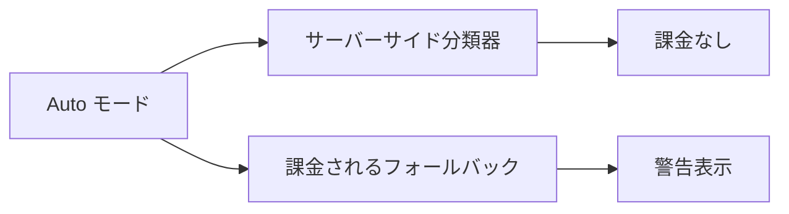

# Claude Code v2.1.278 アップデートまとめ

> 出典: https://code.claude.com/docs/en/changelog#2-1-278

## 💡 注目ポイント

### 1. Auto モードの変更 — 分類器の課金がなくなり、よりコスト効率が向上

Auto モードがサーバーサイドの分類器をデフォルトで使用するようになりました。これにより、分類器のオーバーヘッドに課金されることがなくなります。ただし、課金されるフォールバックに警告が表示されます。`CLAUDE_CODE_AUTO_MODE_SERVER=0` で Bedrock、Vertex、Foundry、およびゲートウェイでオプトアウトできます。

この変更により、Auto モードの使用がよりコスト効率的になり、ユーザーは分類器のオーバーヘッドに課金されることなく、自動モデル選択の恩恵を受けることができます。

## 📋 変更一覧

### ⬆️ 改善

| 変更 | 誰にどう嬉しいか |
|---|---|
| Auto モードがサーバーサイド分類器をデフォルトで使用 | 分類器のオーバーヘッドに課金されなくなり、コスト効率が向上 |

### ✨ 新機能

| 変更 | 誰にどう嬉しいか |
|---|---|
| `/status` に `Auto mode server` 行を追加 | このセッションの Auto モード分類器がサーバーで実行されているかどうかを確認できる |
