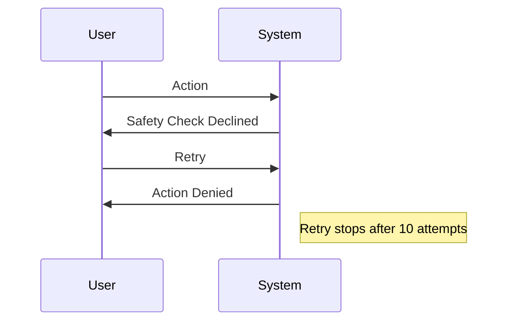

# Claude Code v2.1.280 アップデートまとめ

> 出典: https://code.claude.com/docs/en/changelog#2-1-280

## 💡 注目ポイント

### 1. デフォルト Opus モデルが Claude Opus 5.5 に

1M のコンテキストを持ち、1M トークンあたり $4/$20 で利用可能（キャッシュ読み取りは $0.20/M トークン）。より大規模なコンテキストを必要とするタスクに適しています。

### 2. フルスクリーンモードでマウスサポートが拡大

`/skills` リストや `/plugin` のスキルの状態オプションでマウスホイールスクロールやクリックが可能に。操作性が向上します。

### 3. Auto モードの改善

安全性チェックでアクションが拒否された場合、再試行を繰り返さず一度で拒否。また、安全性チェックが回答しない場合、10回連続でリトライを停止しメッセージを表示。

### 4. VS Code 統合機能の強化

ステータスダイアログ、サンドボックスダイアログ、Chrome での Claude ダイアログ、会話のエクスポート機能などが追加。操作性が向上します。

### 5. クラウドセッションの改善

クラウドセッションで GitHub API 呼び出しの自動トークン更新、セッション再開時のプロンプトと名前の更新、外部リンクの無効化と理由表示など。

## 📋 変更一覧

### ✨ 新機能

| 変更 | 誰にどう嬉しいか |
|---|---|
| Claude Opus 5.5 をデフォルト Opus モデルに | 大規模コンテキストが必要なタスクに適している |
| フルスクリーンモードでマウスサポートを拡大 | 操作性が向上 |
| VS Code 統合機能を強化 | 操作性が向上 |

### ⬆️ 改善

| 変更 | 誰にどう嬉しいか |
|---|---|
| Auto モードの改善 | 操作性が向上 |
| `/permissions` の改善 | 操作性が向上 |
| `/cost` の改善 | 操作性が向上 |
| Artifact ツールの改善 | 操作性が向上 |
| `/install-github-app` の改善 | 操作性が向上 |
| `/artifacts` と `/workflows` リストの改善 | 操作性が向上 |
| ワークフロー進捗ツリーの改善 | 操作性が向上 |
| `/plugin` の Add Marketplace フォームの改善 | 操作性が向上 |
| `/workflows` 詳細ビューの改善 | 操作性が向上 |
| 言語名のないコードブロックの改善 | 操作性が向上 |
| `/btw` の改善 | 操作性が向上 |
| UserPromptSubmit フックの改善 | 操作性が向上 |
| `@` ファイル提案の改善 | 操作性が向上 |
| アーティファクトページの改善 | 操作性が向上 |
| `/ultrareview` アップロードの改善 | 操作性が向上 |
| クロスセッションメッセージングの起動警告の改善 | 操作性が向上 |

### 🐛 バグ修正

| 変更 | 誰にどう嬉しいか |
|---|---|
| シンボリックリンクを通じた書き込みの修正 | 正しいファイルに書き込まれる |
| Auto モードの無限リトライの修正 | 無限ループから解放される |
| Write 呼び出しのバリデーションエラーの修正 | 正しく動作する |
| Ctrl+C や Ctrl+D の二重押しによる終了の修正 | 正しく動作する |
| クリックによる不正なトリガーの修正 | 正しく動作する |
| 余分な `n` や `y` によるダイアログの閉じたり確認したりの修正 | 正しく動作する |
| テキストフィールドでのキーバインディングによる文字の消失の修正 | 正しく動作する |
| Windows ターミナルでのプロンプト行のスクランブルの修正 | 正しく表示される |
| ゼロ幅非結合文字の除去の修正 | 正しく表示される |
| 音声ディクテーションの修正 | 正しく動作する |
| モデルスイッチによるプロンプトキャッシュミスの修正 | 正しく動作する |
| フォークサブエージェントのツールリストの再構築の修正 | 正しく動作する |
| サブエージェントハンドバックメッセージの修正 | 正しく表示される |
| `installed_plugins.json` の修正 | 正しく動作する |
| `~/.claude/skills/` のスキルの移動の修正 | 正しく動作する |
| セッションフィードバックサーベイのホバーハイライトの修正 | 正しく表示される |
| `/workflows` の一時的な一行リストの修正 | 正しく表示される |
| フルスクリーンモードでの選択リストのスクロールの修正 | 正しく動作する |
| `/plugin` と `/skills` のスキルの状態表示の修正 | 正しく表示される |
| 多重選択オプションのインデント修正 | 正しく表示される |
| `/plugin`、`/skills`、`/mcp` の検索ボックスの右枠の修正 | 正しく表示される |
| `/mcp` のサーバーリストと詳細ビューの警告アイコンの修正 | 正しく表示される |
| `/config` 設定リストと選択リストでの Home と End の修正 | 正しく動作する |
| `/skills` メニューでの PgUp/PgDn の修正 | 正しく動作する |
| `/config` リストでの Tab キーの修正 | 正しく動作する |
| 会話の API エラーの修正 | 正しく動作する |
| プロキシやゲートウェイがサポートしない API タグの修正 | 正しく動作する |
| マルフォームドな MCP ツールの通知の修正 | 正しく動作する |
| セッションのクラッシュの修正 | 正しく動作する |
| インターフェースエラーによるセッション終了の修正 | 正しく動作する |
| 設定ファイルの置換中のクラッシュの修正 | 正しく動作する |
| `/config` のクラッシュと誤読の修正 | 正しく動作する |
| 未完了のバックグラウンドエージェントの修正 | 正しく動作する |
| バックグラウンドサブエージェントへのメッセージの損失の修正 | 正しく動作する |
| 終了したサブエージェントのレポートの損失の修正 | 正しく動作する |
| バックグラウンドサブエージェントの LSP ツールの使用の修正 | 正しく動作する |
| バックグラウンドシェルタスクの無害な非ゼロ終了の修正 | 正しく動作する |
| バックグラウンドセッションの NUL 文字を含む環境変数の修正 | 正しく動作する |
| Ctrl+C での終了の修正 | 正しく動作する |
| IDE 選択のドロップの修正 | 正しく動作する |
| スタッシュされたシェルモードプロンプトの復元の修正 | 正しく動作する |
| `claude agents` の修正 | 正しく動作する |
| MCP サーバーの再追加の修正 | 正しく動作する |
| バックグラウンドプラグインマーケットプレイスの自動更新の修正 | 正しく動作する |
| `claude plugin update` の修正 | 正しく動作する |
| Artifact ツールの消失の修正 | 正しく動作する |
| アーティファクトリパブリッシュの修正 | 正しく動作する |
| `/ultrareview` の修正 | 正しく動作する |
| Claude アプリのコンテキスト使用量の修正 | 正しく表示される |
| Claude アプリの diff ビューの修正 | 正しく表示される |
| クラウドとセルフホステッドランナーセッションの認証失敗の修正 | 正しく動作する |
| Cowork セッションのメモリ書き込み競合の修正 | 正しく動作する |
| セルフホステッドランナーのライフサイクルフックのコミットの署名の修正 | 正しく動作する |
| Windows でのディレクトリシンボリックリンクの削除の修正 | 正しく動作する |
| セルフホステッドランナーのターン終了の修正 | 正しく動作する |
| `ctrl+l` / `cmd+k` の修正 | 正しく動作する |

### 📝 その他

| 変更 | 誰にどう嬉しいか |
|---|---|
| デフォルトモデルの変更 | 新しいモデルが利用可能に |
| 努力レベルの変更 | 新しいモデルが利用可能に |
| `/autocompact` のフッターの変更 | 操作性が向上 |
| `/fast` のフッターの変更 | 操作性が向上 |
| セルフホステッドランナーの git の変更 | 操作性が向上 |
| プラグインマーケットプレイスの名前の変更 | 操作性が向上 |
| `PermissionRequest` フックの変更 | 操作性が向上 |
| [VSCode] ステータスダイアログの追加 | 操作性が向上 |
| [VSCode] サンドボックスダイアログの追加 | 操作性が向上 |
| [VSCode] Claude in Chrome ダイアログの追加 | 操作性が向上 |
| [VSCode] 会話のエクスポートの追加 | 操作性が向上 |
| [VSCode] スキルの情報の追加 | 操作性が向上 |
| [VSCode] `/plan` の追加 | 操作性が向上 |
| [VSCode] 貼り付けテキストの処理の改善 | 操作性が向上 |
| [VSCode] プロンプトの処理の改善 | 操作性が向上 |
| [VSCode] "Open in New Tab" の変更 | 操作性が向上 |
| [VSCode] 努力チップの修正 | 正しく表示される |
| [VSCode] Python 拡張機能のハングの修正 | 正しく動作する |
| [VSCode] プラン承認カードの修正 | 正しく動作する |
| [VSCode] セッションリストのナビゲーションの修正 | 正しく動作する |
| [VSCode] ペーストマーカーラインの修正 | 正しく表示される |
| [Claude Code on the web] ルーチンのオン/オフ設定の変更 | 操作性が向上 |
| [Claude Code on the web] `gh` と GitHub API 呼び出しの修正 | 正しく動作する |
| [Claude Code on the web] ルーチンの再開の修正 | 正しく動作する |
| [Claude Code on the web] ファイルリンクの修正 | 正しく動作する |
| [Claude Code on the web] Auto モードの再試行の修正 | 正しく動作する |
| [Claude Code on the web] クラウドセッションの改善 | 操作性が向上 |
| [Claude Code on the web] 空のリポジトリピッカーの削除 | 操作性が向上 |
| [Claude Tag] Slack のネイティブ Working インジケータの追加 | 操作性が向上 |
| [Claude Tag] ゲストの変更の通知の追加 | 操作性が向上 |
| [Claude Tag] スケジュールルーチンの修正 | 正しく動作する |
| [Claude Tag] ファイルの再アップロードの要求の修正 | 正しく動作する |
| [Claude Tag] スラックリプライの修正 | 正しく表示される |
| [Claude Tag] クラウド環境セットアップスクリプトの修正 | 正しく動作する |
| [Claude Tag] GitHub バナーの改善 | 操作性が向上 |
| [Code Review] Code Review チェックランの改善 | 操作性が向上 |
