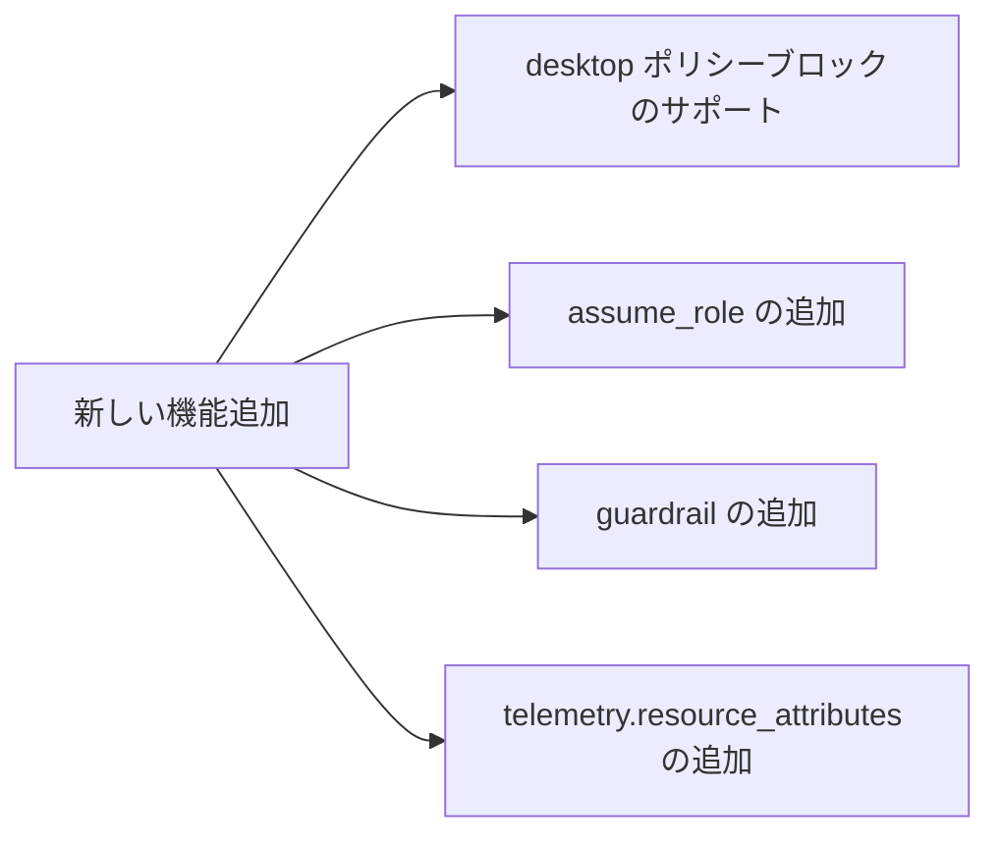

# Claude Code v2.1.281 アップデートまとめ

> 出典: https://code.claude.com/docs/en/changelog#2-1-281

## 💡 注目ポイント

### 1. クラウドアプリゲートウェイの機能拡張

クラウドアプリゲートウェイに新しい機能が追加されました。`desktop` ポリシーブロックで新しいキーがサポートされ、Bedrock アップストリームで `assume_role` と `guardrail` が利用可能になりました。また、`telemetry.resource_attributes` でテレメトリに固定ラベルを付けられるようになりました。

### 2. スクロールバーの追加

`/skills`, `/mcp`, `/plugin` のインストール済みリストにスクロールバーが追加されました。マウスがリストの上に乗るとスクロールバーが表示され、クリックまたはドラッグでスクロールできます。

### 3. 自動モードの改善

自動モードが改善され、`/insights` で最近のセッションで自動モードが処理できた可能性のある許可プロンプトの数を推定する推奨事項が追加されました。また、自動モードの分類器レビューがサーバー側で実行される場合、読み取り専用およびサンドボックスされたシェルコマンドもそのレビューを待ち、フラグが立てられた場合はブロックされます。

### 4. クラウドセッションの改善

クラウドセッションで Fast モードスイッチがコンポーザーのモデルメニューに追加されました。また、GitHub 設定のヒントに設定ショートカットが追加され、「GitHub 接続のトラブルシューティング」リンクがリポジトリピッカーに追加されました。

### 5. Slack での Claude Tag の改善

Slack での Claude Tag が改善されました。ストップを押した後にスレッドに短い行が追加され、誰が Claude の応答を停止したか、@Claude にメンションして続行するように言う行が追加されました。また、Slack チャンネルで Claude が永続的にスレッド内の返信に応答しなくなる問題が修正されました。

## 📋 変更一覧

### ✨ 新機能

| 変更 | 誰にどう嬉しいか |
|---|---|
| クラウドアプリゲートウェイに新しい機能を追加 | より高度な設定と制御が可能に |
| `/skills`, `/mcp`, `/plugin` のインストール済みリストにスクロールバーを追加 | 長いリストのスクロールが容易に |
| 自動モードの改善と推奨事項の追加 | 自動モードの使い勝手が向上 |
| クラウドセッションに Fast モードスイッチと設定ショートカットを追加 | クラウドセッションの操作性が向上 |
| Slack での Claude Tag の改善 | Slack での操作性が向上 |

### ⬆️ 改善

| 変更 | 誰にどう嬉しいか |
|---|---|
| クラウドアプリゲートウェイの改善 | より高度な設定と制御が可能に |
| `/skills`, `/mcp`, `/plugin` のインストール済みリストの改善 | 長いリストの操作性が向上 |
| 自動モードの改善 | 自動モードの使い勝手が向上 |
| クラウドセッションの改善 | クラウドセッションの操作性が向上 |
| Slack での Claude Tag の改善 | Slack での操作性が向上 |

### 🐛 バグ修正

| 変更 | 誰にどう嬉しいか |
|---|---|
| セッションのクラッシュや無限ループの修正 | セッションが安定し、エラーが減少 |
| セッションの再開時の不具合の修正 | セッションの再開がスムーズになり、エラーが減少 |
| プロンプトキャッシュの修正 | プロンプトキャッシュが正しく機能し、エラーが減少 |
| レスポンスの修正 | レスポンスが正しく表示され、エラーが減少 |
| ツールコールの修正 | ツールコールが正しく機能し、エラーが減少 |
| コマンドの実行エラーの修正 | コマンドが正しく実行され、エラーが減少 |
| 設定ファイルの修正 | 設定ファイルが正しく読み込まれ、エラーが減少 |
| プラグインの修正 | プラグインが正しく機能し、エラーが減少 |
| UI の修正 | UI が正しく表示され、エラーが減少 |
| vim モードの修正 | vim モードが正しく機能し、エラーが減少 |
| リストの修正 | リストが正しく表示され、エラーが減少 |
| エージェントパネルの修正 | エージェントパネルが正しく機能し、エラーが減少 |
| その他の修正 | 様々な不具合が修正され、エラーが減少 |

### 📝 その他

| 変更 | 誰にどう嬉しいか |
|---|---|
| クラウドデスクトップのサインインと使用制限エラーメッセージの改善 | エラーメッセージがわかりやすくなり、操作性が向上 |
| スタートアップの改善 | スタートアップ時間が短縮され、操作性が向上 |
| 長いセッションの再開時間の改善 | 長いセッションの再開時間が短縮され、操作性が向上 |
| プロンプトが長すぎるエラーの改善 | プロンプトが長すぎるエラーが減少し、操作性が向上 |
| 自動モードの改善 | 自動モードの使い勝手が向上 |
| 危険な削除チェックの改善 | 危険な削除操作がより安全に |
| サンドボックスガイダンスの改善 | サンドボックスの使い勝手が向上 |
| `--agents` の改善 | `--agents` の使い勝手が向上 |
| `/batch` の改善 | `/batch` の使い勝手が向上 |
| プラグインフックエラーの改善 | プラグインフックエラーがわかりやすくなり、操作性が向上 |
| `/` メニュー、`/skills`、`/context`、`/plugin` のインストール済みリストの改善 | これらのリストの表示が改善され、操作性が向上 |
| `/deep-research` の改善 | `/deep-research` の信頼性が向上 |
| 公開されたアーティファクトページの改善 | アーティファクトページの表示が改善され、操作性が向上 |
| アーティファクト公開の改善 | アーティファクト公開が速くなり、操作性が向上 |
| CLAUDE.md スタートアップノーティスの改善 | CLAUDE.md スタートアップノーティスが改善され、操作性が向上 |
| デバッグログの改善 | デバッグログがわかりやすくなり、操作性が向上 |
| タブ付きダイアログのキーボードナビゲーションの改善 | タブ付きダイアログのキーボードナビゲーションが改善され、操作性が向上 |
| `/help` と `/sandbox` の改善 | `/help` と `/sandbox` の操作性が向上 |
| `/install-github-app`、`/desktop`、`/permissions`、`/plugin` の改善 | これらのコマンドの操作性が向上 |
| `/workflows` と `/mcp` リストの改善 | `/workflows` と `/mcp` リストの操作性が向上 |
| `/plugin` プラグインとマーケットプレイスの詳細メニューと `/remote-control` の already-connected メニューの改善 | これらのメニューの操作性が向上 |
| バックグラウンドワークフローローの改善 | バックグラウンドワークフローの表示が改善され、操作性が向上 |
| `/plugin` インストール済みリストの改善 | `/plugin` インストール済みリストの表示が改善され、操作性が向上 |
| `/skills` の改善 | `/skills` の表示が改善され、操作性が向上 |
| 狭いリストローの改善 | 狭いリストローの表示が改善され、操作性が向上 |
| `/diff` の改善 | `/diff` の操作性が向上 |
| `/hooks` の改善 | `/hooks` の操作性が向上 |
| `/mcp` のスクリーンリーダー出力の改善 | `/mcp` のスクリーンリーダー出力が改善され、操作性が向上 |
| Remote Control 確認の改善 | Remote Control の確認が改善され、操作性が向上 |
| 送信の変更（ctrl+enter または ctrl+x ctrl+s） | 実行中のツールがバックグラウンドに移動するようになり、ターンがキャンセルされなくなった |
| `CLAUDE_CODE_AUTO_MODE_SERVER` の変更 | サーバー側の自動モード分類器が適用されるようになり、`0` でオプトアウト、`1` でオプトインできるようになった |
| 危険な `rm` プロンプトの変更 | `--dangerously-skip-permissions` と自動モードで `rm` プロンプトが 2 分間待機し、答えがなければコマンドを拒否するようになった（`CLAUDE_CODE_DISABLE_DANGEROUS_RM_TIMEOUT=1` で無効化可能） |
| クラウドアプリゲートウェイの変更 | `managedMcpServers` エントリの `envHelper` パスが `\??\` または `/??/` で始まる場合、ゲートウェイが起動を拒否するようになった |
| セルフホステッドランナーの変更 | システムプロンプトがコマンドラインテキストではなくプライベートファイルとして Claude Code に渡されるようになった |
| キューメッセージの変更 | キューメッセージがスピナーの上に表示されるようになった |
| セッションアーティファクトリンクの変更 | セッションアーティファクトリンクがフッターピルに変更され、`/artifacts` を開くようになった |
| Artifact ツールの変更 | Claude がアーティファクトページで unpkg.com からスクリプトをロードできるようになった |
| フルスクリーンモードでのリストローのホバーの変更 | フルスクリーンモードでのリストローのホバーがティントに変更され、2 つ目の ❯ ポインターは描画されなくなった |
| `/mcp` の変更 | 各サーバーの行がステータスイコンと名前で始まり、状態を 1 回だけ言い、狭いターミナルでは "managed" などのトレーリングファクトを短縮するようになった |
| `/workflows` の変更 | 各実行の行がステータスイコンと経過時間で始まり、狭いターミナルでは実行の名前と時間を保持し、エージェントとトークンカウントを最初に落とすようになった |
| Remote Control 添付ファイルダウンロードの変更 | Remote Control 添付ファイルダウンロードが接続を再利用し、セッションですでにダウンロードされたファイルをスキップするようになった |
| MCP リソースリストの変更 | MCP リソースリスト（リソースリストツールと @-mention 提案）が MCP Apps UI リソースをスキップするようになった |
| `claude plugin uninstall --json` と `/plugin` ダイアログの変更 | プラグインのデータが保持された場合、そのフォルダが残る場合、別のインストール済みプラグインが使用しているか、インストール記録を読み取ることができない場合、プラグインのデータが保持されたと表示されるようになった |
| バックグラウンドタスクリストの変更 | 実行中の `/ultrareview` で `x` を押すと、レビューを停止する前に確認を求めるようになった |
| `(removed)` `/agents` エントリの削除 | `(removed)` `/agents` エントリがコマンドメニューと `/help` から削除された |
| [VSCode] Continue/Stop プロンプトの追加 | VS Code と JetBrains パネルで自動モードが課金対象の分類器リクエストにフォールバックした場合、答えられない警告行の代わりに Continue/Stop プロンプトが追加された |
| [VSCode] 空のローカルコピーの保存の修正 | Web セッションを空で開くと、再開できない空のローカルコピーが保存される問題が修正された |
| [VSCode] クラウドセッションの修正 | クラウドセッションが空で開かれたり、一部の会話しか表示されなかったりする問題が修正された |
| [VSCode] エディタタブの会話のハングの修正 | エディタタブの会話がサイレントでハングする問題が修正された |
| [VSCode] チャットパネルの複数選択質問のオプションプレビューの修正 | チャットパネルで複数選択質問のオプションプレビューが添付されない問題が修正された |
| [VSCode] セッションマネージャーのコストと使用ブロックの修正 | セッションマネージャーのコストと使用ブロックが狭いサイドバーで途中で折り返される問題が修正された |
| [Claude Code on the web] Fast モードスイッチの追加 | クラウドセッションで Fast モードスイッチがコンポーザーのモデルメニューに追加された |
| [Claude Code on the web] 設定ショートカットの追加 | GitHub 設定のヒントに設定ショートカットが追加された |
| [Claude Code on the web] "Troubleshoot GitHub connection" リンクの追加 | リポジトリピッカーに "Troubleshoot GitHub connection" リンクが追加された |
| [Claude Code on the web] ルーチンの修正 | プルリクエストのトリガーでドラフトに変換されたルーチンが正しく開始されるようになった |
| [Claude Code on the web] Create PR ボタンの修正 | GitHub 以外のリポジトリで Create PR ボタンが表示されないように修正された |
| [Claude Code on the web] GitHub 設定のヒントの修正 | GitHub 設定のヒントがリポジトリピッカーの検索ボックスと行を覆う問題が修正された |
| [Claude Code on the web] ファイルカードの改善 | クラウドセッションがファイルを開けない場合、ファイルカードに理由が表示されるようになった |
| [Claude Tag] ストップ後の短い行の追加 | Slack スレッドでストップを押した後に短い行が追加されるようになった |
| [Claude Tag] スレッド内の返信への永続的な停止の修正 | Slack チャンネルで Claude が永続的にスレッド内の返信に応答しなくなる問題が修正された |
| [Claude Tag] ストップ後の再開の修正 | Slack でストップを押した後、Claude が再開するようになった |
| [Claude Tag] 遅延した Slack 返信の修正 | Claude のセッションがクラッシュした後、Slack 返信が遅延したり届かなかったりする問題が修正された |
| [Claude Tag] 自動再起動の失敗の修正 | セッションの設定が大きすぎて開始できない場合、スレッドに理由と再試行方法が表示されるようになった |
| [Claude Tag] 非常に長い Slack スレッドの修正 | Claude が古いメッセージと比較して返信を保留する問題が修正された |
| [Claude Tag] チャンネルの移動後のエラーの修正 | Enterprise Grid 組織全体の共有から単一のワークスペースに移動した Slack チャンネルで、Claude が毎回 "Couldn't check this channel just now" と返答する問題が修正された |
| [Claude Tag] 大規模な Enterprise Grid ワークスペースの修正 | 主にワークスペース間で共有されたチャンネルを通じて到達した非常に大きな Enterprise Grid ワークスペースが、静かな時間の後に再び "Couldn't check this channel" と表示される問題が修正された |
| [Claude Tag] 組織の推論フックによるブロックの修正 | 組織の推論フックによってブロックされた Slack リクエストが汎用的な再試行通知を表示する問題が修正された |
| [Claude Tag] モデルの切り替えの修正 | Slack で Claude が使用できないモデルへの切り替えを提案する問題が修正された |
| [Claude Tag] DynamoDB と Kinesis アカウントベースのエンドポイントの認証の修正 | Claude Tag で DynamoDB と Kinesis アカウントベースのエンドポイントの認証が正しく行われるようになった |
| [Claude Tag] プラグインセクションの読み込みの修正 | Claude Tag の管理者設定でプラグインセクションが読み込めない問題が修正された |
| [Claude Tag] ルーチンリストの変更 | スレッド内のスケジュールされたタスクがデフォルトで表示されるようになった |
| [Code Review] プルリクエストのレビューの修正 | プルリクエストがレビューされたコミットが force-push された後、失敗したレビューがリトライ中の場合、レビューが正しく行われるようになった |
