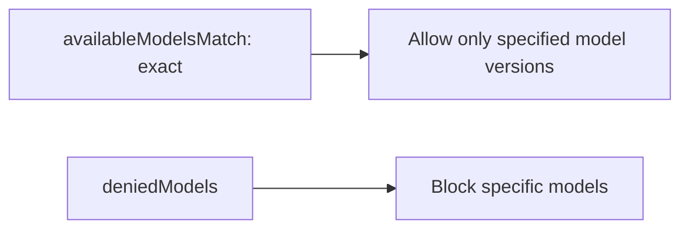
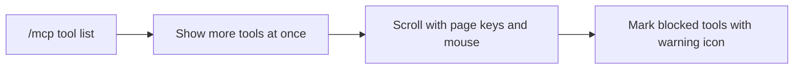

# Claude Code v2.1.283 アップデートまとめ

> 出典: https://code.claude.com/docs/en/changelog#2-1-283

## 💡 注目ポイント

### 1. `/doctor prompt-audit` コマンドの追加 — プロンプトパターンの監査

`/doctor prompt-audit` または `/checkup prompt-audit` コマンドを使用して、`CLAUDE.md` ファイル、スキル、エージェント、コマンドのプロンプトパターンを監査できます。古いモデル向けに書かれたプロンプトパターンを検出します。

### 2. `availableModelsMatch` と `deniedModels` マネージド設定の追加 — モデル管理の柔軟性向上

`availableModelsMatch` 設定を `"exact"` に設定すると、`availableModels` エントリは指定されたモデルバージョンのみを許可します。`deniedModels` 設定を使用して、`availableModels` が許可しているモデルでも特定のモデルをブロックできます。

### 3. フルスクリーンモードでのメッセージのクリック展開機能の追加 — 読みやすさの向上

フルスクリーンモードで、他のセッションからの切り詰められたメッセージをクリックして展開できるようになりました。

### 4. `/mcp` ツールリストの改善 — 操作性の向上

`/mcp` ツールリストは、より多くのツールを一度に表示し、ページキーとマウスでスクロールできます。組織がブロックしたツールには警告アイコンが表示されます。

### 5. クラウドセッションの改善 — 安定性と使いやすさの向上

クラウドセッションの安定性と使いやすさが向上しました。例えば、サーバーサイドの再起動から回復した後、既に完了したステップを再実行することがありましたが、これが修正されました。

## 📋 変更一覧

### ✨ 新機能

| 変更 | 誰にどう嬉しいか |
|---|---|
| `/doctor prompt-audit` コマンドの追加 | 古いモデル向けのプロンプトパターンを監査できる |
| `x-claude-code-prompt-id` ヘッダーの追加 | LLM ゲートウェイがユーザープロンプトに対応するリクエストをグループ化できる |
| `availableModelsMatch` マネージド設定の追加 | モデル管理の柔軟性が向上 |
| `deniedModels` マネージド設定の追加 | 特定のモデルをブロックできる |
| MCP ツール、WebFetch と WebSearch の出力を OpenTelemetry スパンイベントに追加 | ツールの出力をログに記録できる |
| フルスクリーンモードでのメッセージのクリック展開機能の追加 | 他のセッションからのメッセージを読みやすくできる |
| `--plugin-dir` ロード失敗エントリに `path` を追加 | ロードに失敗したディレクトリを特定できる |
| `load_test_mode` ブロックの追加 | デプロイメントの負荷テストが可能 |
| `mantle` アップストリームプロバイダーの追加 | Amazon Bedrock の Mantle エンドポイントを使用できる |

### ⬆️ 改善

| 変更 | 誰にどう嬉しいか |
|---|---|
| `/mcp` ツールリストの改善 | 操作性が向上 |
| MCP ツール結果の改善 | 画像がファイルに保存される |
| `/tasks` の改善 | ステータスイコン、名前と全ファクトが表示され、リストにページキー、マウスホイール、クリックが追加された |
| ヘルプ、フック、コピー、クロム、メモリ、IDE、リリースノート、リワインド、ディフ、リモート環境、プラグインなどのピッカーのリストの改善 | 操作性が向上 |
| 検索ボックス横のリストの改善 | 操作性が向上 |
| コンパクションスピナーの改善 | 操作性が向上 |
| MCP サーバーへのサインイン後のブラウザページの改善 | 操作性が向上 |
| Skill ツールの返答の改善 | 操作性が向上 |
| `prompt-audit` の改善 | 操作性が向上 |
| `installed_plugins.json` の読み取り不能からの回復の改善 | 操作性が向上 |
| アーティファクトデータベース読み取りの改善 | 操作性が向上 |
| 最初の返答の遅延の改善 | 操作性が向上 |
| 最初のリクエストの遅延の改善 | 操作性が向上 |
| スタートアップの改善 | 操作性が向上 |
| `/ultrareview` の起動ダイアログの変更 | 操作性が向上 |
| `/model` ピッカーの変更 | 操作性が向上 |
| ターミナルでのプロンプト提案の変更 | 操作性が向上 |
| `--system-prompt` と `--append-system-prompt` の変更 | 操作性が向上 |
| `Skill` 拒否ルールの変更 | 操作性が向上 |
| `/rewind` と `/diff` リストの変更 | 操作性が向上 |
| `/workflows` 実行リストの変更 | 操作性が向上 |
| `claude plugin eval` の変更 | 操作性が向上 |
| アーティファクト監視の変更 | 操作性が向上 |
| セルフホステッドランナーのライフサイクルフックの変更 | 操作性が向上 |
| `GIT_SSL_CAINFO` と `GIT_SSL_NO_VERIFY` の変更 | 操作性が向上 |
| `claude-ai` 名の予約の復元 | 操作性が向上 |
| [VSCode] パーミッションモードインジケーターの修正 | 操作性が向上 |
| [VSCode] セッションのテレポートの修正 | 操作性が向上 |
| [VSCode] Web セッションの修正 | 操作性が向上 |
| [VSCode] リロードされたセッションの修正 | 操作性が向上 |
| [VSCode] フッターのエージェントピルの修正 | 操作性が向上 |
| [VSCode] チャット入力の修正 | 操作性が向上 |
| [Cloud sessions] リポジトリの追加の改善 | 操作性が向上 |
| [Cloud sessions] クラウドセッションの改善 | 操作性が向上 |
| [Cloud sessions] ルーチンスケジュールの変更 | 操作性が向上 |
| [Claude Tag] "Channels Claude can search" 設定の追加 | 操作性が向上 |
| [Claude Tag] Back to Slack ボタンの追加 | 操作性が向上 |
| [Claude Tag] チャンネルの設定ページの修正 | 操作性が向上 |
| [Claude Tag] アクセスバンドルリポジトリ検索の修正 | 操作性が向上 |
| [Claude Tag] 同じ返答の二重投稿の修正 | 操作性が向上 |
| [Claude Tag] チャンネルルーチンの修正 | 操作性が向上 |
| [Claude Tag] チャネルの会話の修正 | 操作性が向上 |
| [Code Review] "@claude review" リクエストの修正 | 操作性が向上 |
| [Code Review] レビューの課金の修正 | 操作性が向上 |

### 🐛 バグ修正

| 変更 | 誰にどう嬉しいか |
|---|---|
| SDK セッションで遅延したツールコールや終了したツール結果が失われる問題の修正 | 操作性が向上 |
| MCP 進捗通知が破棄される問題の修正 | 操作性が向上 |
| stdio MCP サーバーがセッション終了時に実行され続ける問題の修正 | 操作性が向上 |
| 状態のないリモート MCP サーバーから HTTP 404 が返される問題の修正 | 操作性が向上 |
| 無効な URL の MCP サインインの問題の修正 | 操作性が向上 |
| `/usage` と VS Code 使用量メーターに週間 Fable 制限が表示されない問題の修正 | 操作性が向上 |
| `/model` が Sonnet 4.6 または Sonnet 5 を受け入れない問題の修正 | 操作性が向上 |
| `/model` ピッカーがハードコードされた Haiku バージョンと価格を表示する問題の修正 | 操作性が向上 |
| モデルフォールバック中に開始された動的ワークフローがフォールバックモデルですべてのエージェントを実行する問題の修正 | 操作性が向上 |
| `DISABLE_PROMPT_CACHING_HAIKU` が Haiku がセッションのメインモデルの場合に効果がない問題の修正 | 操作性が向上 |
| `claude plugin validate` がインストールできないプラグインやマーケットプレイス名を受け入れる問題の修正 | 操作性が向上 |
| `claude plugin validate` が `outputStyles`, `themes`, `monitors`, `lspServers` パスが欠落しているかプラグインディレクトリ外を指しているプラグインを通過する問題の修正 | 操作性が向上 |
| `claude plugin details` がプラグインサーバーを 0 と表示する問題の修正 | 操作性が向上 |
| `claude plugin marketplace remove` がアンインストールしたプラグインを表示しない問題の修正 | 操作性が向上 |
| `claude plugin uninstall` が大文字小文字が異なるプラグインを削除する問題の修正 | 操作性が向上 |
| バージョンを宣言しないプラグインが最新のコミットで復元される問題の修正 | 操作性が向上 |
| ユーザーインストールのプラグインとマーケットプレイスが "cache-miss" でロードに失敗する問題の修正 | 操作性が向上 |
| `installed_plugins.json` が無効なプラグイン ID でレコードを持っている場合、プラグインを表示しない問題の修正 | 操作性が向上 |
| `installed_plugins.json` が読み取り不能なレコードを持っている場合、レコードが失われる問題の修正 | 操作性が向上 |
| スクリーンリーダーモードのパーミッションダイアログが引用されたコマンドとパスをダイアログのテキストとして読み上げる問題の修正 | 操作性が向上 |
| `/context` が MCP サーバーの指示をカウントしない問題の修正 | 操作性が向上 |
| Warp ターミナルのマークダウンリンクがクリック可能なハイパーリンクとしてレンダリングされない問題の修正 | 操作性が向上 |
| `claude mcp add`, `add-json`, と `remove` がユーザーまたはローカル設定ファイルに書き込めない場合でも成功と報告する問題の修正 | 操作性が向上 |
| クラウドセッションでの返答の最初の単語がストリーミングされずに遅れて表示される問題の修正 | 操作性が向上 |
| キーバインディングガイドがコードのタイムアウトを 1 秒と誤って記述し、`cmd` を `meta` のエイリアスと誤って呼ぶ問題の修正 | 操作性が向上 |
| `keybindings.json` がスペルミスした修飾子を受け入れる問題の修正 | 操作性が向上 |
| `footer:openSelected` がリバインドまたはアンバインドされた後もフッターヒントが "Enter to view" と表示される問題の修正 | 操作性が向上 |
| 素早くタイプされたキーが古い状態に対して処理される問題の修正 | 操作性が向上 |
| ワークツリーチェックアウトが証明書検証に失敗する問題の修正 | 操作性が向上 |
| サンドボックス `git` がサンドボックスプロキシのログインを保存しようとする問題の修正 | 操作性が向上 |
| マネージド `sandbox` 設定が無効な値を含む場合、設定全体が無視される問題の修正 | 操作性が向上 |
| クラウドコードが git リポジトリのサブディレクトリで開始された場合、クラウドコードによるメモリノートへの編集がブロックされる問題の修正 | 操作性が向上 |
| `DISABLE_TELEMETRY` または `DO_NOT_TRACK` でテレメトリーがオフの場合、有料プランでリモートコントロールが利用できない問題の修正 | 操作性が向上 |
| `/remote-control` メニューが狭いターミナルで QR コードのヒントを途中で切る問題の修正 | 操作性が向上 |
| vim モードの `.` が Shift+Enter 改行を落とす問題の修正 | 操作性が向上 |
| vim モードのカーソル配置の修正 | 操作性が向上 |
| vim モードの `J` が異なる間隔で行を結合する問題の修正 | 操作性が向上 |
| Windows で PowerShell ツールが `cmd /c rd`, `rmdir`, `del` または `erase` でドライブルート、ホームフォルダ、その他のフォルダを削除する問題の修正 | 操作性が向上 |
