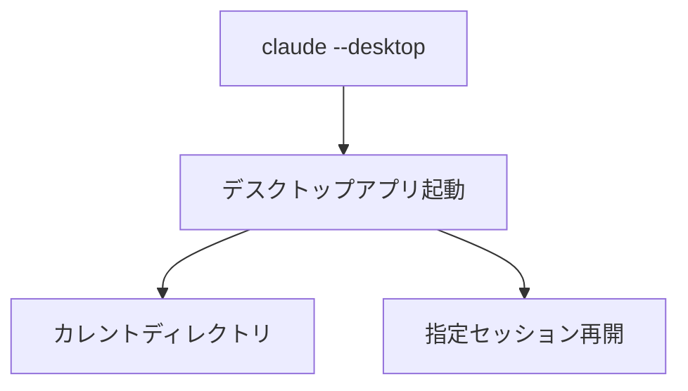
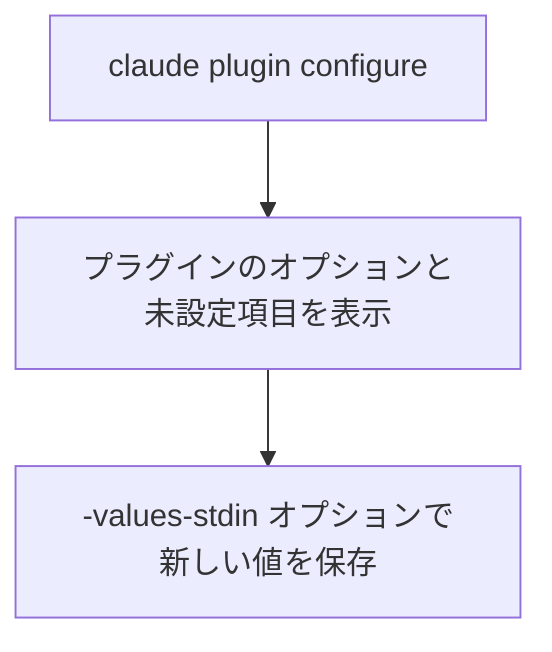
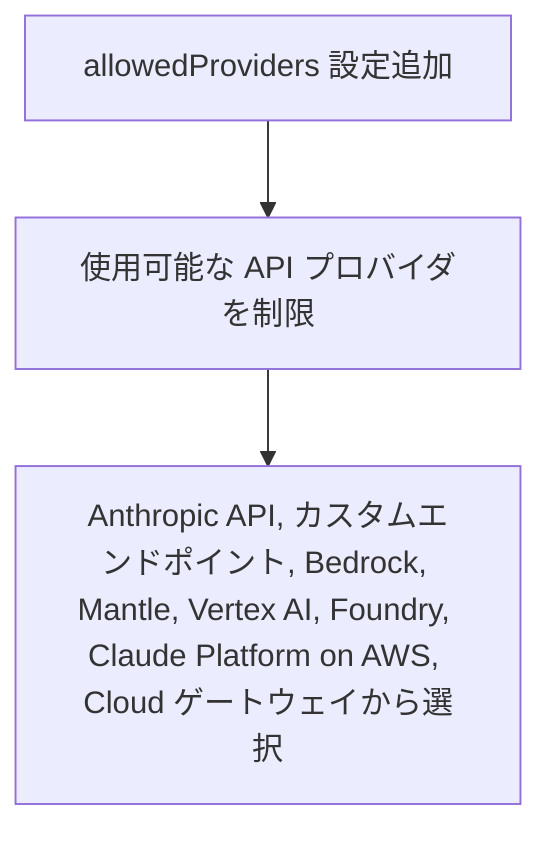
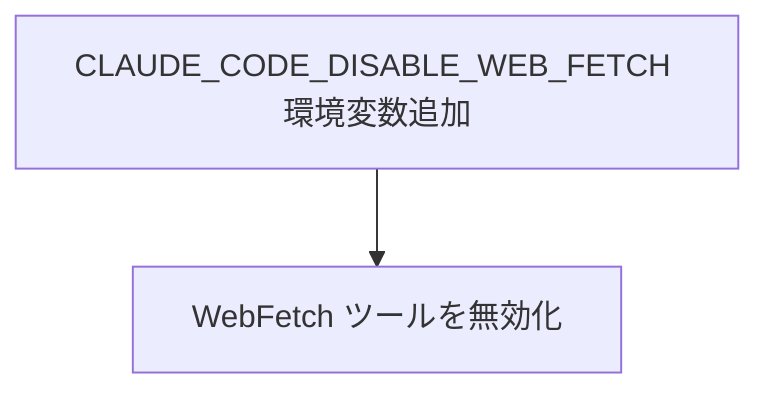
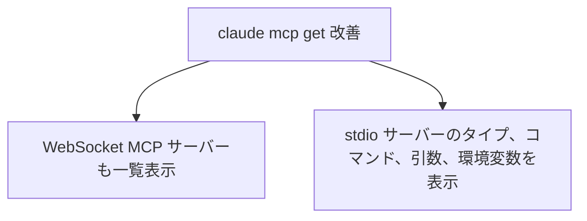

# Claude Code v2.1.285 アップデートまとめ

> 出典: https://code.claude.com/docs/en/changelog#2-1-285

## 💡 注目ポイント

### 1. `claude --desktop` コマンドの追加 — デスクトップアプリを簡単に起動

`claude --desktop` コマンドを実行すると、カレントディレクトリで Claude デスクトップアプリが起動します。`--continue` または `--resume <id>` オプションを付けると、指定したセッションを再開できます。

### 2. `claude plugin configure <plugin>` コマンドの追加 — プラグインの設定を簡単に管理

このコマンドを実行すると、指定したプラグインのオプションと未設定の項目が表示されます。`--values-stdin` オプションを付けると、標準入力から新しい値を読み取って保存できます。

### 3. `allowedProviders` マネージド設定の追加 — API プロバイダを制限

この設定を追加することで、マシンが使用できる API プロバイダを制限できます。Anthropic API、カスタムエンドポイント、Bedrock、Mantle、Vertex AI、Foundry、Claude Platform on AWS、または Cloud ゲートウェイから選択できます。

### 4. `CLAUDE_CODE_DISABLE_WEB_FETCH` 環境変数の追加 — WebFetch ツールを無効化

この環境変数を設定することで、WebFetch ツールを無効にできます。

### 5. `claude mcp list` と `claude mcp get` の改善 — MCP サーバーの情報表示を改善

`claude mcp list` コマンドは、WebSocket (`ws`) MCP サーバーも含めて一覧表示するようになりました。`claude mcp get` コマンドは、stdio サーバーのタイプ、コマンド、引数、環境変数を表示するようになりました。

## 📋 変更一覧

### ✨ 新機能

| 変更 | 誰にどう嬉しいか |
|---|---|
| `CLAUDE_CODE_DISABLE_WEB_FETCH` 環境変数を追加 | WebFetch ツールを無効にできる |
| `claude --desktop` コマンドを追加 | デスクトップアプリを簡単に起動できる |
| `claude plugin configure <plugin>` コマンドを追加 | プラグインの設定を簡単に管理できる |
| `<server>.<key>=<value>` を `claude plugin install --config` に追加 | バンドルされた `.mcpb` MCP サーバーの設定をインストール時に設定できる |
| `allowedProviders` マネージド設定を追加 | API プロバイダを制限できる |
| `CLAUDE_CODE_NONSTREAMING_TIMEOUT_RETRIES` 環境変数を追加 | 非ストリーミングフォールバックリクエストの再送回数を制限できる |

### ⬆️ 改善

| 変更 | 誰にどう嬉しいか |
|---|---|
| Bedrock と Vertex AI セッションが古いモデルに切り替わる | デフォルトモデルへのアクセスが拒否された場合でもセッションが継続できる |
| プラグインマーケットプレイスエラーが具体的な理由を示す | エラーの原因がわかりやすくなる |
| git URL の検証が改善 | プラグイン、マーケットプレイス、リポジトリのリモートの git URL が正しく検証される |
| Artifact ツールの結果が改善 | ページの書き込みや編集と同じステップで公開を提案する |
| Remote Control が改善 | `/btw` サイド質問が進行中のターンを見られるようになる |
| 画像のプレビューが改善 | BMP、HEIC、HEIF、AVIF、TIFF ファイルのプレビューが表示される |
| サブエージェントの自動モードが改善 | サブエージェントの実行が終了するタイミングが改善される |
| Bedrock と Vertex の起動モデルチェックが改善 | 使用できないモデルが最大1日間記憶される |
| Artifact ツールの公開結果が改善 | トークン数が削減される |
| SDK のライブネスが改善 | 非ストリーミングフォールバックリクエスト中に `ping` ストリームイベントが送信される |
| `/resume` と `claude --resume` が改善 | バックグラウンドで実行中のセッションを開くことができる |
| ターンごとのパフォーマンスが改善 | 多くの許可拒否ルールと MCP ツールが設定されている場合のパフォーマンスが向上する |
| フルスクリーンレンダリングがオフの長いセッションでのレスポンシブ性が改善 | セッションの終了が速くなる |
| Bedrock、Vertex、Mantle の起動モデルチェックが改善 | 同じ User-Agent、x-app、session ID ヘッダが送信される |
| `/tasks` が改善 | バックグラウンドで実行中のタスクが "System tasks" 行にまとめられる |
| `/claude-api` が改善 | Remote Control クライアントから実行できなくなる |
| `/config chrome=true` が改善 | /config パネルにリダイレクトされる |
| サンドボックス設定が改善 | プロジェクト設定で管理者権限が必要なサンドボックスを無効化したり、プロキシを置き換えたり、厳格な許可リストを拡張したり、管理された読み取り拒否を再開したりできなくなる |
| [VSCode] プラグインオプションフォームが追加 | プラグインのインストール時に未設定のオプションを尋ね、後で変更できる |
| [VSCode] オンデマンド診断ツールが追加 | パネルのクラウドがいつでも Problems パネルの現在のエラーと警告を読み取れる |
| [VSCode] Manage plugins ダイアログが改善 | 失敗したプラグインアクションの説明と修正方法が表示される |
| [Cloud sessions] `MCP_DISCOVERY_CACHE=1` が改善 | コネクタのツールリストがセッション再起動後に再利用される |
| [Claude Tag] 直接メッセージが追加 | Enterprise プランの Standard または Usage-Based Chat シートのメンバーが Cowork を持っている場合、クラウドコードシートは不要 |
| [Code Review] "Add a repository" ダイアログの組織メニューが改善 | スクロールに応じてより多くの GitHub 組織が読み込まれる |
| [Code Review] Code Review チェックランが改善 | リポジトリの REVIEW.md が適用されなかった場合にその理由が表示される |

### 🐛 バグ修正

| 変更 | 誰にどう嬉しいか |
|---|---|
| `claude -p` と `CLAUDE_CODE_FORK_SUBAGENT=1` の不具合を修正 | サブエージェントの Agent 呼び出しがフォアグラウンドで実行される |
| SSH 経由のプラグインとマーケットプレイスのインストールと更新が `GIT_SSH` または git 設定の `core.sshCommand` を無視していた不具合を修正 | 正しい SSH プログラムが使用される |
| 管理設定ファイルの読み取りが OS によって拒否された場合、クラウドコードが起動しなかった不具合を修正 | 警告が表示され、設定ファイルなしで起動する |
| 会話が圧縮された後に再開されたクラウドセッションが、セッションが既に読み取りまたは公開したアーティファクトの次の更新を拒否していた不具合を修正 | 更新が可能になる |
| `claude plugin disable` と `enable` が `name@marketplace` ID で別のレターケースの設定エントリを変更していた不具合を修正 | 正しいプラグインの設定エントリが変更される |
| リモートコントロールで送信されたメッセージに添付されたファイルが、1回のダウンロード失敗後に除外されていた不具合を修正 | ネットワークエラー、タイムアウト、サーバーエラーは最大2回再試行される |
| セッション中にモデルを切り替えた際に、新しいモデルが出力トークン制限と自動圧縮ウィンドウに縛られていた不具合を修正 | セッション再開まで新しいモデルが使用可能になる |
| ログやトランスクリプトで URL のパスワードの一部が表示されていた不具合を修正 | パスワード全体が正しく表示される |
| SSH パスフレーズや新規ホストのプロンプトが worktree や `/teleport` フェッチでターミナルを占有していた不具合を修正 | これらのフェッチはすぐに失敗する |
| セッション中に追加された MCP サーバーのツールがセッション終了後も利用可能だった不具合を修正 | セッション終了時に MCP サーバーのツールが無効化される |
| `claude -p --permission-prompt-tool` がバックグラウンドサブエージェントの許可要求を自動拒否していた不具合を修正 | 許可要求がプロンプトツールに送られる |
| `claude mcp list` と `claude mcp get`、および `claude mcp remove`、`login`、`logout` のエラーメッセージに改行や端末エスケープシーケンスが含まれていた不具合を修正 | 正しいエラーメッセージが表示される |
| サンドボックスの自動許可が多くのインラインスクリプトで毎回承認を求めていた不具合を修正 | スクリプトが `=` を含むだけでは承認を求めなくなる |
| フォークサブエージェントがセッションのプランモードや `dontAsk` モードを保持していなかった不具合を修正 | フォークは親の許可モードで実行され、プランモードから抜け出せなくなる |
| `claude remote-control --help` が `--[no-]chrome` のデフォルトを誤って説明していた不具合を修正 | セッションは `--chrome` が渡されない限り Chrome でクラウドを実行しない |
| 自動モードのサブエージェントが二重に返答していた不具合を修正 | 二重返答がなくなる |
| クラウドセッションの作成と `/remote-env` がアカウントの環境を最新の20個しか読み取っていなかった不具合を修正 | すべての環境が読み取られる |
| リモートコントロールがメッセージをすぐに読み取り済みとしてマークし、ターミナル終了時にキューに残っていたメッセージを失っていた不具合を修正 | メッセージは次の再開時に到着する |
| `claude plugin install` または `/plugin` がインストールされたプラグインのキャッシュまたはデータフォルダにプラグインをインストールしていた不具合を修正 | インストールは拒否される |
| フックと SDK の許可コールバックが ExitPlanMode でプランが欠落または古い不具合を修正 | プランが正しく読み取られる |
| クラウドセッションの最初の返答が数十ミリ秒遅れていた不具合を修正 | 返答が速くなる |
| `ANTHROPIC_AUTH_TOKEN` で認証するセッションが組織のポリシーを読み込まなかった不具合を修正 | 組織のポリシーが読み込まれる |
| 失敗した `agent()`、`parallel()`、`pipeline()` 呼び出しが未処理のプロミス拒否として扱われていた不具合を修正 | セッションが終了しなくなる |
| 同期フックがバックグラウンドプロセスの出力を開いたままにしていた不具合を修正 | フックがプロセス終了直後に終了する |
| WebFetch がレート制限されたドメインの安全性チェックをネットワークまたは企業ポリシーブロックとして報告していた不具合を修正 | 正しいエラーメッセージが表示される |
| フルスクリーンの ctrl+o トランスクリプトがファイル読み取りや検索が多いターンでフリーズしていた不具合を修正 | ツール呼び出しが完了すると結果が表示される |
| Amazon Bedrock の `modelTimeoutException` と `serviceUnavailableException` エラーが生の JSON ボディを表示していた不具合を修正 | 正しいエラーメッセージが表示される |
| `/autofix-pr` と `/schedule` がリポジトリにクラウド GitHub App がインストールされていないと報告していた不具合を修正 | 正しいエラーメッセージが表示される |
| `/artifacts` で行を却下するとファイルのアーティファクトへのリンクが解除されていた不具合を修正 | 同じファイルを再公開しても新しいアーティファクトは作成されない |
| 会話のリワインド後に Artifact ツールが公開すると、クラウドがリワインドターンでのみ読み取ったファイルの新しいコンテンツを上書きしていた不具合を修正 | 公開は拒否され、クラウドがファイルを再読み取りするまで待つ |
| `Artifact` 許可ルールが作業ディレクトリ外のファイルを公開できるようにしていた不具合を修正 | ファイルを公開するには `--add-dir` でファイルのフォルダを追加する必要がある |
| `/cost` と SDK `modelUsage` が拒否応答で異なるフォールバックモデルを返していた不具合を修正 | 正しいモデルが報告される |
| Artifact ツールがページの公開でソースファイルを上書きしていた不具合を修正 | クラウドがファイルを再読み取りするまで公開は拒否される |
| 自動モードが Artifact ツールのアセットアップロードと他人のアーティファクトの読み取りで分類器をスキップしていた不具合を修正 | 分類器が正しく動作する |
| `/ultrareview` が一時的にプロジェクトフォルダを読み取れなかった際に誤ったエラーメッセージを表示していた不具合を修正 | 正しいエラーメッセージが表示される |
| macOS と Linux の `/ultrareview` が git worktree の working tree をアップロードできなかった不具合を修正 | working tree が正しくアップロードされる |
| Artifact ツールが一時的なサーバーエラーの再試行後に公開を競合と報告していた不具合を修正 | 最初の試行が成功していた場合は競合と報告されない |
| `/ultrareview` がコロンを含む認証ファイル名をアップロードしていた不具合を修正 | 認証ファイルはアップロードされない |
| 2つのセッションが同時にクラッシュしたプロセスによって残されたログインリフレッシュロックを回復しようとした際に稀に認証失敗が発生していた不具合を修正 | 認証が正しく行われる |
| PowerShell ツールの許可チェックが deny と ask ルールをスキップしていた不具合を修正 | 許可チェックが正しく行われる |
| macOS と Linux の `/ultrareview` が一部の異常なファイル名で遅く動作していた不具合を修正 | アップロードが速くなる |
| キャンセルされたシェルコマンドやフックがキャンセルが到着した際にセットアップ中でも開始していた不具合を修正 | コマンドやフックはキャンセルされる |
| vim モードで外部エディタ (Ctrl+G) で編集した後、NORMAL モードで `x` または `r` が貼り付けられたテキストプレースホルダを破壊していた不具合を修正 | 貼り付けられたテキストプレースホルダが破壊されない |
| API の出力コンテンツフィルタによってブロックされた応答が再送および再試行されていた不具合を修正 | フィルタのエラーがすぐに表示される |
| プラグインがまだ設定が必要な `.mcpb` MCP サーバーをスキップしていた不具合を修正 | 設定が必要な `.mcpb` MCP サーバーが `/plugin`、インストールメッセージ、`claude plugin install` で報告される |
| セッションの保存されたトランスクリプトに圧縮マーカーまたはループウェイクアップエントリが欠落または誤ったフィールドを持つと、セッションの圧縮または再開が失敗していた不具合を修正 | セッションの圧縮または再開が可能になる |
| WSL で `/ultrareview` がコロンを含む変更されたファイル名を持つ Linux ボリュームのチェックアウトを拒否していた不具合を修正 | チェックアウトが可能になる |
| `CLAUDE_CODE_RESUME_INTERRUPTED_TURN` が `--max-turns` で終了したターンを再実行していた不具合を修正 | ターンは再実行されない |
| ブラウザが成功を示した後、サインインが永遠に待機していた不具合を修正 | サインインが正しく行われる |
| Windows で `/ultrareview` がホームフォルダにルートを持つリポジトリのリンクされたワークツリーをアップロードしていた不具合を修正 | アップロードされない |
| クラウドセッションがアップロードフォルダが存在しないと報告していた不具合を修正 | 正しいエラーメッセージが表示される |
| `claude agents` からバックグラウンドセッションに送信された返答が許可プロンプトを待っている間に時々承認されていた不具合を修正 | 返答は正しく処理される |
| `claude attach`、`logs`、`stop`、`respawn`、`rm` がオプションが先行していた場合にコマンド名をプロンプトとして新しいセッションを開始していた不具合を修正 | 正しいプロンプトが表示される |
| `.claude/settings.local.json` の許可ルールが git リポジトリ外で保留されていた不具合を修正 | 許可ルールが適用される |
| `/claude-api` eval ランナースキャフォールドとレポートビルダーがシンボリックリンクまたはハードリンクを通して出力ファイルに書き込んでいた不具合を修正 | 正しく書き込まれる |
| `/claude-api` eval ランナースキャフォールドが `max_tokens` で切断された応答をスコア平均に含めていた不具合を修正 | 切断された応答は別途カウントされる |
| `&nbsp;` がターミナルでリテラルテキストとして表示されていた不具合を修正 | 正しく表示される |
| フルスクリーンモード外の長いセッションで `/clear` または `/compact` 後に一時的なフリーズが発生していた不具合を修正 | フリーズが解消される |
| 承認された編集がデバイス（例：/dev/null にシンボリックリンクされたファイル）を対象としていた場合に IDE の diff ビューから承認が来た場合に承認されなかった不具合を修正 | 編集が正しく行われる |
| ストリーミングが失敗し続けた場合に失敗した API リクエストが最大21回再試行されていた不具合を修正 | 非ストリーミングフォールバックがリクエストの再試行バジェットを共有する |
| [VSCode] Enter キーを押した後にスラッシュコマンドを入力すると、ファジーマッチで選択された無関係なメニュー項目が実行されていた不具合を修正 | 正しいコマンドが実行される |
| [VSCode] 長いセッション中にエージェントトランスクリプトが開いていると、エージェントの新しいメッセージが失われていた不具合を修正 | メッセージが失われない |
| [VSCode] クラウドコードまたは IDE タグを引用したメッセージがチャットで残りのテキストを失っていた不具合を修正 | メッセージが正しく表示される |
| [VSCode] クラウドが作業中に送信されたメッセージがセッション再開後に会話から消えていた不具合を修正 | メッセージが正しく表示される |
| [VSCode] セッションリストの Web タブがアカウント切り替え後に前のアカウントのセッションを表示していた不具合を修正 | 正しいセッションが表示される |
| [VSCode] 復元されたタブが VS Code が `CLAUDE_CODE_RESUME_INTERRUPTED_TURN` が設定された状態で開始された場合に中断されたターンを再実行していた不具合を修正 | ターンは再実行されない |
| [VSCode] コマンドメニューの行をクリックした後に Escape キーがコマンドメニューを閉じる代わりに実行中のターンを停止していた不具合を修正 | Escape キーが正しく動作する |
| [VSCode] 過去の会話を開くと、ライブ会話が保存されたコピーに置き換えられていた不具合を修正 | 正しい動作をする |
| [VSCode] 拡張機能の再起動後に復元されたクラウドタブが空白のままで回復方法が表示されなかった不具合を修正 | 回復方法が表示される |
| [VSCode] 別のウィンドウまたはアプリですでに開かれている会話を開くと、警告なしにそのコピーが開始されていた不具合を修正 | 警告が表示される |
| [VSCode] ウィンドウの再読み込み後にフックのブロックまたは停止の理由が消えていた不具合を修正 | 理由が正しく表示される |
| [VSCode] エディタが拡張機能の自動保存に応答しなくなると、すべてのファイル読み取り、書き込み、編集が10分間停止してスキップされていた不具合を修正 | 正しく動作する |
| [VSCode] エージェントマップがサブエージェントにセッションのモデルの代わりに実際に実行されたモデルのラベルを付けていた不具合を修正 | 正しいモデルがラベルに付けられる |
| [VSCode] Manage plugins ダイアログでプラグインをアンインストールすると、プロジェクトにインストールされたプラグインが誤って削除されていた不具合を修正 | 正しいプラグインが削除される |
| [VSCode] サインインが同じサインイン方法を再選択した後に認証コードステップに留まっていた不具合を修正 | 正しくサインインされる |
| [VSCode] 長いセッションが最古の行をトリムするとチャットパネルが停止していた不具合を修正 | 正しく動作する |
| [VSCode] 多くのエージェントが実行されていると会話がセッションから消えていた不具合を修正 | 会話が正しく表示される |
| [VSCode] セッションが `/rename`、SessionStart フック、または claude.ai でリネームされた後、エディタタブが古い名前を保持していた不具合を修正 | 正しい名前が表示される |
| [VSCode] エージェントマップのトランスクリプトビューが実行中のエージェントに送信されたメッセージを除外していた不具合を修正 | メッセージが正しく表示される |
| [Cloud sessions] Run now が拒否される前に内部エラーテキストを表示していた不具合を修正 | ルーチンの失敗通知と同じ説明が表示される |
| [Claude Tag] Default model 設定が管理者設定とチャンネルの Configure ページで使用できないモデルを提供していた不具合を修正 | 正しいモデルが提供される |
| [Claude Tag] クラウドの Slack メッセージの下の注記がフォールバックモデルで回答したこととその理由を示していたが、クラウドが後でそのメッセージを編集した際に消えていた不具合を修正 | 注記が正しく表示される |
| [Code Review] "Add a repository" ダイアログの組織メニューが GitHub 組織のほんの一部しか表示していなかった不具合を修正 | スクロールに応じてより多くの組織が表示される |
| [Code Review] Code Review チェックランがリポジトリの REVIEW.md が適用されなかった場合にその理由を示していなかった不具合を修正 | 理由が表示される |

### 📝 その他

| 変更 | 誰にどう嬉しいか |
|---|---|
| MCP ツールが `_meta['anthropic/alwaysLoad']` を `false` に設定すると、`--mcp-config`、Agent SDK、またはプラグインサーバーが `alwaysLoad` に設定されていても遅延される | 不要な MCP ツールのロードが防止される |
| バックグラウンドの Bash と PowerShell コマンドが時間制限（`timeout` と `run_in_background`、デフォルト30分、最大2時間）で停止する | 長時間実行されるコマンドが制限される |
| Code Review のプルリクエストレビューと `/ultrareview` が `disableWorkflows` がオンの時に実行される | ワークフローが無効化されている場合でもレビューが可能になる |
| カスタム `ANTHROPIC_BASE_URL` を使用するセッションが 1M コンテキストウィンドウのモデルを使用する | より長いコンテキストウィンドウが利用可能になる |
| チームおよびエンタープライズセッション、およびクラウドコードがサインインプランを決定できないセッションが、組織ポリシーが読み込まれるまで WebFetch を保留する | WebFetch が正しく動作する |
| `/memory` がバックグラウンドセッションまたはクラウドコードのツールが開始したセッションから Auto-memory をオンにできなくなる | Auto-memory のオンオフが正しく動作する |
| 自動モードをデフォルトの許可モードにする一回限りのオファーが、サードパーティプロバイダやテレメトリオフのユーザーにも表示される | 自動モードをデフォルトに設定するオプションが増える |
| `claude -p` と Python Agent SDK セッションがサードパーティプロバイダやテレメトリオフのユーザーでも自動モードで開始する | 許可モードが正しく設定される |
| Bedrock、Mantle、およびクラウドプラットフォーム on AWS のリクエストが非デフォルトポートのベースURLに SigV4-signed Host ヘッダを含める | リクエストが正しく送信される |
| クラウドセッションおよびセルフホステッドランナーで `widgets` という MCP サーバー名が予約される | 予約されたサーバー名が使用できなくなる |
| macOS および Linux の `/ultrareview` がローカルチェックアウトのシンボリックリフを除外する | シンボリックリフを含むチェックアウトは拒否される |
| Windows でプロジェクトおよびローカル設定の `env` が `ALLUSERSPROFILE`、`SystemDrive`、または `CommonProgramFiles` 変数を設定しなくなる | これらの変数はユーザーまたは管理者設定で設定する必要がある |
| `/tasks` がバックグラウンドで実行中のクラウドコードのタスクを "System tasks" 行にまとめる | タスクが正しく表示される |
| macOS および Linux の `/ultrareview` が git 2.31 以降でローカルリポジトリのアップロードに git 2.31 以降が必要になる | 古い git バージョンではアップロードできない |
| macOS および Linux の `/ultrareview` が git 2.31 以降で部分クローンをワーキングツリースナップショットとして送信する | 古い git バージョンでは部分クローンが拒否される |
| Bedrock、Vertex、および Mantle の起動モデルチェックがクラウドコードとして自身を識別する | 正しい User-Agent、x-app、session ID ヘッダが送信される |
| `claude mcp get` が stdio MCP サーバーの提供するプラグインの環境変数を非表示にする | 変数名のみが表示される |
| `/claude-api` がリモートコントロールクライアントから実行できなくなる | セキュリティが向上する |
| `/config chrome=true` が /config パネルにリダイレクトされる | 正しい動作をする |
| サンドボックス設定がプロジェクト設定で管理者権限が必要なサンドボックスを無効化したり、プロキシを置き換えたり、厳格な許可リストを拡張したり、管理された読み取り拒否を再開したりできなくなる | セキュリティが向上する |
| [VSCode] ウィンドウのリロードが中断したタブの最後のメッセージの下にメモが追加される | 中断したタブの状態がわかる |
| [VSCode] Manage plugins ダイアログでプラグインを削除する前に確認メッセージが表示される | 誤ってプラグインを削除するのを防ぐ |
| [Cloud sessions] `MCP_DISCOVERY_CACHE=1` がクラウド環境の変数に設定されている場合、コネクタのツールリストがセッション再起動後に再利用される | コネクタのツールリストが正しく再利用される |
| [Claude Tag] 直接メッセージが Enterprise プランの Standard または Usage-Based Chat シートのメンバーに追加される | 直接メッセージが送信可能になる |
| [Code Review] Code Review チェックランがリポジトリの REVIEW.md が適用されなかった場合にその理由を表示する | 理由が表示される |
