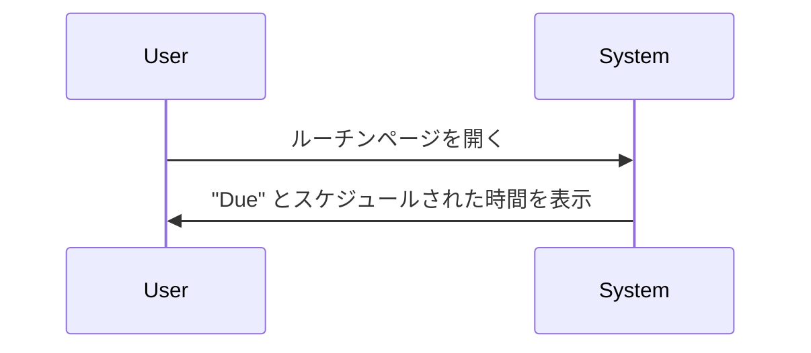

# Claude Code v2.1.286 アップデートまとめ

> 出典: https://code.claude.com/docs/en/changelog#2-1-286

## 💡 注目ポイント

### 1. 許可プロンプトにスタックした複数のリクエストのカウントを追加

複数の許可リクエストがスタックした場合、"2 of 5" のようにカウントを表示するようになりました。これにより、ユーザーは現在何番目のリクエストを処理しているかが明確にわかります。

### 2. フルスクリーンモードでのリストの "N more" 行へのマウスサポート追加

フルスクリーンモードでリストの "N more" 行をクリックすると、そのリストの末尾にジャンプするようになりました。また、ホバーと押下状態もサポートされています。

### 3. クラウドセッションのルーチンページの改善

クラウドセッションのルーチンページが "Due" とスケジュールされた時間で表示されるようになりました。これにより、スケジュールされた実行が遅れている場合でも、ユーザーは正確な情報を得ることができます。

### 4. VSCode エクステンションの改善

VSCode エクステンションにブックマーク機能が追加され、Claude の応答を保存してブックマークサイドパネルで表示できるようになりました。また、質問カードにオプションプレビューが追加され、選択したオプションのモックアップやスニペットが表示されるようになりました。

### 5. Claude Tag の改善

Claude Tag の管理設定にチャンネル追加ボタンが追加され、任意のチャンネル（プライベートチャンネルを含む）に制限を設定できるようになりました。また、Slack チャンネルが別のワークスペースに移動された際の Claude 設定の保持問題が修正されました。

## 📋 変更一覧

### 🚨 セキュリティ修正

| 変更 | 誰にどう嬉しいか |
|---|---|
| MCP エラーメッセージで資格情報の値が表示されないように修正 | セキュリティ情報の漏洩を防ぐ |

### ✨ 新機能

| 変更 | 誰にどう嬉しいか |
|---|---|
| 許可プロンプトにスタックした複数のリクエストのカウントを追加 | 複数のリクエストを処理する際の状況把握が容易になる |
| フルスクリーンモードでのリストの "N more" 行へのマウスサポート追加 | リストのナビゲーションがより直感的になる |
| VSCode エクステンションにブックマーク機能を追加 | 重要な応答を簡単に保存・参照できる |
| VSCode エクステンションにオプションプレビューを追加 | 選択肢の内容が一目でわかる |
| Claude Tag にチャンネル追加ボタンを追加 | 任意のチャンネルに制限を設定できる |

### ⬆️ 改善

| 変更 | 誰にどう嬉しいか |
|---|---|
| コミットガイダンスの改善 | プロジェクトやユーザースキルに `verify` が含まれている場合、コミット前にそれを実行する |
| サブエージェントビューでの即時送信（ctrl+enter）の改善 | サブエージェントのコマンドがバックグラウンドで実行されるため、メッセージがすぐに読み取られる |
| バックグラウンドエージェントからの返信の改善 | メッセージの再キャプチャなしで直接返信される |
| リストスクロールバーの改善 | スクロールバーが安定し、↑/↓矢印でスクロールできるようになる |
| 外部エディタ（Ctrl+G）の改善 | カーソル位置の行番号でエディタが開く |
| スラッシュコマンド提案の応答性の改善 | 多くのスキルやプラグインコマンドがインストールされている場合でも、より速く提案が表示される |
| 出力スタイルピッカーの改善 | 現在のスタイルで開き、各スタイルの説明が名前の下に表示される |
| `/hooks` の改善 | フックの詳細画面の閉じる行が "this hook" と表示される |
| クラウドセッションのルーチンページの改善 | "Due" とスケジュールされた時間で表示される |
| VSCode エクステンションの管理プラグインダイアログの改善 | オフのプラグインが他の設定によりまだオンになっている場合や、プラグインフォルダのクラッシュの説明が表示される |

### 🐛 バグ修正

| 変更 | 誰にどう嬉しいか |
|---|---|
| 複数の Claude Code プロセスと IDE エクステンションが gcpAuthRefresh または awsAuthRefresh 認証情報の期限切れ時にログインブラウザを開く問題を修正 | 不必要なログイン画面の表示がなくなる |
| `claude --resume` と `--continue` がバッチの並列ツールコール後にすべてのターンを失う問題を修正 | セッションがクラッシュまたは強制終了された後もターンが保持される |
| ツールやフックがオブジェクト、数値、またはブール値を返した後に API 400 エラーが発生する問題を修正 | 正しい形式でデータが返される |
| 非常に大きな履歴を持つクラウドセッションがコンテナが停止中にトランスクリプトがまだ読み込まれているために起動しない問題を修正 | セッションが正しく起動する |
| Claude アプリゲートウェイの支出メーターが 1 時間プロンプトキャッシュ書き込みを 5 分レートで安価にカウントし、ストリームターンがサーバーサイドツール（ウェブ検索など）を実行する最初のモデル呼び出しの入力トークンのみをカウントする問題を修正 | 正確なコスト計算が可能になる |
| macOS セッションが `/login` が別の Claude Code ウィンドウで成功した後も "Not logged in" または "Login expired" と表示される問題を修正 | 正しいログイン状態が表示される |
| Anthropic API がデフォルトモデルまたはモデルエイリアスが解決するモデルを拒否した場合にすべてのターンが失敗する問題を修正 | 同じティアの前のモデルで再試行される |
| 組織のポリシーがリモートコントロールをオフにした後もリモートコントロールセッションが接続されたままになる問題を修正 | ポリシーに従ってセッションが切断される |
| フォールバックモデルが速く実行できない場合に拒否と `--fallback-model` の再試行が失敗する問題を修正 | 標準速度で実行され、インタラクティブセッションで一回限りの通知が表示される |
| MCP ディスカバリーキャッシュが有効な場合、ヘッドレスセッションが成功した再認証後に "MCP サーバーは認証を要求します" というリマインダーを繰り返す問題を修正 | 不必要なリマインダーが表示されなくなる |
| `claude auth status` がコンソールサインインの保存された API キーを `claude.ai` として報告する問題を修正 | 正しく `api_key` として報告され、VS Code エクステンションがそのセッションを API キーセッションとして扱う |
| `/status` が Anthropic プロファイルと API キーの両方を効果的であるかのようにリストする問題を修正 | プロファイルは使用されていないとマークされる |
| リモートコントロールで送信されたメッセージに添付されたファイルが到着しなかった場合に Claude に通知されない問題を修正 | ファイルが正しく通知される |
| リモートコントロールメッセージが Claude Code が終了している間に到着した場合に配信済みとマークされ、その後回答されない問題を修正 | セッションの次の実行までキューに留まる |
| MCP エラーメッセージで資格情報の値が表示される問題を修正 | セキュリティ情報の漏洩を防ぐ |
| パーセントエンコードされた Bearer トークンがエラーメッセージで部分的にマスクされる問題を修正 | トークンが完全にマスクされる |
| 赤字ログとトランスクリプトが不可視文字（ゼロ幅スペースなど）を含む秘密鍵名を表示する問題を修正 | 秘密鍵名が正しく赤字される |
| ログとトランスクリプトが URL パスワードの一部を表示する問題を修正 | パスワードが正しく赤字される |
| `/feedback` がディスクに保存する zip 内のセッショントランスクリプトに無効な JSON 行が含まれる問題を修正 | 正しい JSON 形式で保存される |
| MCP コネクタが古い MCP ハンドシェイクをサーバーがドロップした後、最大 1 日間ツールをリストしない問題を修正 | 正しくツールがリストされる |
| Claude からの繰り返しの MCP サインイン要求が保留中のサインインリンクを置き換え、そのリンクが機能しなくなる可能性がある問題を修正 | サインインリンクが正しく機能する |
| `/usage` が MCP サーバーが接続中または接続したばかりのときに行われたツール呼び出しをクレジットしない問題を修正 | 正しくクレジットされる |
| claude.ai で有効化されたプラグインが一時的なサーバーエラー後に Claude Code でセッションから時々消える問題を修正 | プラグインが正しく表示される |
| 実行中のサブエージェントにタイプされたメッセージがサブエージェントがそれを読んだ後にそのトランスクリプトに 2 回表示される問題を修正 | メッセージが 1 回だけ表示される |
| サブエージェントが登録名を持っていない場合にサブエージェントのハンドバックメッセージが raw タスク ID を代わりに表示する問題を修正 | エージェントの名前が表示される |
| フォアグラウンドサブエージェントがタスク追跡ツール（TaskCreate/Get/Update/List、TodoWrite）を有効にしているセッションで時々それらを欠落する問題を修正 | ツールが正しく表示される |
| ワークツリー分離で生成されたサブエージェントが最初のファイル読み取り時にプロジェクトの CLAUDE.md とそのインポートをワークツリーコピーから 2 回読み込む問題を修正 | ファイルが 1 回だけ読み込まれる |
| 接続が数分間の応答の途中で停止したときにワークフローツールサブエージェントが元のプロンプトから再起動される問題を修正 | サブエージェントが正しく再起動される |
| バックグラウンドエージェントまたはチームメートのトランスクリプトを表示中に `/compact`、`/clear`、および `/rewind` をタイプするとメイン会話にサイレントで作用する問題を修正 | ダイアログがターゲットを指定し、最初に確認を求める |
| バックグラウンドジョブが完了中であるにもかかわらず待機中と表示される問題を修正 | 正しく完了中と表示される |
| モデルフォールバックが 1 ターンのみ続いた場合にツール出力内でコミット帰属リマインダーが再送信される問題を修正 | リマインダーが正しく送信される |
| 折りたたまれた行（"Thought for 4s" など）の単語間のスペースをクリックするとフルスクリーンモードで行がハイライトされるが展開されない問題を修正 | 行が正しく展開される |
| 詳細のない行（長い名前を持つアクション行など）がリスト画面で他の行の詳細を右に押し出す問題を修正 | 行が正しく配置される |
| 非常に長い名前を持つファイルがクラウドセッションに添付されたときに到達しない問題を修正 | ファイルが正しく到達する |
| マーケットプレイスをロードすることを拒否する Claude Code のプラグインエラーが "not found" と表示される問題を修正 | エラーメッセージが具体的になり、修正方法が示される |
| `/plugin` の Discover タブがマーケットプレイス名をその行がすでに引用符で囲まれているにもかかわらず引用符なしで "Checking … for new plugins" 行に表示する問題を修正 | マーケットプレイス名が正しく引用符で囲まれる |
| Windows で `claude --bg` とエージェントビューが `claude` がすでに信頼しているフォルダを異なる大文字小文字で保存された信頼記録がある場合に拒否する問題を修正 | フォルダが正しく信頼される |
| [VSCode] 会話がすでにサイドバーで開かれているときにタブで二重に開く問題を修正 | サイドバーが正しく切り替わる |
| [VSCode] 設定ダイアログが Claude Code が 1 MB 以上の出力を印刷したときに保存失敗を報告する問題を修正 | 正しく保存される |
| [VSCode] エクステンションが応答しなくなったときに "Teleporting session…" スピナーが終わりなく回る問題を修正 | スピナーが正しく停止する |
| [Cloud sessions] 答えられた質問カードまたは承認されたツールコールがセッションがアイドル状態になった後に Claude がメッセージを送信した後に返答されない問題を修正 | 正しく返答される |
| [Cloud sessions] 管理設定で組織環境のセットアップスクリプトをクリアしても新しいクラウドセッションがまだ古いスクリプトを実行している問題を修正 | 正しく新しいスクリプトが実行される |
| [Cloud sessions] セルフホステッド環境の管理ページの Runner アクションメニューがそれ自体で数秒後に閉じる問題を修正 | メニューが正しく開く |
| [Cloud sessions] クラウドセッションが開始されなかったルーチン実行が Runs ペイン、ルーチンのページ、サイドバーで Succeeded と表示される問題を修正 | 正しく Failed と表示される |
| [Cloud sessions] クラウドセッションの出力カードでオーディオまたはビデオファイルをクリックすると空のファイル検索が開く問題を修正 | 正しくファイルが再生される |
| [Claude Tag] メモリリコールがデフォルトの Sonnet モデルを使用できない組織で何も見つからない問題を修正 | 正しくメモリリコールが機能する |
| [Claude Tag] Enterprise Grid 管理者が別のワークスペースに移動した Slack チャンネルが最初の投稿が Claude に言及していない場合に Claude 設定を失う問題を修正 | 正しく設定が保持される |
| [Claude Tag] Slack スレッドで Claude が新規のマシンで開始し、プッシュされていない作業を失う問題を修正 | 正しく作業が保持される |
| [Claude Tag] 管理設定の Claude Tag の支出制限ページで大規模な組織のパブリックチャンネル名が raw Slack ID として表示される問題を修正 | 正しくチャンネル名が表示される |
| [Claude Tag] claude.ai で表示される Slack から開始されたセッションのタイトルが Slack ユーザー ID やエスケープコードなしで表示されるように改善 | タイトルが読みやすくなる |

### 📝 その他

| 変更 | 誰にどう嬉しいか |
|---|---|
| プロンプトが何も実行またはキューにない状態で送信された場合に、通常のテキスト色ですぐに表示されるように変更 | プロンプトの可視性が向上 |
| 失敗した API リクエストの再試行方法を変更：1 つの制限がモデル呼び出し全体をカバーするようになり、デフォルトの再試行設定では失敗した呼び出しが最大 14 リクエストを送信する | API リクエストの再試行がより効率的になる |
| `--bare` を変更：コマンドラインで指定された MCP サーバーのみ接続し、モデルにシステムリマインダーを送信せず、バックグラウンドタスクを開始しない | `--bare` オプションの動作が明確になる |
| 送信キー（ctrl+enter）を変更：スキル自身のシェルコマンドをバックグラウンドに移動する代わりに終了する | 送信キーの動作が明確になる |
| WebFetch エラーを変更：レート制限されたドメイン安全チェックで Claude にループで再試行しないように指示する | WebFetch エラーがより適切に処理される |
| プラグインインストールを変更：git リポジトリまたはフォルダの npm ソースを拒否し、プラグイン依存関係をレジストリパッケージからのみインストールする | プラグインインストールがより安全になる |
| リスト画面（`/artifacts`、`/mcp`、`/skills`、`/hooks` など）を変更：各行の詳細を名前の後に 1 列で配置する | リスト画面のレイアウトが向上 |
| リストのオーバーフロー行を変更： "↑ N more" / "↓ N more" と表示する代わりに "N more above" / "N more below" と表示する | リストのナビゲーションがより直感的になる |
| `/hooks` を変更：設定したフックの 1 つのリストをイベントごとにグループ化して開く | フックの表示がより簡潔になる |
| テーマピッカーを変更：端末に合わせてスクロールリストに変更し、プレビューを画面外に押し出さない | テーマピッカーの使いやすさが向上 |
| `/exit` の Remove worktree を変更：Claude Code が開始したサーバーとシェルを停止した後に実行する | Windows でフォルダが正しく削除される |
| `claude-api` スキルの Managed Agents 例を変更：制限されたネットワーキングを持つ環境を作成する | `claude-api` スキルの使いやすさが向上 |
| ブラウザリンクを `/ultrareview` と `claude ultrareview` の出力から削除 | 不要なリンクが表示されなくなる |
| [VSCode] Stop と Escape を変更：現在のターンのみ終了し、バックグラウンドエージェントは引き続き実行される | エージェントの制御がより細かく become |
| [VSCode] "✻ Claude Code" ステータスバーアイテムを変更：ファイルが開かれていない場合でもすべてのウィンドウに表示される | Claude Code の使いやすさが向上 |
| [Cloud sessions] ルーチンのページを変更：スケジュールされた実行が遅れている場合、"Due" とスケジュールされた時間で表示される | スケジュールされた実行の状態が明確になる |
| [Claude Tag] 管理設定の Claude Tag の支出制限ページにチャンネル追加ボタンを追加 | 任意のチャンネルに制限を設定できる |
