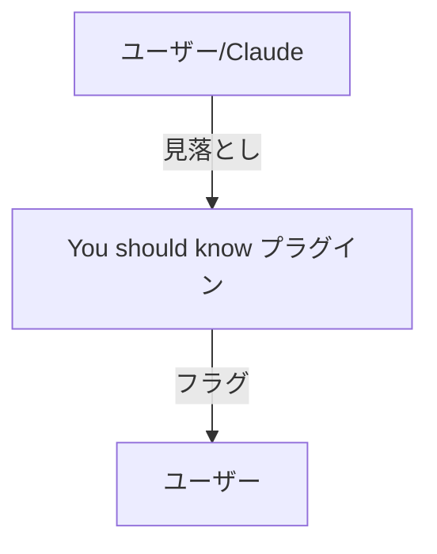

# Claude Code v2.1.287 アップデートまとめ

> 出典: https://code.claude.com/docs/en/changelog#2-1-287

## 💡 注目ポイント

### 1. プラグインによる挙動の深い変更が可能に

従来のプラグインは表面的な機能拡張に限られていましたが、今回のアップデートにより、プラグインがより深い挙動を変更できるようになりました。これにより、開発者はよりカスタマイズされたエクスペリエンスを提供できるようになります。

### 2. 「You should know」プラグインの追加

新たに追加された「You should know」プラグインは、サイドエージェントがユーザーや Claude が見落としがちな点をフラグします。`/plugin enable cc-plugin-you-should-know@builtin` で有効化できます（テレメトリーがオンのファーストパーティセッションの場合）。

### 3. エージェントビューに `n:<text>` フィルターを追加

セッション名やタスクにマッチするフィルターが追加されました。フィルターは折りたたまれたセクションでマッチを表示し、Enter キーで最初のマッチを開きます。これにより、特定のセッションやタスクをより簡単に検索できます。

### 4. OpenTelemetry `user_prompt` イベントに `prompt_text` を追加

`prompt_text` は `prompt` のコピーで、ドット付きキーをネストするバックエンド向けです。`prompt` をドロップまたはマスクする場所で `prompt_text` もドロップまたはマスクしてください（anthropics/claude-code#70763）。

### 5. 2025-11-25 プロトコルでの URL プロンプトの追加

MCP サーバーからの URL プロンプト（例：サインイン）が追加されました。この更新後にサーバーが接続できなくなった場合は、MCP 設定エントリに `"bareElicitationCapability": true` を追加してください。

## 📋 変更一覧

### ✨ 新機能

| 変更 | 誰にどう嬉しいか |
|---|---|
| プラグインによる挙動の深い変更が可能に | よりカスタマイズされたエクスペリエンスを提供 |
| 「You should know」プラグインの追加 | 見落としがちな点をフラグし、より良いレビューを提供 |
| エージェントビューに `n:<text>` フィルターを追加 | セッション名やタスクをより簡単に検索 |
| OpenTelemetry `user_prompt` イベントに `prompt_text` を追加 | ドット付きキーをネストするバックエンドでのプロンプト管理を改善 |
| 2025-11-25 プロトコルでの URL プロンプトの追加 | MCP サーバーからの URL プロンプトを利用可能に |

### ⬆️ 改善

| 変更 | 誰にどう嬉しいか |
|---|---|
| `/config` の改善 | 設定のサイクル表示とナビゲーションが向上 |
| プラグインマーケットプレイスエラーの改善 | エラーメッセージがより明確に |
| プラグインリストの改善 | 依存関係の未インストールを表示 |
| SDK セッションの改善 | 優先度の高いメッセージがバックグラウンドの web fetch をキャンセルしなくなった |
| `/memory` の改善 | 左右矢印キーでオン/オフ設定を切り替え可能に |
| `/skill` 名の改善 | メッセージ中でスキル名を認識 |
| プロンプト入力ボーダーのコントラスト改善 | 読みやすさが向上 |
| ファイル送信の改善 | タイムアウトやネットワークエラーで失敗したアップロードを再試行 |
| 大規模な MCP ツール結果の改善 | メモリ使用量の削減とセッションファイルのサイズ縮小 |

### 🐛 バグ修正

| 変更 | 誰にどう嬉しいか |
|---|---|
| fast mode がリモートセッションでオフになるバグを修正 | リモートセッションでの fast mode の利用が可能に |
| Remote Control がメッセージを受信しないバグを修正 | 安定した Remote Control セッションが可能に |
| フックのスクリプトファイルが欠落している場合の無限通知を修正 | 不要な通知がなくなり、エラーの報告が一回限りに |
| ツールハートビートの不達を修正 | ツールの正常な動作が確保される |
| Bedrock と Vertex の startup model チェックのバグを修正 | 正しいモデルリストが表示 |
| Chrome ブラウザピッカーの JSON パースエラーを修正 | Chrome との連携が安定 |
| `/model` での Fable の選択バグを修正 | 最新の Fable がデフォルトで選択される |
| Opus 5.5 と Sonnet 5.5 の切り替え時のバグを修正 | 安定したモデル切り替えが可能に |
| Amazon Bedrock Guardrails のブロックメッセージを修正 | 正しいエラーメッセージが表示される |
| 危険な `rm` コマンドのバグを修正 | 安全なコマンド実行が可能に |
| `claude -p` と SDK セッションでのモデルフォールバックの繰り返しを修正 | 安定したセッションが可能に |
| CLAUDE.md の重複添付を修正 | セッションの整合性が保たれる |
| 終了したエージェントのセッションを再開できないバグを修正 | セッションの再開が可能に |
| `/advisor` のペアリングチェックを修正 | 正しいアドバイスが提供される |
| Bash パーミッションプロンプトの表示を修正 | わかりやすい説明が表示される |
| フルスクリーンセッションのエラーを修正 | セッションが安定して実行される |
| 組織ごとのツールパーミッションの上限を修正 | 正しいパーミッションが適用される |
| 大規模な MCP 結果のページングを修正 | 正しいページングが可能に |
| コミットアトリビューションのリマインダーの表示を修正 | 正しいタイミングでリマインダーが表示される |
| スクリーンリーダーモードのバグを多数修正 | スクリーンリーダーでの操作性が向上 |
| クラウドセッションでの会話の損失を修正 | セッションの安定性が向上 |
| プラグインのリロードによるセッションの破損を修正 | セッションの整合性が保たれる |
| `/desktop` のエラーメッセージを改善 | エラーの原因が明確に表示される |
| MCP コネクタツールコールの重複実行を修正 | 安定したツールコールが可能に |
| セッションスタートフックの実行を修正 | 新しいクラウドセッションでフックが正しく実行される |
| トランスクリプトのフック数表示を修正 | 正確なフック数が表示される |
| ファイル送信のタイムアウトを修正 | ファイル送信が安定する |
| セッション中のリポジトリ追加のバグを修正 | スキルとプラグインが正しくロードされる |
| 大型画像の送信を修正 | 大型画像が正しく送信される |
| 添付ファイル数の制限を修正 | 正しい添付ファイル数でメッセージが送信される |
| headless セッションでの認証エラーを修正 | 安定したセッションが可能に |
| Windows での interactive `claude` のバグを修正 | 安定したコマンド実行が可能に |
| Bedrock, Vertex, Mantle でのモデルチェックのバグを修正 | 正しいモデルが選択される |
| VSCode での多数のバグを修正 | VSCode での操作性が向上 |
| Cloud sessions での多数のバグを修正 | クラウドセッションの安定性が向上 |
| Claude Tag での多数のバグを修正 | Claude Tag の機能が向上 |
| Code Review での多数のバグを修正 | Code Review の機能が向上 |

### 📝 その他

| 変更 | 誰にどう嬉しいか |
|---|---|
| Windows での Bash ツールの速度改善 | Bash ツールのレスポンスが向上 |
| シェル書き込みの変更 | 安全なファイル操作が可能に |
| Opus 4.7+ と Fable のコンテキストウィンドウサイズの変更 | より大きなコンテキストウィンドウを利用可能に |
| メッセージの到着方法の変更 | メッセージの到着がよりスムーズに |
| Bash の許可ルールの変更 | 安全なファイル操作が可能に |
| 右クリックペーストの変更 | ペースト操作がより直感的に |
| MCP サーバーの `alwaysLoad` の変更 | ツール検索でサーバーのツールを表示 |
| スクリーンリーダーモードの変更 | 新しい行の表示がよりスムーズに |
| 自動モデル切り替えの変更 | 現在の努力レベルが保持される |
| 待機中のパーミッションプロンプトの表示順序の変更 | 古いプロンプトが優先的に表示される |
| VSCode での多数の変更 | VSCode での操作性が向上 |
