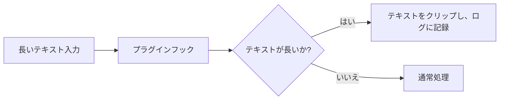
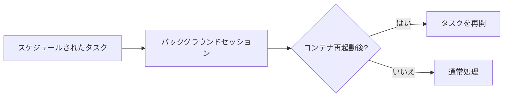
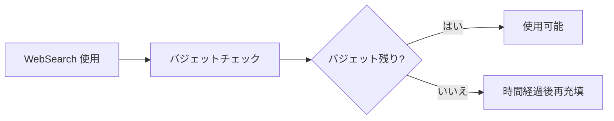
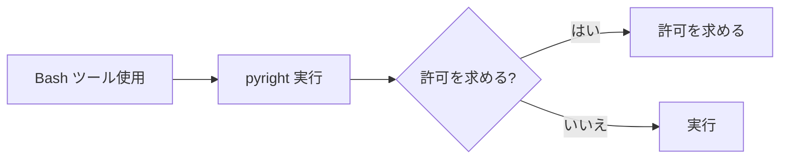

# Claude Code v2.1.290 アップデートまとめ

> 出典: https://code.claude.com/docs/en/changelog#2-1-290

## 💡 注目ポイント

### 1. `/ultrareview` コマンドの改善 — ローカルブランチの未コミット変更を正しくアップロード

`/ultrareview` コマンドがローカルブランチの未コミット変更を正しくアップロードするようになりました。以前は、ブランチが `.git` の外にあるリポジトリで未コミット作業がアップロードから外れることがありましたが、今では適切なエラーメッセージとともに拒否されます。

```mermaid
flowchart LR
    A[ローカルブランチの未コミット変更] --> B[/ultrareview コマンド]
    B --> C{ブランチが.git の外にあるか?}
    C -- はい --> D[エラーメッセージで拒否]
    C -- いいえ --> E[正常にアップロード]
```

### 2. プラグインフックの改善 — 長いテキストがクリップされ、ログに記録される

プラグインフックで長いテキストがクリップされ、ログに記録されるようになりました。以前は長いテキストが拒否またはサイレントにドロップされていましたが、今では適切に処理されます。



### 3. バックグラウンドセッションの改善 — スケジュールされたタスクが正しく再開

バックグラウンドセッションがスケジュールされたタスクを正しく再開するようになりました。以前は、コンテナの再起動後にスケジュールされたタスクが正しく再開されないことがありましたが、今では適切に処理されます。



### 4. クラウドセッションの改善 — WebSearch バジェットの変更

クラウドセッションの WebSearch バジェットが時間とともに再充填されるようになりました（デフォルトは 100 回/時間）。以前は 200 回の呼び出し後に終了していましたが、今では再充填されるようになりました。



### 5. セキュリティ改善 — Bash ツールの pyright 実行前に許可を求める

Bash ツールが `pyright` を実行する前に許可を求めるようになりました。以前は `pyright` が読み取り専用コマンドとして扱われていましたが、今では許可を求めるよう変更されました。



## 📋 変更一覧

### ✨ 新機能

| 変更 | 誰にどう嬉しいか |
|---|---|
| `serverToolUses` を mod の `turn.step` フックの結果に追加 | アドバイザーが実行した API 呼び出しの詳細を取得できる |
| `agentId` をプラグインフックの `tool.check` イベントに追加 | サブエージェントの権限チェックとメインセッションの区別が可能 |
| `ceiling` を mod の `tool.check` フックが読み取る質問と評決に追加 | 組織が要求するツールの承認レベルを指定できる |
| `ThemeKey` と `Color` タイプをプラグインフックのタイピングに追加 | エディタが mod の描画で使用できるテーマカラーをリストアップ |
| `claude plugin validate` に各 mod が登録するフックの `.catch` の有無をリストアップ | 開発者が mod のフックをより詳細に検証できる |
| Deny ボタンを Claude アプリゲートウェイのサインイン承認ページに追加 | 待機中のサインインを終了し、待機中のターミナルを数秒以内に停止 |
| `claude attach <name>` と `claude logs <name>` を追加 | セッション名の一部を ID の代わりに使用可能 |
| `/claude-api managed-agents-onboard <url>` と `/claude-api managed-agents-onboard <quickstart-name>` を追加 | Managed Agents パターンをセットアップ可能 |
| マネージド設定ファイルがマネージド設定フォルダ外のファイルへのリンクの場合に警告を追加 | ユーザーが誤った設定を避けられる |
| マネージド設定がユーザー設定のサンドボックス許可読み取りパスまたは許可ドメインを無視している場合に `/status` と `doctor` 警告を追加 | ユーザーが設定ミスを早期に発見できる |

### ⬆️ 改善

| 変更 | 誰にどう嬉しいか |
|---|---|
| MCP 起動時のネットワークプロキシの改善 | プロキシがブロックするサーバー（HTTP 403）が3回リトライされなくなる |
| バックグラウンドエージェントからの許可プロンプトの改善 | Ctrl+X Ctrl+K ショートカットが背景エージェントを停止することを示す |
| ビルトイン `plugin-authoring` スキルの改善 | 他の人があなたの mod をインストールするコマンドが README のインストールセクションに記述される |
| `/plugin` への返答の改善 | デスクトップアプリの Code タブでプラグインをインストールおよび管理する場所が示される |
| Bash 変更ファイルビューの改善 | git merge、pull、checkout を含む連鎖コマンドで、フルディフなしでファイルをリストする |
| クラウドセッション開始時のエラーメッセージの改善 | `claude auth login` と /login を示し、APIキー認証を非難しなくなる |
| Read ツールのバイナリファイルメッセージの改善 | その形式を読むことができるスキルまたはシェルコマンドを示す |
| `/ultrareview` アップロード拒否のエラーメッセージの改善 | 半分の長さになり、問題のファイルの種類を示す |
| `/ultrareview` アップロード拒否の既知の原因ごとに独自のメッセージを表示 | 修正方法も示す |
| クラウドアプリゲートウェイのログの改善 | 上流のクラウドクレデンシャルまたは接続が失敗した際の警告に根本原因を追加 |
| クラウドアプリゲートウェイのブラウザサインインページの改善 | ブランドフォント、中央配置レイアウト、ダークモードを追加 |
| 大セッションの再開時の応答性の改善 | トランスクリプトがロードされている間、タイマー、入力、レンダリングが実行され続ける |
| `/` と `@` 提案リストの改善 | 選択された行が ❯ ポインターで始まり、色なしで見える |

### 🐛 バグ修正

| 変更 | 誰にどう嬉しいか |
|---|---|
| プロキシまたは API エンドポイントがプロジェクトの設定で設定されている場合、セッションの最初の機能フラグリクエストがそれを無視しないように修正 | 設定が正しく適用される |
| ローカルブランチの未コミット変更が `/ultrareview` コマンドで正しくアップロードされるように修正 | 未コミット作業が失われなくなる |
| プラグインフックで長いテキストがクリップされ、ログに記録されるように修正 | 長いテキストが適切に処理される |
| バックグラウンドセッションがスケジュールされたタスクを正しく再開するように修正 | タスクが正しく再開される |
| クラウドセッションの WebSearch バジェットが時間とともに再充填されるように変更 | バジェットが使い果たされた後も WebSearch を使用できる |
| Bash ツールが `pyright` を実行する前に許可を求めるよう変更 | セキュリティが向上 |
| その他多数のバグ修正 | 安定性と使いやすさの向上 |

### 📝 その他

| 変更 | 誰にどう嬉しいか |
|---|---|
| `CLAUDE_CODE_DISABLE_NONESSENTIAL_TRAFFIC` がスタートアップ接続ウォームアップもスキップするように変更 | 不要なトラフィックが減少 |
| Claude in Chrome がプロジェクトの設定ファイルで有効にならないように変更 | ユーザー設定または `--chrome`, `/chrome` で有効にする必要がある |
| その他多数の変更 | 機能の改善と安定性の向上 |
