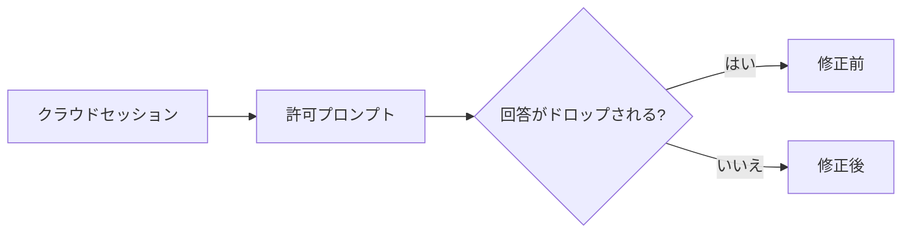
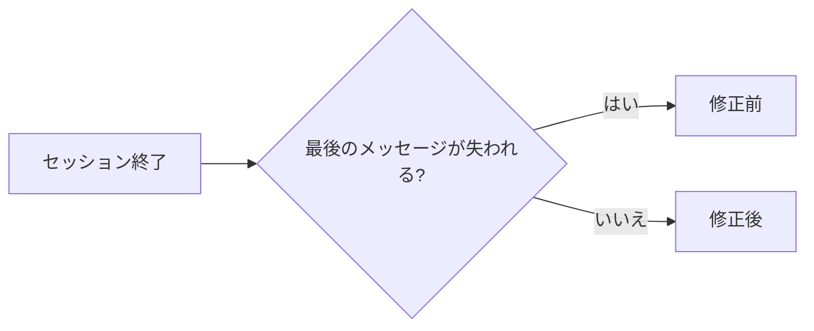

# Claude Code v2.1.291 アップデートまとめ

> 出典: https://code.claude.com/docs/en/changelog#2-1-291

## 💡 注目ポイント

### 1. クラウドセッションの許可プロンプトへの回答が正しく処理されるよう修正

v2.1.290 で導入された回帰により、クラウドセッションで許可プロンプトへの回答がドロップされる問題を修正しました。これにより、ユーザーは許可プロンプトに正しく回答できるようになりました。

### 2. セッション終了時に最後のメッセージが正しく保存されるよう修正

v2.1.288 で導入された回帰により、セッション終了時に最後のメッセージが失われる問題を修正しました。これにより、セッションの最後のメッセージが正しく保存されるようになりました。

## 📋 変更一覧

### 🐛 バグ修正

| 変更 | 誰にどう嬉しいか |
|---|---|
| v2.1.290 で導入された回帰により、クラウドセッションで許可プロンプトへの回答がドロップされる問題を修正 | 許可プロンプトに正しく回答できる |
| v2.1.288 で導入された回帰により、セッション終了時に最後のメッセージが失われる問題を修正 | セッションの最後のメッセージが正しく保存される |
