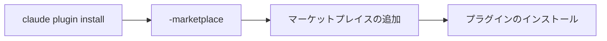
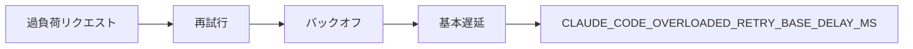
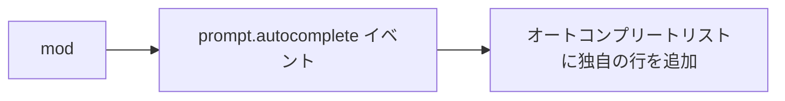
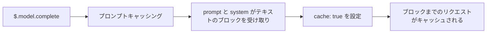

# Claude Code v2.1.292 アップデートまとめ

> 出典: https://code.claude.com/docs/en/changelog#2-1-292

## 💡 注目ポイント

### 1. `claude plugin install` に `--marketplace <source>` オプションを追加

`claude plugin install` コマンドに `--marketplace <source>` オプションを追加しました。これにより、必要なマーケットプレイスが自動的に追加され、`claude plugin marketplace add` と同じポリシーチェックの下でプラグインをインストールできます。

### 2. Agent ツールに `effort` パラメータを追加

Agent ツールに `effort` パラメータを追加し、指定された努力レベルでサブエージェントを実行できるようになりました。

### 3. `CLAUDE_CODE_OVERLOADED_RETRY_BASE_DELAY_MS` 環境変数を追加

過負荷（529）リクエストの再試行時に、バックオフの基本遅延を長く設定できる `CLAUDE_CODE_OVERLOADED_RETRY_BASE_DELAY_MS` 環境変数を追加しました。

### 4. `prompt.autocomplete` イベントを追加

`prompt.autocomplete` イベントを追加し、mod がプロンプトボックスのオートコンプリートリストに独自の行を追加できるようになりました。

### 5. `$.model.complete` にプロンプトキャッシングを追加

mod 用の `$.model.complete` にプロンプトキャッシングを追加し、`prompt` と `system` がテキストのブロックを受け取り、ブロックに `cache: true` を設定すると、そのブロックまでのリクエストがキャッシュされます。

## 📋 変更一覧

### ✨ 新機能

| 変更 | 誰にどう嬉しいか |
|---|---|
| `claude plugin install` に `--marketplace <source>` オプションを追加 | 必要なマーケットプレイスが自動的に追加され、プラグインをインストールできる |
| Agent ツールに `effort` パラメータを追加 | 指定された努力レベルでサブエージェントを実行できる |
| `CLAUDE_CODE_OVERLOADED_RETRY_BASE_DELAY_MS` 環境変数を追加 | 過負荷リクエストの再試行時に、バックオフの基本遅延を長く設定できる |
| `prompt.autocomplete` イベントを追加 | mod がプロンプトボックスのオートコンプリートリストに独自の行を追加できる |
| `$.model.complete` にプロンプトキャッシングを追加 | mod がプロンプトキャッシングを利用できる |

### ⬆️ 改善

| 変更 | 誰にどう嬉しいか |
|---|---|
| `claude -p` と SDK セッションの起動を改善 | 最初のターンが HTTP と SSE MCP サーバーの応答を待たない |
| 長い箇条書きや番号付きの返答のレンダリング速度を改善 | ストリーム、リサイズ、トランスクリプトでの再開がはるかに速くなる |
| Ctrl+C による下書きの回復を改善 | スラッシュコマンドや送信されたメッセージの後も、クリアされたプロンプトにアクセス可能 |
| フック出力の処理を改善 | フックの出力にある `<system-reminder>` タグがエスケープされる |
| ツール入力の処理を改善 | Grep が `file_path` を `path` として受け入れ、Write、WebFetch、Read が余分なパラメータを無視する |
| 設定ファイルで宣言されたマーケットプレイスの名前が Anthropic の公式マーケットプレイスのように見える場合のステップを改善 | より適切なステップが示される |
| サンドボックスの自動許可を改善 | 厳格なサンドボックスモードが設定されている場合、env var プレフィックスを持つインタープリターコマンドがプロンプトなしで実行される |
| Artifact ツールのリストを改善 | Claude が公開されたアーティファクトの数を確認し、一度に最大 200 個までリストできる |
| クラウドセッションの再起動後の改善 | Claude が停止したバックグラウンドエージェントを ID で再開できる |
| Chrome での Claude メッセージを改善 | ブラウザにアクセスできない場合、Claude が代替手段で続行できる |
| /focus のヒントを改善 | ターン中にフォーカスビューを試すよう招待し、戻り方を示す |
| ローカル (stdio) MCP サーバー接続の起動を改善 | プロトコルバージョン 2026-07-28 をデフォルトでネゴシエート |

### 🐛 バグ修正

| 変更 | 誰にどう嬉しいか |
|---|---|
| サブエージェント定義が `permissionMode: auto` で自動モードに入る問題を修正 | 自動モードが利用できない場合でも正しく動作する |
| サンドボックスコマンドが `/ultrareview` アップロードの一時的なファイルコピーを読み取れる問題を修正 | セキュリティが向上 |
| マネージドサンドボックスの読み取り拒否パスがセッション中に変更された場合、プロジェクトグラントがドロップされない問題を修正 | 正しい権限が適用される |
| macOS および Windows でのノートブックまたは PDF の読み取りが承認されたファイル以外を返す可能性がある問題を修正 | 正しいファイルが返される |
| サーバー管理設定のオンディスクキャッシュが改ざんされた場合、ビルトインポリシープラグインが無効にならない問題を修正 | セキュリティが向上 |
| `rm -rf` がホームフォルダまたはドライブの 8.3 短縮名または別の代替 Windows スペリングで扱われない問題を修正 | 正しく処理される |
| セキュリティ: PreToolUse フックの承認と自動モードがネットワーク（UNC）パスからのファイル読み取りの許可プロンプトをバイパスする問題を修正 | セキュリティが向上 |
| スキルまたはスラッシュコマンドの `allowed-tools` ルールがオートモードまたはプランモードの途中で戻ってきた場合の修正 | 正しいツールが使用可能 |
| `NO_PROXY` が `HTTPS_PROXY` が設定されている場合、Claude Code 自身の API リクエスト（サインイン、ポリシー、フィードバック、アーティファクト）で無視される問題を修正 | 正しくプロキシが適用される |
| MCP ツールの名前が 128 文字を超える場合、すべてのリクエストが失敗する問題を修正 | 正しくエラーメッセージが表示される |
| `claude plugin` コマンドが組織のマネージド設定がロードされる前に実行される問題を修正 | 正しく設定が適用される |
| その他多数のバグ修正 | 安定性と使いやすさの向上 |

### 📝 その他

| 変更 | 誰にどう嬉しいか |
|---|---|
| クラウドセッションの agent 名を最大 256 文字に制限 | 長すぎる名前は拒否され、スキルまたはプラグインファイルの `name` が長すぎる場合は無視される |
| [Cloud sessions] ルーチン実行が終了後も何時間も実行中としてリストされることが時々ある問題を修正 | 正しく終了状態が示される |
| [Cloud sessions] ルーチンの編集または複製がプッシュ通知をオフにする問題を修正 | 正しい通知設定が適用される |
| [Cloud sessions] SVG、HEIC、TIFF などの一般的でない画像ファイルが添付できない問題を修正 | 正しく添付可能 |
| [Cloud sessions] 承認プロンプトが組織が承認を要求するコネクタツールに対して「常に許可」を提供する問題を修正 | 正しい選択肢が表示される |
| [Remote Control] 新しい Remote Control セッションの最初のメッセージが画像のみを受け入れる問題を修正 | 正しく PDF やその他のファイルも受け入れる |
| [Claude Tag] チャンネルの設定ページの「Allowed domains」カードに「Edit」ボタンを追加 | Enterprise 管理者がチャンネルのドメインを設定するアクセスバンドルを開くことができる |
| [Claude Tag] Slack スレッドで送信された返答が Claude が最初のリクエストを終了するまで保持される問題を修正 | 正しく即座に返答される |
| [Claude Tag] GitHub プルリクエストアクティビティまたはルーチンによってのみ起動された Slack スレッドが元のモデルに留まる問題を修正 | 正しいモデルが使用される |
| [Claude Tag] Claude が Slack で使用制限通知を投稿することがある問題を修正 | 正しい原因が示される |
| [Claude Tag] 自動的に拒否された Slack から回答できない許可プロンプトがある場合のセッションが中断されるまでハングする問題を修正 | 正しく処理される |
| [Claude Tag] チャンネルで `@Claude!status` が Claude が未タグのメッセージを読み取るのを停止した理由と、@-mention で再開できることを示すように改善 | 正しい情報が提供される |
| [Claude Tag] `!fork` で続行された Slack スレッドの最初のメッセージが元のスレッド、リクエスト、要求者を示すカードに変更 | 正しい情報が提供される |
| [Claude Tag] 管理設定の Claude Tag の使用制限ページの組織全体およびデフォルトの使用制限ボックスが Save または Enter を押すまで保存されないよう変更 | 正しい保存動作が行われる |
| [Code Review] PRs レビューチャートに期間の合計と前期間からの変更、およびリポジトリ別の内訳を追加 | より詳細な情報が提供される |
| [Code Review] プルリクエストが新しいベースブランチに移動し、古いブランチが削除された場合にキューイングされたレビューが失敗する問題を修正 | 正しく再キューイングされる |
| [Code Review] プルリクエストが CLAUDE.md を編集する場合、レビューがそのルールを無視する問題を修正 | 正しくベースブランチのバージョンが使用される |
