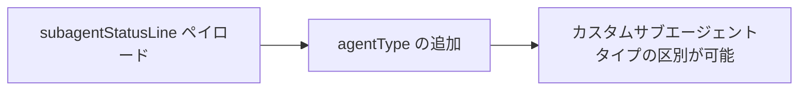
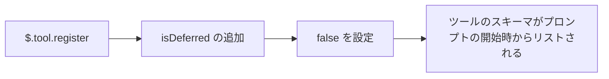

# Claude Code v2.1.293 アップデートまとめ

> 出典: https://code.claude.com/docs/en/changelog#2-1-293

## 💡 注目ポイント

### 1. Claude Haiku 5.5 (`claude-haiku-5-5`) の追加

Anthropic API のデフォルト Haiku モデルとして Claude Haiku 5.5 (`claude-haiku-5-5`) が追加されました。1M のコンテキスト、$0.10/$0.50 パー Mtok（100K を超えるプロンプトは $0.50/$2.50）の料金体系です。

```mermaid
flowchart LR
    A[Anthropic API] --> B[Claude Haiku 5.5 (claude-haiku-5-5)]
    B --> C[デフォルト Haiku モデル]
    C --> D[1M コンテキスト, $0.10/$0.50 パー Mtok]
```

### 2. `subagentStatusLine` ペイロードに `agentType` を追加

スクリプトがカスタムサブエージェントタイプを区別できるように、`subagentStatusLine` ペイロードに `agentType` を追加しました。



### 3. `$.tool.register` に `isDeferred` を追加

mod 用の `$.tool.register` に `isDeferred` を追加し、`false` を設定すると、ツールのスキーマがツール検索の背後ではなく、プロンプトの開始時からリストされます。



## 📋 変更一覧

### ✨ 新機能

| 変更 | 誰にどう嬉しいか |
|---|---|
| Claude Haiku 5.5 (`claude-haiku-5-5`) の追加 | Anthropic API のデフォルト Haiku モデルとして利用可能 |
| `subagentStatusLine` ペイロードに `agentType` を追加 | カスタムサブエージェントタイプを区別可能 |
| `$.tool.register` に `isDeferred` を追加 | ツールのスキーマをプロンプトの開始時からリスト可能 |

### ⬆️ 改善

| 変更 | 誰にどう嬉しいか |
|---|---|
| Team および Enterprise 組織の起動を改善 | ポリシーとマネージド設定が早期に取得され、停止したリクエストは 3 秒後に再試行される |
| Chrome での Claude を改善 | ブラウザがタブを報告するのが遅い場合、拒否されるページアクションが減少 |
| クラウドセッションでの Chrome での Claude メッセージを改善 | 複数の組織に所属している場合、拡張機能が同じ組織にサインインしている必要があること、およびその変更方法が示される |
| Bash 編集差分ノートを改善 | コマンド実行中に変更されたファイルがリストされ、他のプロセスによる書き込みも含まれる可能性がある |

### 🐛 バグ修正

| 変更 | 誰にどう嬉しいか |
|---|---|
| Claude がコンテキスト圧縮前の自身の最後のアクションを完了した後として扱い、終了した作業を撤回またはやり直すことがある問題を修正 | 正しい動作が行われる |
| HTTP MCP 接続が送信したすべてのリクエストを閉じるまで保持するメモリリークを修正 | メモリ使用量が改善 |
| Claude が作業中に送信されたメッセージが `←` によってセッションがバックグラウンドに移動した際に失われる問題を修正 | メッセージが正しく送信される |
| `/model` 努力の ←/→ が最高または最低レベルを超えてラップする問題を修正 | 正しい努力レベルが設定される |
| `/tui` が Chrome で `--chrome` で開始されたセッションで Claude を切断し、`--no-chrome` を無視する問題を修正 | 正しく動作する |
| その他多数のバグ修正 | 安定性と使いやすさの向上 |

### 📝 その他

| 変更 | 誰にどう嬉しいか |
|---|---|
| claude.ai スキル同期の変更間隔を約 40 分に変更 | セッションが使用されていない間、変更をチェックする頻度が低下 |
| エージェントリストと MCP サーバーの順序を変更 | 非 ASCII 文字を含む名前が ASCII 名の後に並ぶ |
| OpenTelemetry `claude_code.at_mention` ログを変更 | プロンプト読み取り時に最大 100 エージェントと 100 MCP リソースイベントを発行 |
| セルフホステッドランナーのオーケストレータを変更 | ポーリング間の待機時間を 4 ～ 6 秒に変更 |
| [Claude Tag] Slack での Claude が Enterprise Grid チャンネルでワークスペースがセットアップされていないと言う問題を修正 | 正しい情報が提供される |
| [Claude Tag] Slack での Claude がチャンネルの接続、プラグイン、スキル、ルールが変更された際にタスクを中断する問題を修正 | 変更が適用されるまで Claude が完了する |
| [Claude Tag] Slack での Claude がスレッドのルーチンを実行するよう求められた際に追加のノートが別の実行を開始する問題を修正 | そのスレッドで実行が続行される |
| [Claude Tag] Claude Tag 管理設定の Add a connector ダイアログが Google サインイン後にすべての Google コネクタを接続済みとして表示する問題を修正 | 正しい情報が提供される |
| [Claude Tag] Claude Tag 管理設定を改善し、接続されていない Enterprise Grid を Connect ボタン付きでリストする | 正しい情報が提供される |
| [Claude Tag] Slack での Claude が管理者のみが投稿できるアナウンスチャンネルに参加する際、イントロを投稿しないよう変更 | 正しい動作が行われる |
| [Claude Tag] Claude Tag 管理設定のチャンネルルールの制限を 20 から 50 に変更 | より多くのルールが設定可能 |
| [Code Review] Code Review の Add a repository ダイアログを改善し、追加できない各リポジトリとその理由（GitHub の書き込みアクセス権の欠如など）をリストする | より詳細な情報が提供される |
