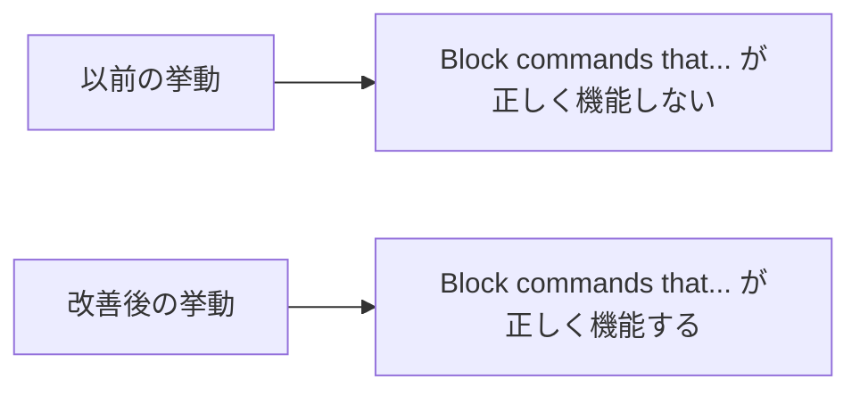
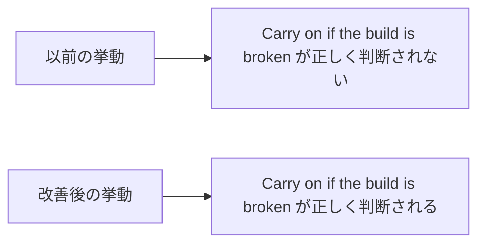

# Claude Code v2.1.294 アップデートまとめ

> 出典: https://code.claude.com/docs/en/changelog#2-1-294

## 💡 注目ポイント

### 1. `prompt` と `agent` フックの改善 — 意図したブロックが正しく機能するように

これまで、`prompt` や `agent` フックが「ブロックする」という指示を正しく解釈できず、意図しないコマンドが実行されることがありました。このアップデートでは、フックの指示がより正確に判断されるよう改善されました。これにより、フックが意図した通りに機能し、不要なコマンドの実行を防ぐことができます。

### 2. Stop と SubagentStop フックの改善 — 早期停止を減らす

`prompt` フックが Stop や SubagentStop の際に「Carry on if the build is broken」のような指示を正しく判断するように改善されました。これにより、ビルドが壊れている場合でも早期に停止してしまう可能性が減少し、タスクが必要なだけ継続して実行されるようになります。

## 📋 変更一覧

### 🐛 バグ修正

| 変更 | 誰にどう嬉しいか |
|---|---|
| `prompt` と `agent` フックの改善 | フックが意図した通りに機能し、不要なコマンドの実行を防ぐ |
| Stop と SubagentStop フックの改善 | 早期停止を減らし、タスクが必要なだけ継続して実行される |
