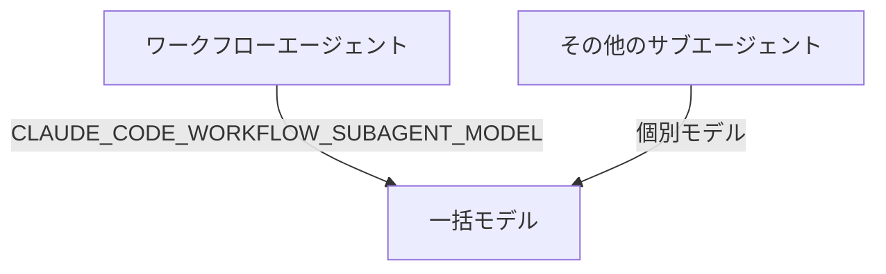

# Claude Code v2.1.296 アップデートまとめ

> 出典: https://code.claude.com/docs/en/changelog#2-1-296

## 💡 注目ポイント

### 1. `code` キーの追加 — ポリシー管理がより柔軟に

`managed.policies[]` に `code` キーが追加され、`cli` と同じ設定が適用されるようになりました。これにより、Claude Desktop の Code タブでも同じポリシーが適用され、`desktop` キーを使うことで Claude Desktop のゲートウェイモードが有効になります。

### 2. `autoCompactWindow` の追加 — サブエージェントのウィンドウを自動コンパクト

サブエージェントのフロントマターと `--agents` 定義に `autoCompactWindow` が追加されました。これにより、サブエージェントはメインの会話ウィンドウよりも早く自動コンパクトすることができます。

### 3. `CLAUDE_CODE_WORKFLOW_SUBAGENT_MODEL` の追加 — ワークフローエージェントの一括モデル設定

`CLAUDE_CODE_WORKFLOW_SUBAGENT_MODEL` 環境変数が追加され、すべてのワークフローエージェントを1つのモデルで実行しつつ、他のサブエージェントはそれぞれのモデルを維持できるようになりました。

### 4. `CLAUDE_CODE_OVERLOADED_RETRY_MAX_DELAY_MS` の追加 — 過負荷リトライの最大遅延設定

`CLAUDE_CODE_OVERLOADED_RETRY_MAX_DELAY_MS` 環境変数が追加され、過負荷（529）リクエストのリトライ時のバックオフの最大遅延時間を設定できるようになりました。

### 5. ステータスフィルターの追加 — クラウドセッションの管理が容易に

セルフホスト環境の管理者設定の Activity タブに、セッションとランナーのリストにステータスフィルターが追加されました。複数のステータスを一度に選択できます。

## 📋 変更一覧

### ✨ 新機能

| 変更 | 誰にどう嬉しいか |
|---|---|
| `managed.policies[]` に `code` キーを追加 | ポリシー管理がより柔軟に |
| `autoCompactWindow` を追加 | サブエージェントのウィンドウを自動コンパクト |
| `CLAUDE_CODE_WORKFLOW_SUBAGENT_MODEL` を追加 | ワークフローエージェントの一括モデル設定 |
| `CLAUDE_CODE_OVERLOADED_RETRY_MAX_DELAY_MS` を追加 | 過負荷リトライの最大遅延設定 |
| ステータスフィルターを追加 | クラウドセッションの管理が容易に |

### ⬆️ 改善

| 変更 | 誰にどう嬉しいか |
|---|---|
| `/plugin` にプラグインのフックが省略された場合の注意を追加 | プラグインの設定ミスを防ぐ |
| Read ツールに `allow_large` オプションを追加 | 大容量ファイルの読み込みが可能に |
| データビジュアライゼーションスキルを更新 | 視認性が向上 |
| MCP ツールの説明とサーバー指示の文字数制限を 4,096 文字に変更 | より詳細な説明が可能に |
| セッションがバックグラウンドに移行中に開始された `←` コマンドを停止 | 意図しないコマンド実行を防ぐ |
| VSCode でブラウザアクション前に確認を求める | セキュリティ向上 |
| Slack で最新の返信にのみフッターを表示 | 情報過多を防ぐ |

### 🐛 バグ修正

| 変更 | 誰にどう嬉しいか |
|---|---|
| `/cost`、ステータスライン、`--max-budget-usd`、SDK のコスト数値を更新 | 正確なコスト計算が可能に |
