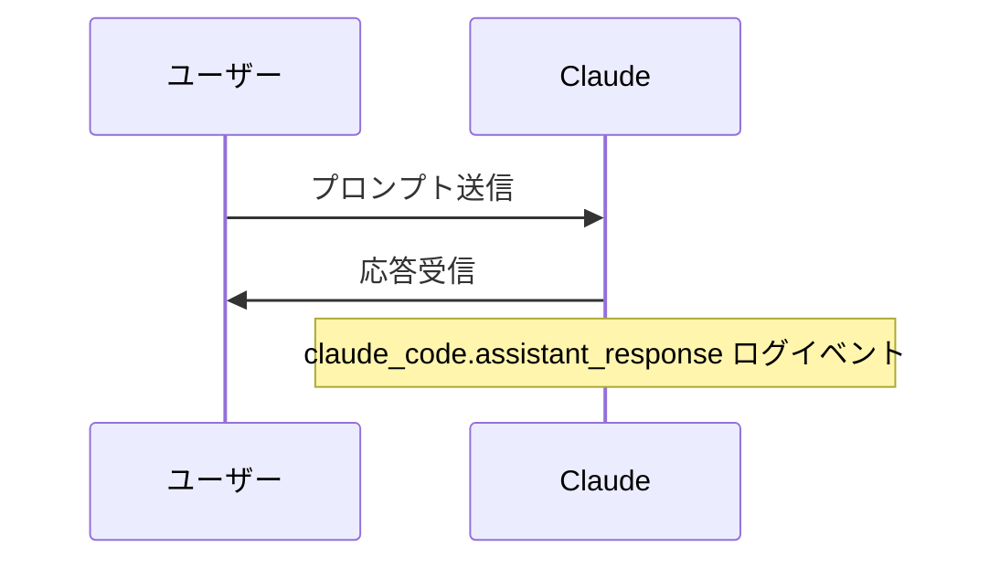

# Claude Code v2.1.193 アップデートまとめ

> 出典: https://code.claude.com/docs/en/changelog#2-1-193

## 💡 注目ポイント

### 1. `autoMode.classifyAllShell` 設定の追加 — シェルコマンドの自動分類を強化

これまでは任意のコード実行パターンのみが自動モードで分類されていましたが、
この設定を有効にすると、すべての Bash/PowerShell コマンドが自動分類の対象になります。
これにより、より広範なコマンドの安全性チェックが可能になります。

### 2. 自動モード拒否理由の追加 — 拒否理由をより明確に

自動モードでコマンドが拒否された場合、その理由がトランスクリプト、拒否トースト、
`/permissions` の最近の拒否リストに追加されました。これにより、拒否の理由が
より明確になり、ユーザーは適切な対応をとることができます。

### 3. `claude_code.assistant_response` OpenTelemetry ログイベントの追加 — モデルの応答をログに記録

このイベントはモデルの応答テキストを含むログイベントを追加します。`OTEL_LOG_ASSISTANT_RESPONSES=1` を設定すると、応答内容が記録されます。この変数が設定されていない場合、`OTEL_LOG_USER_PROMPTS` に従います。プロンプトコンテンツを既にログ記録しているデプロイメントは、アップグレード時に応答コンテンツの受信を開始します。プロンプトのみを保持するには `OTEL_LOG_ASSISTANT_RESPONSES=0` を設定します。

### 4. ライブファイルパスオートコンプリートの追加 — Bash モードでのファイルパス補完

Bash モードで `!` を入力すると、ライブファイルパスのオートコンプリートが有効になります。これにより、ファイルパスの入力がより簡単かつ正確になります。

### 5. MCP サーバー認証のスタートアップ通知 — `/mcp` への指示

MCP サーバーが認証を必要とする場合、スタートアップ時に通知が表示され、`/mcp` への指示が示されます。これにより、ユーザーは認証プロセスをよりスムーズに行うことができます。

## 📋 変更一覧

### ✨ 新機能

| 変更 | 誰にどう嬉しいか |
|---|---|
| `autoMode.classifyAllShell` 設定の追加 | すべての Bash/PowerShell コマンドを自動分類の対象にし、安全性チェックを強化 |
| 自動モード拒否理由の追加 | 拒否理由が明確になり、適切な対応が可能に |
| `claude_code.assistant_response` OpenTelemetry ログイベントの追加 | モデルの応答をログに記録し、デバッグや分析が容易に |
| ライブファイルパスオートコンプリートの追加 | Bash モードでのファイルパス入力が簡単かつ正確に |
| MCP サーバー認証のスタートアップ通知の追加 | MCP サーバー認証プロセスがスムーズに |

### ⬆️ 改善

| 変更 | 誰にどう嬉しいか |
|---|---|
| バックグラウンドエージェントの改善 | エージェントが他のタスクで作業を続けながら、起動結果が Claude に「応答を終了」と指示しないように |
| MCP `headersHelper` 認証の改善 | ヘルパーが 401/403 を返すツールコール時に自動で再実行・再接続するように |
| プラグイン自動リネーム機能の改善 | マーケットプレイスの `renames` マップが自動でフォローされ、設定が新しい名前に更新されるように |
| `/add-dir` メッセージの改善 | ディレクトリが既に作業ディレクトリである場合のメッセージが改善されるように |

### 🐛 バグ修正

| 変更 | 誰にどう嬉しいか |
|---|---|
| `/model` とその他のクライアントデータゲートUIが `/login` 直後に古い/空の状態を表示する問題の修正 | ログイン直後のUI表示が正しく行われるように |
| バックグラウンド化（←←）が「N 個のバックグラウンドタスクが放棄される」と誤ってキャンセルされる問題の修正 | バックグラウンドタスクが正しく継続されるように |
| ピン留めされたバックグラウンドエージェントが自動更新後に毎回「中断したところから続ける」と再プロンプトされる問題の修正 | 自動更新後に不必要に再プロンプトされることがなくなるように |
| メインターンをバックグラウンド化した際に「general-purpose (resumed)」サブエージェントが現れてメイン会話を再実行する問題の修正 | 不要なサブエージェントが生成されなくなるように |
| エージェントパネルがサブエージェントを表示する際に兄弟エージェントを隠す問題の修正 | サブエージェントと兄弟エージェントが正しく表示されるように |